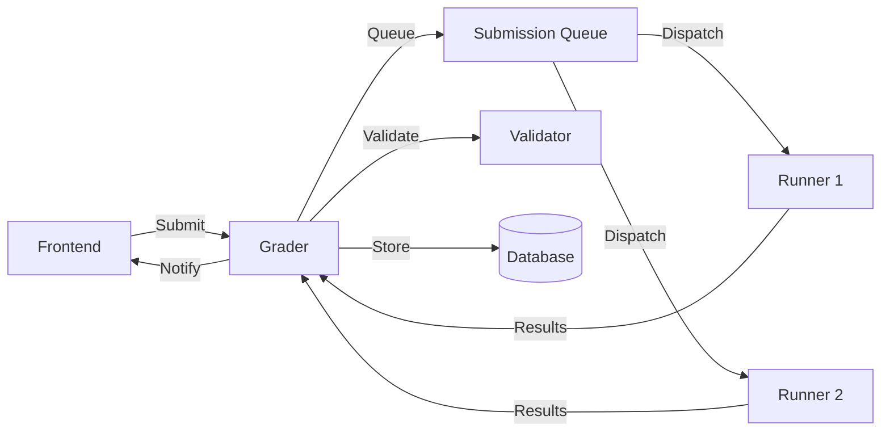

# Grader

The Grader is responsible for managing the submission queue and coordinating code evaluation. It acts as the central dispatcher between the frontend and Runners.

## Responsibilities

- **Queue Management**: Maintains submission queues
- **Runner Coordination**: Dispatches submissions to available Runners
- **Validation**: Runs validators on outputs
- **Scoring**: Calculates final scores and verdicts
- **Database Updates**: Stores results in the database

## Architecture

## Queue System

The Grader maintains multiple queues:

- **Contest Queue**: Contest submissions
- **Normal Queue**: Practice mode submissions
- **Rejudge Queue**: Rejudge requests
- **Urgent Queue**: High-priority contests (configurable)
- **Slow Queues**: For problems that may take >30 seconds

## Evaluation Flow

1. Frontend sends submission to Grader
2. Grader adds to appropriate queue
3. Grader dispatches to available Runner
4. Runner compiles and executes code
5. Runner returns results to Grader
6. Grader validates outputs
7. Grader calculates score and verdict
8. Grader updates database
9. Grader notifies frontend via WebSocket

## Related Documentation

- **[Runner](runner.md)** - Code execution system
- **[System Internals](../architecture/internals.md)** - Detailed flow
- **[Architecture](../architecture/index.md)** - System overview
