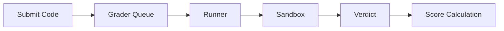

# Features Documentation

Detailed documentation for omegaUp features and functionality. This section covers everything from problem creation to real-time contest updates.

## Core Features

-   :material-puzzle:{ .lg .middle } **[Problems](problems/index.md)**

    ---

    Creating, managing, and formatting programming problems. Learn about problem statements, test cases, validators, and the complete problem lifecycle.

    [:octicons-arrow-right-24: Learn More](problems/index.md)

-   :material-trophy:{ .lg .middle } **[Contests](contests/index.md)**

    ---

    Organizing and managing programming contests. Configure scoring modes, manage participants, and run successful competitions.

    [:octicons-arrow-right-24: Learn More](contests/index.md)

-   :material-code-braces:{ .lg .middle } **[Arena](arena.md)**

    ---

    The contest interface where participants solve problems. Features code editor, real-time scoreboard, and clarification system.

    [:octicons-arrow-right-24: Learn More](arena.md)

## Evaluation System

The evaluation system is the heart of omegaUp, handling code compilation, execution, and scoring.

| Component | Description | Documentation |
|-----------|-------------|---------------|
| **Grader** | Queue management and verdict determination | [Grader](grader.md) |
| **Runner** | Code compilation and sandboxed execution | [Runner](runner.md) |
| **Sandbox** | Secure execution using Minijail | [Sandbox](sandbox.md) |
| **Verdicts** | Result types and scoring models | [Verdicts](verdicts.md) |

### Evaluation Flow

## Problem Management

| Feature | Description | Documentation |
|---------|-------------|---------------|
| **Creating Problems** | Write statements, test cases, validators | [Creating Problems](problems/creating-problems.md) |
| **Problem Format** | File structure and settings | [Problem Format](problems/problem-format.md) |
| **Version Control** | Git-based problem versioning | [Problem Versioning](problem-versioning.md) |

## Real-time Features

| Feature | Description | Documentation |
|---------|-------------|---------------|
| **Live Updates** | WebSocket-based notifications | [Real-time](realtime.md) |
| **Scoreboards** | Live contest rankings | [Arena](arena.md) |
| **Clarifications** | Contest Q&A system | [Arena](arena.md) |

## Achievement System

| Feature | Description | Documentation |
|---------|-------------|---------------|
| **Badges** | User achievement rewards | [Badges](badges.md) |

### Badge Categories

- **Problem Solving**: 100 Solved Problems, 500 Score
- **Streaks**: 7-day, 15-day, 30-day solving streaks
- **Language Expertise**: C++, Java, Python specialists
- **Community**: Problem Setter, Contest Manager, Feedback Provider

## Feature Matrix

| Feature | Practice | Contest | Course |
|---------|----------|---------|--------|
| Problem solving | ✅ | ✅ | ✅ |
| Live scoreboard | ❌ | ✅ | ❌ |
| Time limits | ❌ | ✅ | Configurable |
| Clarifications | ❌ | ✅ | ✅ |
| Progress tracking | ✅ | ❌ | ✅ |
| Certificates | ❌ | ✅ | ✅ |
| Virtual participation | ✅ | ✅ | ❌ |

## Related Documentation

- **[API Reference](../api/index.md)** - API endpoints for all features
- **[Architecture](../architecture/index.md)** - System architecture details
- **[Development Guides](../development/index.md)** - Feature implementation guides
