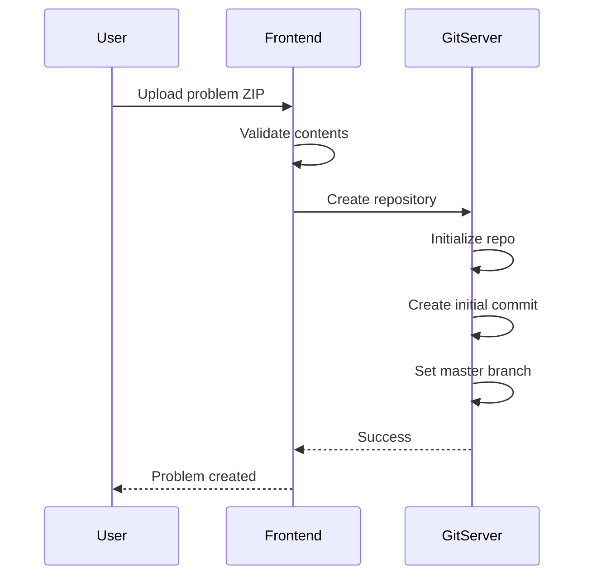
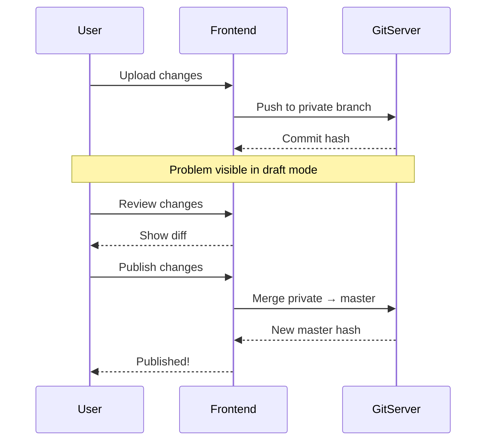
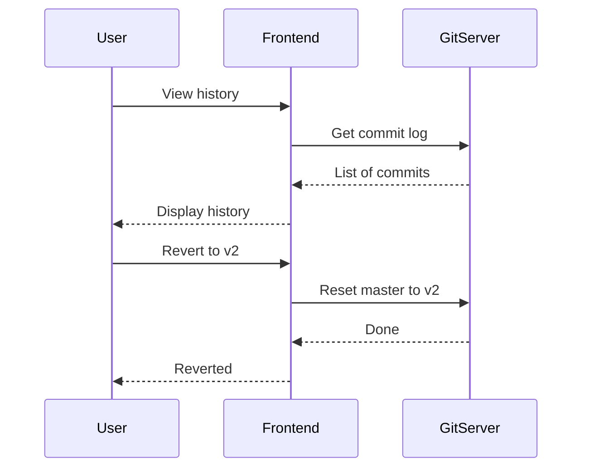
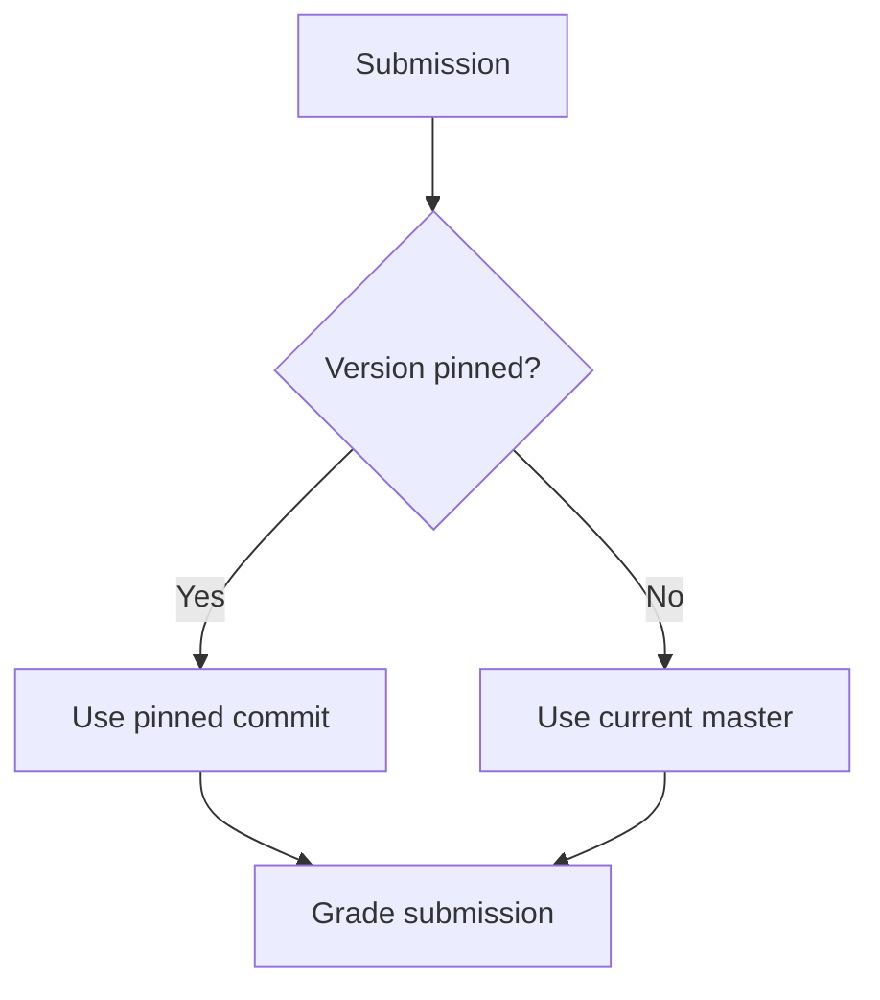

# Problem Versioning

omegaUp uses Git for problem version control, enabling full history tracking, atomic updates, and version pinning for contests.

## Overview

Every problem is a Git repository containing:

- Problem statements (multiple languages)
- Test cases (inputs and expected outputs)
- Custom validators (optional)
- Interactive problem files (optional)
- Configuration settings

## Version Control Benefits

### For Problem Setters

- **History tracking**: See all changes over time
- **Rollback**: Revert to any previous version
- **Draft mode**: Test changes before publishing
- **Collaboration**: Multiple editors with change tracking

### For Contest Organizers

- **Version pinning**: Lock problem at specific version
- **Consistency**: Same version throughout contest
- **Independence**: Problem updates don't affect running contests

## Branches

### Branch Structure

```
refs/
├── heads/
│   ├── master      # Published version
│   ├── private     # Draft version
│   └── published   # Alias for master
└── tags/
    ├── v1
    ├── v2
    └── contest-2024
```

### Branch Purposes

| Branch | Purpose | Visibility |
|--------|---------|------------|
| `master` | Live, published version | Public (if problem is public) |
| `private` | Work in progress | Problem admins only |
| `published` | Alias for master | Same as master |

## Workflow

### Creating a Problem



### Updating a Problem



### Reverting Changes



## Version Pinning

### In Contests

When adding a problem to a contest:

```json
{
  "problem_alias": "sum-two",
  "commit": "abc123def456",  // Optional: pin to specific version
  "points": 100
}
```

If `commit` is omitted, uses current `master` at contest start.

### During Contest



### After Contest

Problem can be updated without affecting:

- Contest scoreboards
- Historical submissions
- Contest integrity

## Commit History

### Viewing History

Access via API or UI:

```bash
GET /api/problem/versions/?problem_alias=sum-two
```

Response:

```json
{
  "versions": [
    {
      "commit": "abc123",
      "message": "Fixed test case 5",
      "author": "admin",
      "timestamp": 1704067200
    },
    {
      "commit": "def456",
      "message": "Added edge cases",
      "author": "admin",
      "timestamp": 1703980800
    }
  ]
}
```

### Commit Messages

Automatic messages for common operations:

| Operation | Message Format |
|-----------|---------------|
| Create | "Initial commit" |
| Update statement | "Updated statement for {lang}" |
| Add test cases | "Added {n} test cases" |
| Change limits | "Updated limits: time={t}s, memory={m}MB" |

## Directory Structure

### Problem Contents

```
problem/
├── statements/
│   ├── es.markdown       # Spanish statement
│   ├── en.markdown       # English statement
│   └── images/
│       └── diagram.png
├── cases/
│   ├── easy.1.in
│   ├── easy.1.out
│   ├── easy.2.in
│   ├── easy.2.out
│   ├── hard.1.in
│   └── hard.1.out
├── solutions/
│   └── solution.cpp
├── validators/
│   └── validator.cpp     # Optional
├── interactive/
│   ├── Main.idl          # Optional
│   └── Main.cpp
├── settings.json
└── testplan              # Optional
```

### settings.json

```json
{
  "Limits": {
    "TimeLimit": "1s",
    "MemoryLimit": "256MiB",
    "OverallWallTimeLimit": "30s",
    "OutputLimit": "10240KiB"
  },
  "Validator": {
    "Name": "token-numeric",
    "Tolerance": 1e-6
  },
  "Cases": [
    {
      "Name": "easy",
      "Cases": ["easy.1", "easy.2"],
      "Weight": 30
    },
    {
      "Name": "hard",
      "Cases": ["hard.1"],
      "Weight": 70
    }
  ]
}
```

## File Format Details

### Statement Markdown

```markdown
# Problem Title

## Description
Problem description here...

## Input
Input format description...

## Output
Output format description...

## Constraints
- $1 \leq n \leq 10^6$

## Examples

### Input
```
5
1 2 3 4 5
```

### Output
```
15
```

## Notes
Additional notes...
```

### Test Cases

| Extension | Purpose |
|-----------|---------|
| `.in` | Input file |
| `.out` | Expected output |

Naming convention:

```
{group}.{number}.in
{group}.{number}.out
```

## API Operations

### Get Current Version

```bash
GET /api/problem/details/?problem_alias=sum-two
```

Returns `current_version` field.

### List Versions

```bash
GET /api/problem/versions/?problem_alias=sum-two
```

### Update Problem

```bash
POST /api/problem/update/
  problem_alias=sum-two
  message="Fixed edge case"
  contents=<zip file>
  update_published=none|non-problemset|all
```

### Publish Draft

```bash
POST /api/problem/updateProblemLevel/
  problem_alias=sum-two
  update_published=all
```

## Best Practices

### Version Management

1. **Use meaningful messages**: Describe what changed
2. **Test before publishing**: Use private branch
3. **Pin for contests**: Always pin critical contests
4. **Archive old versions**: Tag important releases

### Collaboration

1. **Coordinate edits**: One editor at a time
2. **Review changes**: Check diff before publishing
3. **Document decisions**: Use commit messages

### Contest Preparation

1. **Freeze early**: Pin versions well before contest
2. **Test pinned version**: Verify with test submissions
3. **Don't update during contest**: Could cause issues

## Related Documentation

- **[GitServer Architecture](../architecture/gitserver.md)** - Technical details
- **[Problems API](../api/problems.md)** - API reference
- **[Creating Problems](problems/creating-problems.md)** - Problem creation guide
