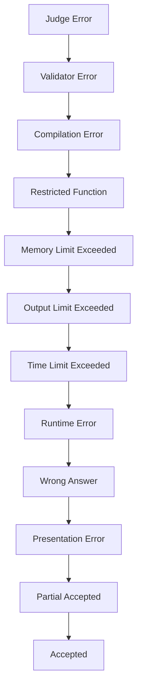

# Verdicts & Scoring

This page documents all verdict types returned by the omegaUp judge system and explains the different scoring models available for contests and problems.

## Verdict Types

### Success Verdicts

| Verdict | Code | Description |
|---------|------|-------------|
| **Accepted** | `AC` | All test cases passed |
| **Partial Accepted** | `PA` | Some test cases passed |

### Wrong Answer Verdicts

| Verdict | Code | Description |
|---------|------|-------------|
| **Wrong Answer** | `WA` | Output doesn't match expected |
| **Presentation Error** | `PE` | Output format issues (extra whitespace, etc.) |

### Runtime Verdicts

| Verdict | Code | Description |
|---------|------|-------------|
| **Runtime Error** | `RTE` | Program crashed (segfault, exception, etc.) |
| **Time Limit Exceeded** | `TLE` | Exceeded time limit |
| **Memory Limit Exceeded** | `MLE` | Exceeded memory limit |
| **Output Limit Exceeded** | `OLE` | Too much output generated |
| **Restricted Function** | `RFE` | Used forbidden system call |

### Compilation Verdicts

| Verdict | Code | Description |
|---------|------|-------------|
| **Compilation Error** | `CE` | Failed to compile |

### System Verdicts

| Verdict | Code | Description |
|---------|------|-------------|
| **Judge Error** | `JE` | Internal grading error |
| **Validator Error** | `VE` | Custom validator crashed |

## Verdict Hierarchy

When multiple test cases have different verdicts, the overall verdict follows this priority:



## Scoring Models

### All or Nothing (`all_or_nothing`)

Points awarded only for full solution:

```
Score = 100% if ALL cases pass
Score = 0%   otherwise
```

Best for:
- Simple problems
- IOI-style problems where partial credit isn't desired

### Partial Credit (`partial`)

Points proportional to cases passed:

```
Score = (passing_cases / total_cases) × max_points
```

Best for:
- Problems with independent test cases
- Educational settings

### Maximum Per Group (`max_per_group`)

Points based on test case groups:

```
Group Score = max_points × (passing_cases_in_group / total_cases_in_group)
Total Score = sum(Group Scores weighted by group weights)
```

Best for:
- Problems with subtasks
- IOI-style problems with partial scoring

## Test Case Groups

### Group Definition

Groups are defined in `settings.json` or inferred from filenames:

```json
{
  "Cases": [
    {
      "Name": "small",
      "Cases": ["1", "2", "3"],
      "Weight": 30
    },
    {
      "Name": "large",
      "Cases": ["4", "5", "6"],
      "Weight": 70
    }
  ]
}
```

### Automatic Grouping

Without explicit groups, cases are grouped by filename prefix:

```
small.1.in  → Group "small"
small.2.in  → Group "small"
large.1.in  → Group "large"
large.2.in  → Group "large"
```

### Testplan File

Alternative grouping via `testplan`:

```
# Format: group_name weight
small 30
large 70

# Test cases (order matters for display)
small.1
small.2
small.3
large.1
large.2
large.3
```

## Penalty Models

### No Penalty (`none`)

Score is purely based on correctness:

```
Final Score = Best Score
```

### Runtime Penalty (`runtime`)

Score penalized by execution time:

```
Final Score = Points × (1 - time_factor)
```

Where `time_factor` is based on relative runtime.

### Submission Count Penalty (`submission_count`)

ICPC-style penalty:

```
Penalty = Σ(wrong_submissions × penalty_minutes + solve_time)
```

## Contest Scoring

### IOI Style

- Partial credit allowed
- Best submission counts
- No wrong submission penalty

```
Total = Σ(max_score_per_problem)
```

### ICPC Style

- All-or-nothing per problem
- Time + wrong submission penalty
- Problems worth equal points

```
Solved = count(AC_problems)
Penalty = Σ(solve_time + wrong_attempts × 20)
Rank by: Solved DESC, Penalty ASC
```

### Custom Scoring

Configurable per contest:

| Setting | Options |
|---------|---------|
| `score_mode` | `all_or_nothing`, `partial`, `max_per_group` |
| `penalty` | `none`, `runtime`, `submission_count` |
| `penalty_calc_policy` | `sum`, `max` |

## Scoreboard Display

### Score Representation

| Format | Example | When Used |
|--------|---------|-----------|
| Points | `100.00` | Partial scoring |
| Fraction | `3/5` | All-or-nothing |
| Time | `45:30` | ICPC penalty |
| Combined | `100 (+2)` | IOI with attempts |

### Color Coding

| Color | Meaning |
|-------|---------|
| 🟢 Green | Accepted / Full score |
| 🟡 Yellow | Partial score |
| 🔴 Red | No score / Wrong answer |
| ⚪ Gray | Pending judgment |

## Verdict Details

### Runtime Error Signals

| Signal | Description |
|--------|-------------|
| SIGSEGV (11) | Segmentation fault |
| SIGFPE (8) | Floating point exception |
| SIGABRT (6) | Abort (assertion failed) |
| SIGKILL (9) | Killed by system |

### Time Limit Notes

- **CPU Time**: Actual computation time
- **Wall Time**: Real elapsed time (typically 2× CPU limit)
- TLE can result from:
  - Slow algorithm
  - Infinite loop
  - Excessive I/O

### Memory Limit Notes

- Measured via cgroups (peak RSS)
- Includes:
  - Heap allocations
  - Stack usage
  - Static variables
- Does NOT include:
  - Shared libraries
  - Code segment

## Custom Validators

### Validator Interface

Custom validators receive:

```bash
./validator <input_file> <expected_output> <user_output> <score_limit>
```

And output:

```
<score>
<message>
```

Where `score` is between 0.0 and 1.0.

### Use Cases

- Floating point tolerance
- Multiple valid outputs
- Interactive verification
- Partial credit logic

## Best Practices

### For Problem Setters

1. **Use meaningful groups**: Group related test cases
2. **Balance weights**: Ensure subtasks have appropriate difficulty
3. **Include edge cases**: Test boundary conditions
4. **Set appropriate limits**: Don't make limits too tight or loose

### For Contestants

1. **Check all verdicts**: Read verdict messages carefully
2. **Understand scoring**: Know if partial credit is available
3. **Optimize incrementally**: Get partial score first, then optimize
4. **Watch for edge cases**: Common source of WA

## Related Documentation

- **[Grader Internals](../architecture/grader-internals.md)** - How verdicts are determined
- **[Runner Internals](../architecture/runner-internals.md)** - Execution details
- **[Problems API](../api/problems.md)** - Problem configuration
- **[Contests API](../api/contests.md)** - Contest scoring settings
