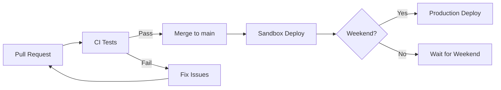

# Release and Deployment

omegaUp uses GitHub Actions for continuous integration and automated deployments.

## Deployment Environments

### Production
- **Schedule**: Automatically deployed on weekend nights (Central Mexico time)
- **URL**: [omegaup.com](https://omegaup.com)
- **Process**: All automated tests must pass before deployment

### Sandbox
- **Trigger**: Each merge into `main` branch
- **URL**: [sandbox.omegaup.com](https://sandbox.omegaup.com)
- **Purpose**: Pre-production testing environment
- **Benefits**: Catch errors early, enable rollbacks

### Hotfixes
- **Trigger**: Manual deployment for critical production errors
- **Process**: Internal validation process required

## CI/CD Pipeline

Before a PR is merged, it must pass:

### Validations

- **PHP Tests**: PHPUnit unit tests for controllers
- **JavaScript Tests**: Jest tests for Vue.js components
- **Linting**: Style and format validators for all languages
- **Type Checking**: Psalm for PHP type validation
- **Cypress E2E**: End-to-end tests for critical flows
- **Python Tests**: pytest automated tests

## Code Coverage

We use **Codecov** to measure test coverage:

- **PHP**: Coverage measured
- **TypeScript**: Coverage measured
- **Cypress**: Coverage not yet measured (pending)

## Deployment Flow

## Related Documentation

- **[Monitoring](monitoring.md)** - Monitoring tools
- **[Troubleshooting](troubleshooting.md)** - Common issues
