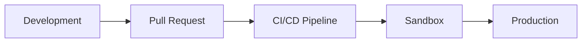

# Operations

Guides for deploying, monitoring, and maintaining omegaUp in development and production environments.

## Quick Navigation

| Guide | Description |
|-------|-------------|
| [Deployment](deployment.md) | Release process and deployment procedures |
| [Docker Setup](docker-setup.md) | Local development with Docker Compose |
| [Nginx Configuration](nginx-configuration.md) | Web server setup and configuration |
| [Monitoring](monitoring.md) | System monitoring and alerting |
| [Troubleshooting](troubleshooting.md) | Common issues and solutions |

## Environment Overview

| Environment | Purpose | URL |
|-------------|---------|-----|
| **Local** | Development | `localhost:8001` |
| **Sandbox** | Pre-production testing | `sandbox.omegaup.com` |
| **Production** | Live system | `omegaup.com` |

## Deployment Guides

### [Release & Deployment](deployment.md)

Learn about omegaUp's deployment process:

- CI/CD pipeline with GitHub Actions
- Automated weekend deployments
- Hotfix procedures
- Rollback strategies

### [Docker Setup](docker-setup.md)

Set up your local development environment:

- Docker Compose configuration
- Service architecture
- Volume management
- Common commands

## Infrastructure Guides

### [Nginx Configuration](nginx-configuration.md)

Web server setup including:

- Development vs production configs
- PHP-FPM proxying
- WebSocket configuration
- SSL/TLS setup
- Rate limiting

### [Monitoring](monitoring.md)

Keep track of system health:

- Prometheus metrics
- Grafana dashboards
- Alert configuration
- Log aggregation

## Support Guides

### [Troubleshooting](troubleshooting.md)

Solve common problems:

- Docker issues
- Database problems
- Build failures
- Production debugging

## Related Documentation

- **[Architecture](../architecture/index.md)** - System architecture details
- **[Infrastructure](../architecture/infrastructure.md)** - Redis, RabbitMQ, services
- **[Development Setup](../getting-started/development-setup.md)** - Getting started guide
- **[Security](../architecture/security.md)** - Security configuration
