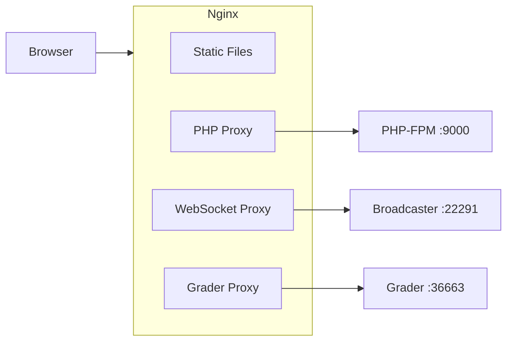

# Nginx Configuration

omegaUp uses Nginx as the web server and reverse proxy. This guide covers configuration for both development and production environments.

## Architecture



## Development Configuration

The development Nginx configuration is located at `stuff/docker/etc/nginx/nginx.conf`:

```nginx
daemon off;
pid /tmp/nginx.pid;
worker_processes 1;

error_log /dev/stderr error;

events {
    worker_connections 1024;
}

http {
    # Temp directories for non-root operation
    client_body_temp_path /tmp/client_body;
    fastcgi_temp_path /tmp/fastcgi_temp;
    proxy_temp_path /tmp/proxy_temp;
    
    access_log /dev/stderr;
    
    # Buffer sizes for proxying
    proxy_busy_buffers_size 512k;
    proxy_buffers 4 512k;
    proxy_buffer_size 256k;
    
    include /etc/nginx/mime.types;
    
    # PHP-FPM upstream
    upstream php {
        server 127.0.0.1:9000;
    }
    
    server {
        listen 8001 default_server;
        listen [::]:8001 default_server ipv6only=on;
        
        root /opt/omegaup/frontend/www;
        index index.php index.html;
        
        # Default location
        location / {
            index index.php index.html;
        }
        
        # PHP handling
        location ~* "\.php(/|$)" {
            fastcgi_index index.php;
            fastcgi_keep_conn on;
            
            # FastCGI buffers
            fastcgi_buffer_size 64k;
            fastcgi_buffers 16 32k;
            fastcgi_busy_buffers_size 64k;
            
            # FastCGI parameters
            fastcgi_param QUERY_STRING $query_string;
            fastcgi_param REQUEST_METHOD $request_method;
            fastcgi_param CONTENT_TYPE $content_type;
            fastcgi_param CONTENT_LENGTH $content_length;
            fastcgi_param SCRIPT_FILENAME $request_filename;
            fastcgi_param SCRIPT_NAME $fastcgi_script_name;
            fastcgi_param REQUEST_URI $request_uri;
            fastcgi_param DOCUMENT_URI $document_uri;
            fastcgi_param DOCUMENT_ROOT $document_root;
            fastcgi_param SERVER_PROTOCOL $server_protocol;
            fastcgi_param GATEWAY_INTERFACE CGI/1.1;
            fastcgi_param SERVER_SOFTWARE nginx/$nginx_version;
            fastcgi_param REMOTE_ADDR $remote_addr;
            fastcgi_param REMOTE_PORT $remote_port;
            fastcgi_param SERVER_ADDR $server_addr;
            fastcgi_param SERVER_PORT $server_port;
            fastcgi_param SERVER_NAME $server_name;
            fastcgi_param HTTPS $https;
            fastcgi_param REDIRECT_STATUS 200;
            
            fastcgi_pass 127.0.0.1:9000;
        }
        
        # WebSocket endpoint for real-time events
        location ^~ /events/ {
            rewrite ^/events/(.*) /$1 break;
            proxy_pass http://broadcaster:22291;
            proxy_read_timeout 90;
            proxy_connect_timeout 90;
            proxy_redirect off;
            
            # WebSocket upgrade headers
            proxy_set_header Upgrade $http_upgrade;
            proxy_set_header Connection "upgrade";
            proxy_set_header Host $host;
            proxy_http_version 1.1;
        }
        
        # Grader web interface
        location /grader/ {
            try_files $uri $uri/ @grader;
        }
        
        location @grader {
            rewrite ^/grader/(.*) /$1 break;
            proxy_pass http://grader:36663;
        }
        
        # URL rewrites
        include /opt/omegaup/frontend/server/nginx.rewrites;
    }
}
```

## Production Configuration

### HTTPS Setup

```nginx
server {
    listen 80;
    server_name omegaup.com www.omegaup.com;
    return 301 https://$server_name$request_uri;
}

server {
    listen 443 ssl http2;
    server_name omegaup.com www.omegaup.com;
    
    # SSL certificates
    ssl_certificate /etc/letsencrypt/live/omegaup.com/fullchain.pem;
    ssl_certificate_key /etc/letsencrypt/live/omegaup.com/privkey.pem;
    
    # SSL configuration
    ssl_protocols TLSv1.2 TLSv1.3;
    ssl_ciphers ECDHE-ECDSA-AES128-GCM-SHA256:ECDHE-RSA-AES128-GCM-SHA256;
    ssl_prefer_server_ciphers off;
    ssl_session_timeout 1d;
    ssl_session_cache shared:SSL:50m;
    ssl_stapling on;
    ssl_stapling_verify on;
    
    # Security headers
    add_header Strict-Transport-Security "max-age=63072000" always;
    add_header X-Frame-Options DENY;
    add_header X-Content-Type-Options nosniff;
    add_header X-XSS-Protection "1; mode=block";
    
    root /opt/omegaup/frontend/www;
    index index.php index.html;
    
    # ... rest of configuration
}
```

### Rate Limiting

```nginx
http {
    # Define rate limit zones
    limit_req_zone $binary_remote_addr zone=api:10m rate=10r/s;
    limit_req_zone $binary_remote_addr zone=login:10m rate=1r/s;
    limit_req_zone $binary_remote_addr zone=submit:10m rate=2r/s;
    
    server {
        # API rate limiting
        location /api/ {
            limit_req zone=api burst=20 nodelay;
            # ... PHP handling
        }
        
        # Login rate limiting (stricter)
        location /api/Session/login/ {
            limit_req zone=login burst=5;
            # ... PHP handling
        }
        
        # Submission rate limiting
        location /api/Run/create/ {
            limit_req zone=submit burst=10;
            # ... PHP handling
        }
    }
}
```

### Static Asset Caching

```nginx
server {
    # Static assets with long cache
    location ~* \.(css|js|png|jpg|jpeg|gif|ico|svg|woff|woff2)$ {
        expires 1y;
        add_header Cache-Control "public, immutable";
        access_log off;
    }
    
    # HTML with short cache
    location ~* \.html$ {
        expires 1h;
        add_header Cache-Control "public, must-revalidate";
    }
}
```

### Gzip Compression

```nginx
http {
    gzip on;
    gzip_vary on;
    gzip_proxied any;
    gzip_comp_level 6;
    gzip_types
        text/plain
        text/css
        text/xml
        application/json
        application/javascript
        application/xml
        application/xml+rss
        image/svg+xml;
    gzip_min_length 256;
}
```

## URL Rewrites

The `nginx.rewrites` file handles clean URLs:

```nginx
# API endpoints
rewrite ^/api/(.*)$ /api/ApiEntryPoint.php last;

# Contest arena
rewrite ^/arena/([^/]+)/$ /arena/contest.php?contest_alias=$1 last;
rewrite ^/arena/([^/]+)/scoreboard/([^/]+)/$ /arena/scoreboard.php?contest_alias=$1&scoreboard_token=$2 last;

# Problem pages
rewrite ^/problem/([^/]+)/$ /problem/problem.php?problem_alias=$1 last;
rewrite ^/problem/([^/]+)/edit/$ /problem/edit.php?problem_alias=$1 last;

# User profiles
rewrite ^/profile/([^/]+)/$ /profile/profile.php?username=$1 last;

# Course pages
rewrite ^/course/([^/]+)/$ /course/course.php?course_alias=$1 last;

# Group pages
rewrite ^/group/([^/]+)/$ /group/group.php?group_alias=$1 last;
```

## Load Balancing (Multiple Servers)

```nginx
upstream php_backend {
    least_conn;
    server php1:9000 weight=5;
    server php2:9000 weight=5;
    server php3:9000 backup;
}

upstream grader_backend {
    server grader1:21680;
    server grader2:21680;
}
```

## Health Check Endpoint

```nginx
server {
    location /health/ {
        access_log off;
        return 200 "OK\n";
        add_header Content-Type text/plain;
    }
    
    location /nginx_status {
        stub_status on;
        access_log off;
        allow 127.0.0.1;
        deny all;
    }
}
```

## Logging

### Access Log Format

```nginx
http {
    log_format main '$remote_addr - $remote_user [$time_local] '
                    '"$request" $status $body_bytes_sent '
                    '"$http_referer" "$http_user_agent" '
                    '$request_time $upstream_response_time';
    
    log_format json escape=json '{'
        '"time":"$time_iso8601",'
        '"remote_addr":"$remote_addr",'
        '"request":"$request",'
        '"status":$status,'
        '"body_bytes_sent":$body_bytes_sent,'
        '"request_time":$request_time,'
        '"upstream_response_time":"$upstream_response_time"'
    '}';
    
    access_log /var/log/nginx/access.log json;
}
```

## Troubleshooting

### Common Issues

**502 Bad Gateway**:
```bash
# Check PHP-FPM is running
docker-compose logs frontend | grep php-fpm
```

**504 Gateway Timeout**:
```nginx
# Increase timeouts
fastcgi_read_timeout 300;
proxy_read_timeout 300;
```

**WebSocket Connection Failed**:
```nginx
# Ensure upgrade headers are set
proxy_set_header Upgrade $http_upgrade;
proxy_set_header Connection "upgrade";
```

### Testing Configuration

```bash
# Test configuration syntax
nginx -t

# Reload configuration
nginx -s reload

# View error logs
tail -f /var/log/nginx/error.log
```

## Related Documentation

- **[Docker Setup](docker-setup.md)** - Container configuration
- **[Deployment](deployment.md)** - Production deployment
- **[Security](../architecture/security.md)** - Security configuration
- **[Infrastructure](../architecture/infrastructure.md)** - Service architecture
