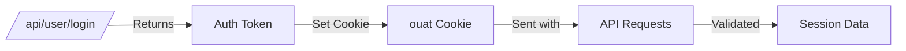
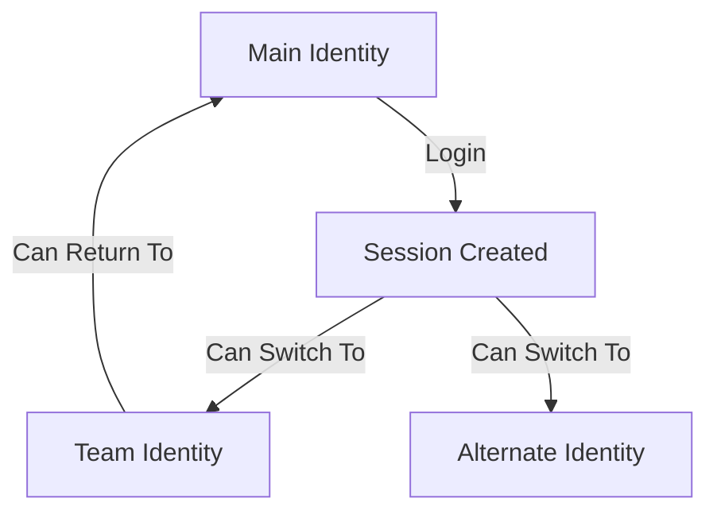

# API de administração e sistema

Esta página documenta endpoints administrativos e APIs de utilitários do sistema, incluindo gerenciamento de sessão, sincronização de horário e estatísticas de plataforma.

## API de sessão

### Obter sessão atual

Retorna informações sobre a sessão atual e horário do servidor. Útil para sincronizar o horário do cliente com o servidor.

**`GET /api/session/currentSession/`**

**Parâmetros:**

| Parâmetro | Tipo | Obrigatório | Descrição |
|-----------|------|----------|------------|
| `auth_token` | corda | Não | Token de autenticação (geralmente de cookie) |

**Resposta:**

```json
{
  "session": {
    "valid": true,
    "email": "user@example.com",
    "user": { ... },
    "identity": { ... },
    "classname": "user-rank-expert",
    "auth_token": "abc123...",
    "is_admin": false,
    "associated_identities": [
      { "username": "main-user", "default": true },
      { "username": "team:group:team1", "default": false }
    ],
    "api_tokens": [
      {
        "name": "CI Token",
        "timestamp": { "time": 1609459200 },
        "last_used": { "time": 1704067200 },
        "rate_limit": {
          "limit": 1000,
          "remaining": 950,
          "reset": { "time": 1704070800 }
        }
      }
    ]
  },
  "time": 1704067200
}
```
**Campos da sessão:**

| Campo | Descrição |
|-------|------------|
| `valid` | Se a sessão está autenticada |
| `email` | Endereço de e-mail do usuário |
| `user` | Objeto de usuário completo |
| `identity` | Identidade ativa atual |
| `loginIdentity` | Identidade de login original |
| `classname` | Classe CSS para exibição da classificação do usuário |
| `is_admin` | Estatuto de administrador do sistema |
| `associated_identities` | Identidades vinculadas (equipes, etc.) |
| `api_tokens` | Tokens de API ativos |

**Privilégios:** Público (retorna dados limitados se não for autenticado)

---

## API de tempo

### Obtenha o horário do servidor

Retorna o carimbo de data/hora atual do servidor. Essencial para sincronização de tempo de arena.

**`GET /api/time/get/`**

**Resposta:**

```json
{
  "time": 1704067200
}
```
**Casos de uso:**

- Sincronize os cronômetros do concurso com o servidor
- Calcule o desvio de tempo entre cliente e servidor
- Exibir o tempo restante preciso nas competições

**Privilégios:** Público (sem necessidade de autenticação)

---

## API de administração

### Estatísticas do relatório da plataforma

Retorna estatísticas agregadas da plataforma para relatórios administrativos.

**`GET /api/admin/platformReportStats/`**

**Parâmetros:**

| Parâmetro | Tipo | Obrigatório | Descrição |
|-----------|------|----------|------------|
| `start_time` | interno | Não | Carimbo de data e hora de início (padrão: 1º de janeiro do ano atual) |
| `end_time` | interno | Não | Carimbo de data/hora final (padrão: hora atual) |

**Resposta:**

```json
{
  "report": {
    "activeUsers": {
      "male": 5000,
      "female": 2500,
      "other": 500,
      "decline": 1000
    },
    "acceptedSubmissions": 150000,
    "activeSchools": 500,
    "courses": 50,
    "omiCourse": {
      "attemptedUsers": 1000,
      "passedUsers": 700,
      "completedUsers": 500
    }
  }
}
```
**Métricas:**

| Métrica | Descrição |
|--------|------------|
| `activeUsers` | Utilizadores com atividade, por género |
| `acceptedSubmissions` | Total de submissões de AC |
| `activeSchools` | Escolas com utilizadores ativos |
| `courses` | Número de cursos |
| `omiCourse` | Estatísticas do curso OMI |

**Privilégios:** Somente administrador do sistema

---

## Fluxo de autenticação

### Autenticação baseada em cookies

omegaUp usa o cookie `ouat` (omegaUp Auth Token) para gerenciamento de sessão.


### Autenticação de token de API

Para acesso programático, use tokens de API por meio do cabeçalho `Authorization`:

```bash
# Simple token
curl -H "Authorization: token abc123..." https://omegaup.com/api/...

# Token with identity selection
curl -H "Authorization: token Credential=abc123,Username=team:group:team1" \
  https://omegaup.com/api/...
```
---

## Limitação de taxa

Os tokens de API têm limites de taxa retornados nos cabeçalhos de resposta:

| Cabeçalho | Descrição |
|--------|------------|
| `X-RateLimit-Limit` | Máximo de pedidos por período |
| `X-RateLimit-Remaining` | Pedidos restantes |
| `X-RateLimit-Reset` | Carimbo de data/hora Unix quando o limite é redefinido |
| `Retry-After` | Segundos de espera (quando o limite for excedido) |

**Resposta de erro (429):**

```json
{
  "status": "error",
  "error": "Rate limit exceeded",
  "errorcode": 429
}
```
---

## Troca de identidade

Os usuários com identidades associadas (equipes, identidades alternativas) podem alternar entre elas:


Isso é tratado internamente ao selecionar uma identidade na IU ou por meio de credenciais de token de API.

---

## Casos de uso

### Sincronização de horário

```javascript
// Sync client time with server
async function syncTime() {
  const response = await fetch('/api/time/get/');
  const { time } = await response.json();
  const serverTime = time * 1000; // Convert to milliseconds
  const clientTime = Date.now();
  const drift = serverTime - clientTime;
  return drift;
}
```
### Verifique o status da sessão

```javascript
async function checkSession() {
  const response = await fetch('/api/session/currentSession/');
  const { session } = await response.json();
  
  if (!session.valid) {
    // Redirect to login
    window.location.href = '/login/';
    return;
  }
  
  console.log(`Logged in as: ${session.identity.username}`);
  console.log(`Admin: ${session.is_admin}`);
}
```
---

## Documentação Relacionada

- **[Autenticação](authentication.md)** - Guia detalhado de autenticação
- **[API de usuários](users.md)** - Gerenciamento e login de usuários

## Referência completa

Para obter detalhes completos de implementação, consulte:

- [Controlador de sessão](https://github.com/omegaup/omegaup/blob/main/frontend/server/src/Controllers/Session.php)
- [Controlador de tempo](https://github.com/omegaup/omegaup/blob/main/frontend/server/src/Controllers/Time.php)
- [Controlador administrativo](https://github.com/omegaup/omegaup/blob/main/frontend/server/src/Controllers/Admin.php)
