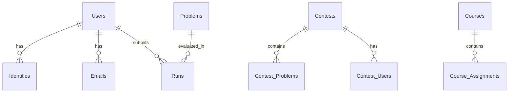

# Esquema de banco de dados

omegaUp usa MySQL 8.0.39 como sistema de banco de dados. O esquema consiste em mais de 77 tabelas organizadas em torno de entidades principais.

## Entidades principais

### Usuários e Identidades
- **Usuários**: contas de usuários principais
- **Identidades**: identidades de usuário (suporta múltiplas identidades por usuário)
- **E-mails**: endereços de e-mail vinculados aos usuários
- **Escolas**: Instituições educacionais

### Problemas
- **Problemas**: definições de problemas
- **Problem_Tags**: categorização de problemas
- **Problem_Of_The_Week**: Problemas apresentados

### Concursos
- **Concursos**: definições de concurso
- **Contest_Problems**: Problemas em concursos
- **Contest_Users**: participantes do concurso
- **Contest_Clarifications**: perguntas e respostas do concurso

### Envios
- **Execuções**: registros de envio
- **Runs_Groups**: resultados de casos de teste agrupados
- **Envios**: metadados de envio

### Cursos
- **Cursos**: Definições dos cursos
- **Course_Assignments**: tarefas do curso
- **Course_Problems**: Problemas em cursos

## Principais relacionamentos

## Migrações de banco de dados

As alterações no esquema do banco de dados são gerenciadas por meio de arquivos de migração em `frontend/database/`:

- Arquivos de migração: `00001_initial_schema.sql`, `00002_*.sql`, etc.
- Esquema principal: `schema.sql` (gerado a partir de migrações)
- Aplicar migrações: `./stuff/db-migrate.py migrate`

## Documentação Relacionada

- **[Padrões de banco de dados](../development/database-patterns.md)** - Uso de DAO/VO
- **[Arquitetura de back-end](backend.md)** - Estrutura de back-end
- **[Comandos Úteis](../development/useful-commands.md)** - Comandos de banco de dados
