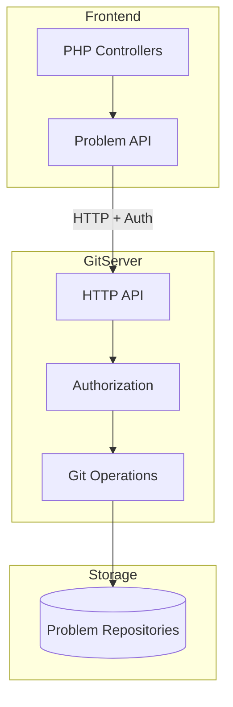
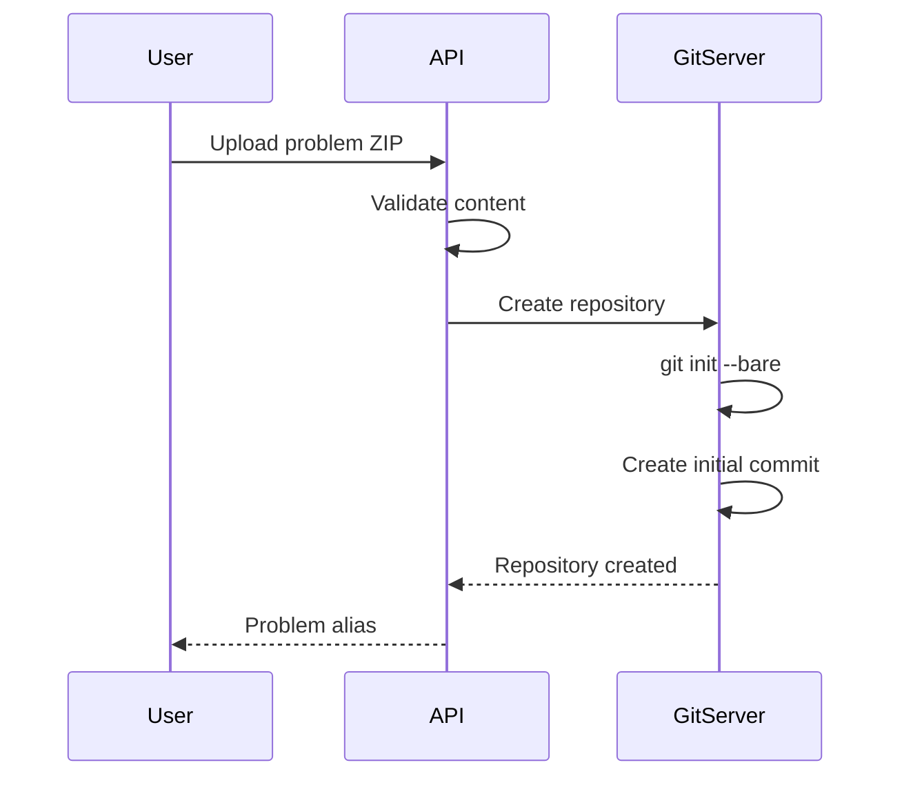
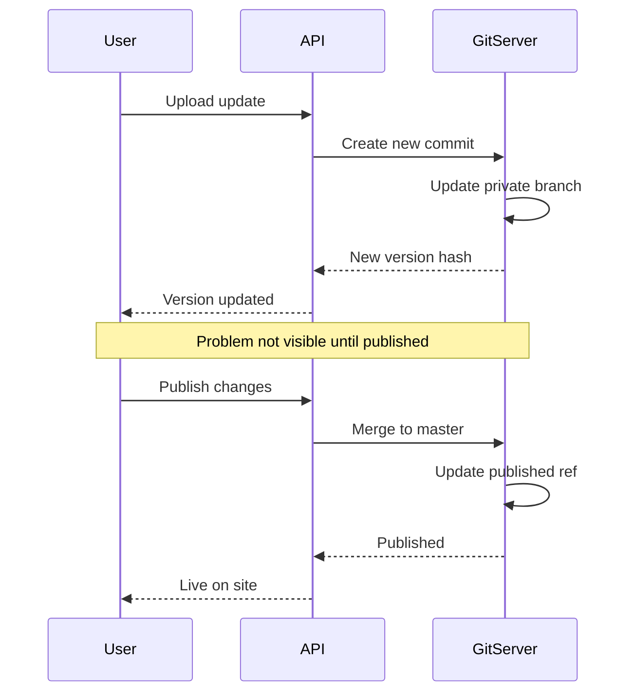
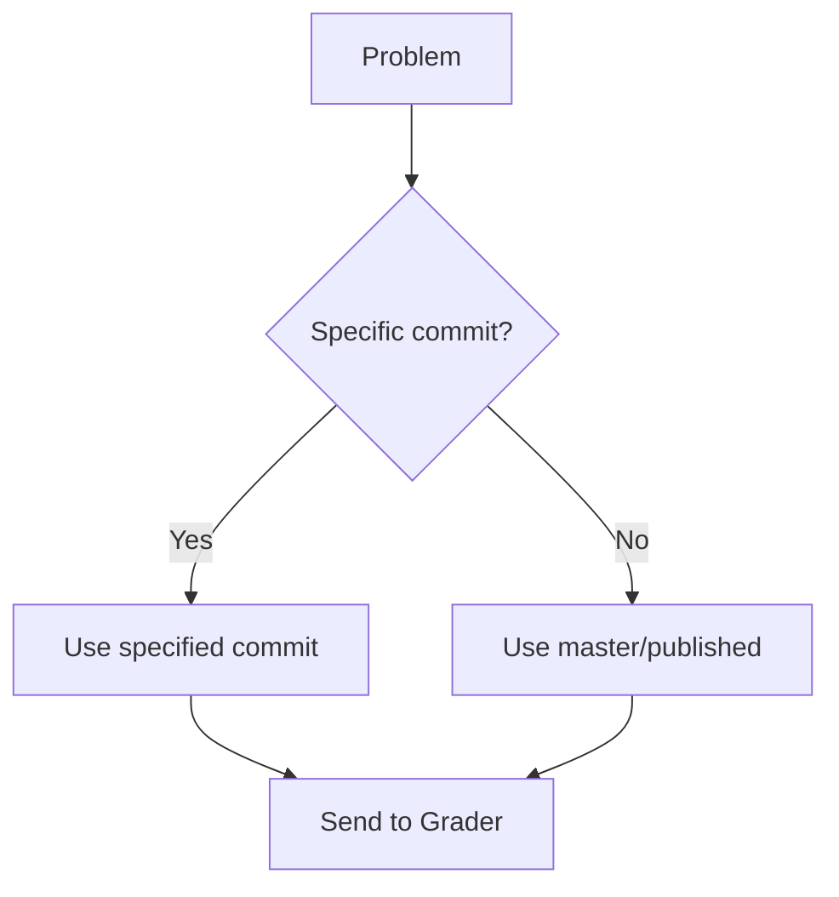

# Arquitetura GitServer

O GitServer gerencia repositórios de problemas, fornecendo controle de versão para declarações de problemas, casos de teste e validadores. Ele permite controle de versão de problemas, reversão e edição simultânea.

## Visão geral

Cada problema no omegaUp é armazenado como um repositório Git, permitindo:

- **Histórico de versões**: acompanhe todas as alterações nos problemas
- **Atualizações atômicas**: atualizações de problemas do tipo tudo ou nada
- **Reversão**: Reverter para qualquer versão anterior
- **Ramificação**: manter diversas versões do problema

## Arquitetura


## Estrutura do repositório

Cada problema é armazenado em um repositório Git simples:

```
/var/lib/omegaup/problems/{problem_alias}.git/
├── HEAD
├── config
├── objects/
│   ├── pack/
│   └── info/
└── refs/
    ├── heads/
    │   ├── master        # Current published version
    │   ├── private       # Private (draft) version
    │   └── published     # Alias for master
    └── tags/
        ├── v1
        └── v2
```
## Estrutura do conteúdo do problema

Dentro de cada repositório, o conteúdo do problema segue esta estrutura:

```
problem/
├── statements/
│   ├── es.markdown      # Spanish statement
│   ├── en.markdown      # English statement
│   └── images/
│       └── diagram.png
├── cases/
│   ├── 1.in             # Test input
│   ├── 1.out            # Expected output
│   ├── 2.in
│   ├── 2.out
│   └── ...
├── solutions/
│   └── solution.cpp     # Official solution
├── validators/
│   └── validator.cpp    # Custom validator (optional)
├── interactive/
│   └── Main.cpp         # Interactive problem (optional)
├── settings.json        # Problem configuration
└── testplan            # Test case weights (optional)
```
## Configurações de problemas

O arquivo `settings.json` define a configuração do problema:

```json
{
  "Limits": {
    "TimeLimit": "1s",
    "MemoryLimit": "64MiB",
    "OverallWallTimeLimit": "30s",
    "OutputLimit": "10240KiB"
  },
  "Validator": {
    "Name": "token-caseless"
  },
  "Interactive": {
    "IdlName": "Main",
    "ModuleName": "Main"
  },
  "Cases": [
    {
      "Name": "group1",
      "Cases": ["1", "2", "3"],
      "Weight": 50
    },
    {
      "Name": "group2", 
      "Cases": ["4", "5"],
      "Weight": 50
    }
  ]
}
```
## Terminais de API

### Operações problemáticas

| Ponto final | Método | Descrição |
|----------|--------|------------|
| `/problem/{alias}/` | OBTER | Obtenha informações sobre o problema |
| `/problem/{alias}/tree/{ref}/` | OBTER | Obtenha listagem de diretório |
| `/problem/{alias}/blob/{ref}/{path}` | OBTER | Obtenha o conteúdo do arquivo |
| `/problem/{alias}/archive/{ref}.zip` | OBTER | Baixe como ZIP |

### Operações de versão

| Ponto final | Método | Descrição |
|----------|--------|------------|
| `/problem/{alias}/versions/` | OBTER | Listar todas as versões |
| `/problem/{alias}/log/` | OBTER | Histórico de commits do Git |
| `/problem/{alias}/refs/` | OBTER | Listar ramificações/tags |

### Operações de atualização

| Ponto final | Método | Descrição |
|----------|--------|------------|
| `/problem/{alias}/update/` | POSTAR | Atualizar conteúdo do problema |
| `/problem/{alias}/publish/` | POSTAR | Publicar versão preliminar |
| `/problem/{alias}/git-upload-pack` | POSTAR | Protocolo push Git |

## Fluxo de controle de versão

### Criando um novo problema


### Atualizando um problema


### Seleção de versão para concursos


## Autenticação

### Cabeçalho de autorização

As solicitações para GitServer incluem:

```
Authorization: OmegaUpSharedSecret secret {service}:{identity}
```
Componentes:
- `secret`: Segredo compartilhado configurado em ambos os serviços
- `service`: serviço de chamada (por exemplo, `grader`, `frontend`)
- `identity`: Identidade do usuário ou serviço

### Níveis de permissão

| Nível | Capacidades |
|-------|------------|
| **Administrador** | Acesso total, pode publicar |
| **Colaborador** | Pode atualizar filial privada |
| **Visualizador** | Leia a versão publicada |
| **Público** | Leia problemas públicos |

## Cache

### Cache do avaliador

O Grader mantém um cache local de arquivos problemáticos:

```
/var/lib/omegaup/problems/cache/
└── {problem_alias}/
    └── {commit_hash}/
        ├── cases/
        ├── validator
        └── settings.json
```
Invalidação de cache:
- Na notificação de atualização de problema
- Expiração baseada em TTL
- Atualização manual no rejulgamento

### Cache de front-end

As declarações do problema são armazenadas em cache no Redis:

Chave: `problem:{alias}:statement:{lang}:{commit}`
- TTL: 1 hora
- Invalidado na publicação

## Problema no formato ZIP

Ao enviar problemas, use esta estrutura ZIP:

```
problem.zip
├── statements/
│   └── es.markdown
├── cases/
│   ├── easy.1.in
│   ├── easy.1.out
│   ├── hard.1.in
│   └── hard.1.out
└── testplan           # Optional
```
### Formato do plano de teste

```
# Weights for test groups
easy 30
hard 70

# Test case listing
easy.1
easy.2
hard.1
hard.2
```
## Configuração

### Configuração do GitServer

```json
{
  "GitServer": {
    "RootPath": "/var/lib/omegaup/problems",
    "SecretToken": "shared-secret-token",
    "AllowDirectPushToMaster": false,
    "LibinteractivePath": "/usr/lib/libinteractive",
    "MaxCommitSize": 104857600
  },
  "HTTP": {
    "Port": 33861,
    "TLS": {
      "CertFile": "/etc/omegaup/ssl/gitserver.crt",
      "KeyFile": "/etc/omegaup/ssl/gitserver.key"
    }
  }
}
```
### Docker Compor

```yaml
gitserver:
  image: omegaup/gitserver
  ports:
    - "33861:33861"  # HTTP API
    - "33862:33862"  # Git protocol
  volumes:
    - problems:/var/lib/omegaup/problems
  environment:
    - OMEGAUP_SECRET_TOKEN=shared-secret
```
## Monitoramento

### Exame de saúde

```bash
curl http://gitserver:33861/health
```
Resposta:
```json
{
  "status": "ok",
  "repositories": 1500,
  "disk_usage": "10GB"
}
```
### Métricas

Disponível em `/metrics`:
- Contagem de repositórios
- Solicitar latência
- Tempo de operação do Git
- Taxas de erro

## Segurança

### Controle de acesso

- Todas as gravações requerem autenticação
- Problemas públicos legíveis por qualquer pessoa
- Problemas privados requerem acesso explícito
- Ações administrativas registradas

### Validação de entrada

- Tamanho máximo do ZIP: 100 MB
- Contagem máxima de arquivos: 1000
- Sanitização de nome de arquivo
- Validação do tipo de conteúdo

## Código Fonte

O GitServer faz parte do repositório [`gitserver`](https://github.com/omegaup/gitserver):

- `cmd/omegaup-gitserver/` - Ponto de entrada principal
- `githttp/` - manipuladores de API HTTP
- `gitserver/` - Operações principais do Git

## Documentação Relacionada

- **[Controle de versões de problemas](../features/problem-versioning.md)** - Guia de gerenciamento de versões
- **[API de problemas](../api/problems.md)** - Referência da API de problemas
- **[Grader Internals](grader-internals.md)** - Como o Grader usa o GitServer
