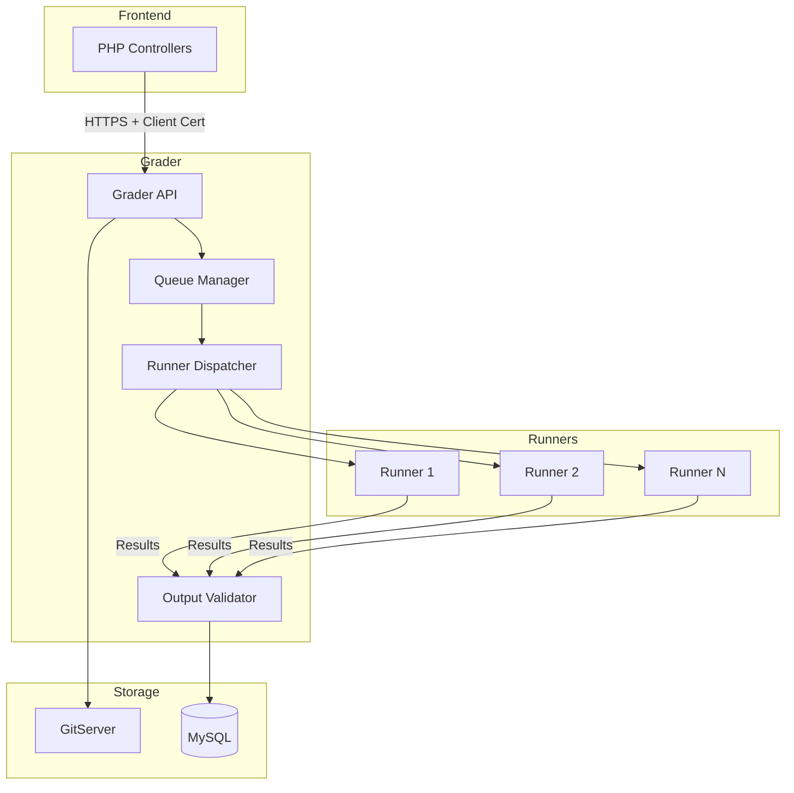
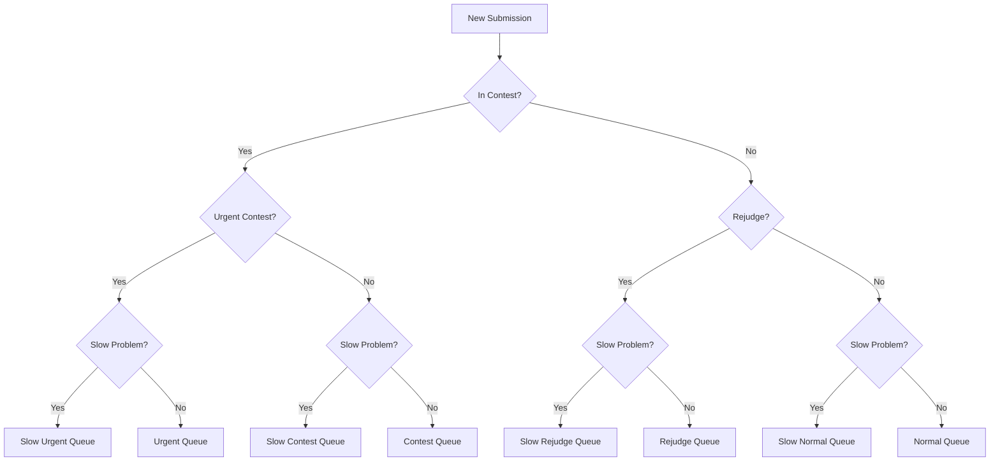
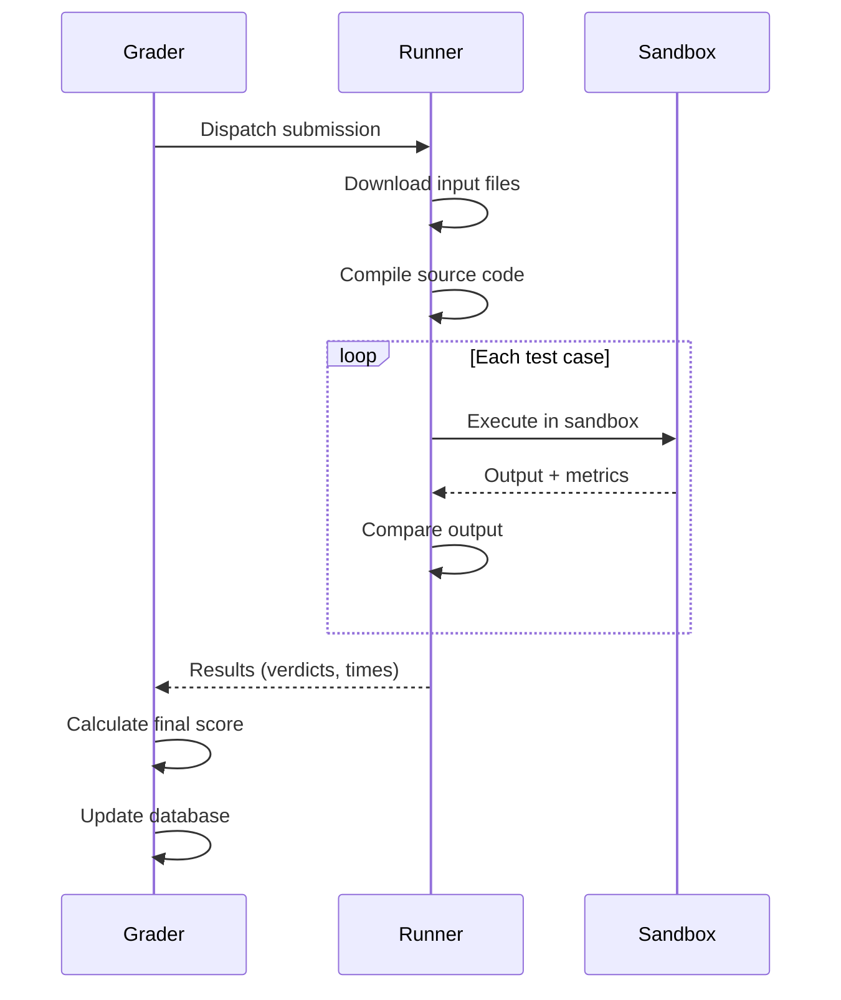

# Internos da niveladora

O Grader é o componente central de orquestração do sistema de avaliação do omegaUp. Escrito em Go, ele gerencia filas de envio, coordena Runners e determina os veredictos finais.

## Visão geral da arquitetura


## Sistema de filas

O Grader mantém oito filas de prioridade para lidar com diferentes tipos de envio:

### Tipos de fila

| Fila | Prioridade | Finalidade |
|-------|----------|--------|
| **Urgente** | 1 (mais alto) | Concursos de alta prioridade marcados como urgentes |
| **Lento Urgente** | 2 | Envios urgentes para problemas lentos |
| **Concurso** | 3 | Inscrições regulares para concursos |
| **Concurso Lento** | 4 | Envios de concursos para problemas lentos |
| **Normal** | 5 | Inscrições no modo prático |
| **Lento Normal** | 6 | Pratique submissões para problemas lentos |
| **Rejulgar** | 7 | Pedidos de rejulgamento |
| **Rejulgamento lento** | 8 (mais baixo) | Rejulgar por problemas lentos |

### Lógica de roteamento de fila


### Definição de problema lento

Um problema é considerado “lento” se:
- O limite de tempo excede 30 segundos
- Ou o problema está explicitamente marcado como lento

**Restrição de fila lenta**: apenas 50% dos executores podem processar simultaneamente envios de fila lenta para evitar a falta de recursos.

## Coordenação do Corredor

### Registro do Corredor

1. Os corredores se conectam ao Grader na inicialização
2. Registre-se com suas capacidades (memória, CPU)
3. Registre-se novamente a cada 60 segundos como batimento cardíaco
4. O Grader remove os corredores que perdem os batimentos cardíacos

### Algoritmo de Despacho

O método `RunnerDispatcher.dispatchLocked()`:

1. Seleciona o envio de maior prioridade nas filas
2. Encontra um Runner disponível (round-robin, sem afinidade)
3. Cria um `GradeTask` com prazo de 10 minutos
4. Envios para Runner via HTTPS

```
Priority Order:
Urgent → Slow Urgent → Contest → Slow Contest → 
Normal → Slow Normal → Rejudge → Slow Rejudge
```
### Fluxo de execução


## Determinação do veredicto

### Tipos de veredicto

| Veredicto | Código | Descrição |
|--------|------|---------|
| Aceito | `AC` | Resposta correta |
| Parcialmente aceito | `PA` | Alguns casos de teste foram aprovados |
| Erro de apresentação | `PE` | Problemas de formato de saída |
| Resposta errada | `WA` | Saída incorreta |
| Prazo excedido | `TLE` | Prazo excedido |
| Limite de saída excedido | `OLE` | Muita produção |
| Limite de memória excedido | `MLE` | Limite de memória excedido |
| Erro de tempo de execução | `RTE` | Programa travou |
| Erro de função restrita | `RFE` | Syscall proibido usado |
| Erro de compilação | `CE` | Falha ao compilar |
| Erro do juiz | `JE` | Erro de classificação interna |
| Erro do validador | `VE` | Validador travou |

### Lógica de pontuação

1. **Veredicto por caso de teste**: Cada caso de teste recebe um veredicto
2. **Atribuição de peso**:
   - Se `/testplan` existir: analise pesos explícitos
   - Caso contrário: pesos iguais (1/N para N casos)
3. **Pontuação de grupo**: Casos agrupados por prefixo de nome de arquivo (antes do primeiro `.`)
4. **Pontuação final**: Soma ponderada das pontuações dos grupos

### Formato do plano de teste

```
# Group weights (optional)
[group1]
weight = 30

[group2]  
weight = 70

# Test case to group mapping
group1.case1.in
group1.case2.in
group2.case1.in
group2.case2.in
```
## Terminais de API

O Grader expõe estas APIs internas (acessadas via HTTPS com certificados de cliente):

### Gerenciamento de envios

| Ponto final | Método | Descrição |
|----------|--------|------------|
| `/run/new/{run_id}/` | POSTAR | Enviar nova corrida para avaliação |
| `/run/grade/` | POSTAR | Corridas de notas/rejulgamentos |
| `/submission/source/{guid}/` | OBTER | Recuperar fonte de envio |
| `/run/resource/` | OBTER | Obtenha recursos de execução |

### Status e controle

| Ponto final | Método | Descrição |
|----------|--------|------------|
| `/grader/status/` | OBTER | Obtenha o status do avaliador e o comprimento das filas |
| `/broadcast/` | POSTAR | Transmitir mensagens para clientes |

## Configuração

O Grader é configurado via JSON:

```json
{
  "Grader": {
    "BroadcasterURL": "https://broadcaster:32672/broadcast/",
    "GitserverURL": "http://gitserver:33861",
    "GitserverAuthorization": "OmegaUpSharedSecret secret omegaup:grader",
    "V1": {
      "Enabled": true
    }
  },
  "Runner": {
    "PreserveFiles": false
  },
  "Logging": {
    "Level": "info"
  }
}
```
### Configurações principais

| Configuração | Descrição |
|--------|-------------|
| `BroadcasterURL` | Servidor WebSocket para atualizações em tempo real |
| `GitserverURL` | Servidor de repositório de problemas |
| `GitserverAuthorization` | Cabeçalho de autenticação para GitServer |
| `PreserveFiles` | Manter os arquivos após a avaliação (depuração) |

## Monitoramento

### Status Resposta do Endpoint

```json
{
  "status": "ok",
  "grader": {
    "running": true,
    "queue_length": {
      "urgent": 0,
      "contest": 5,
      "normal": 12,
      "rejudge": 3
    },
    "runners": {
      "total": 4,
      "available": 2
    }
  }
}
```
### Porta de Métricas

O Grader expõe métricas do Prometheus na porta 6060:

- Comprimentos de fila por tipo
- Disponibilidade do corredor
- Latências de classificação
- Taxas de erro

## Segurança

### Autenticação

- PHP Frontend usa certificados de cliente para autenticação
- Segredo compartilhado para comunicação interna do serviço
- Todo o tráfego criptografado via HTTPS

### Caixa de areia

Toda a execução de código acontece em Runners em sandbox (consulte [Runner Internals](runner-internals.md)).

## Código Fonte

O Grader é implementado no repositório [`quark`](https://github.com/omegaup/quark):

- `cmd/omegaup-grader/` - Ponto de entrada principal
- `grader/` - Lógica de classificação central
- `runner/` - Coordenação do corredor

## Documentação Relacionada

- **[Runner Internals](runner-internals.md)** - Detalhes de execução do código
- **[Internos do Sistema](internals.md)** - Fluxo de solicitação completo
- **[Recursos: Graduador](../features/grader.md)** - Visão geral de alto nível
