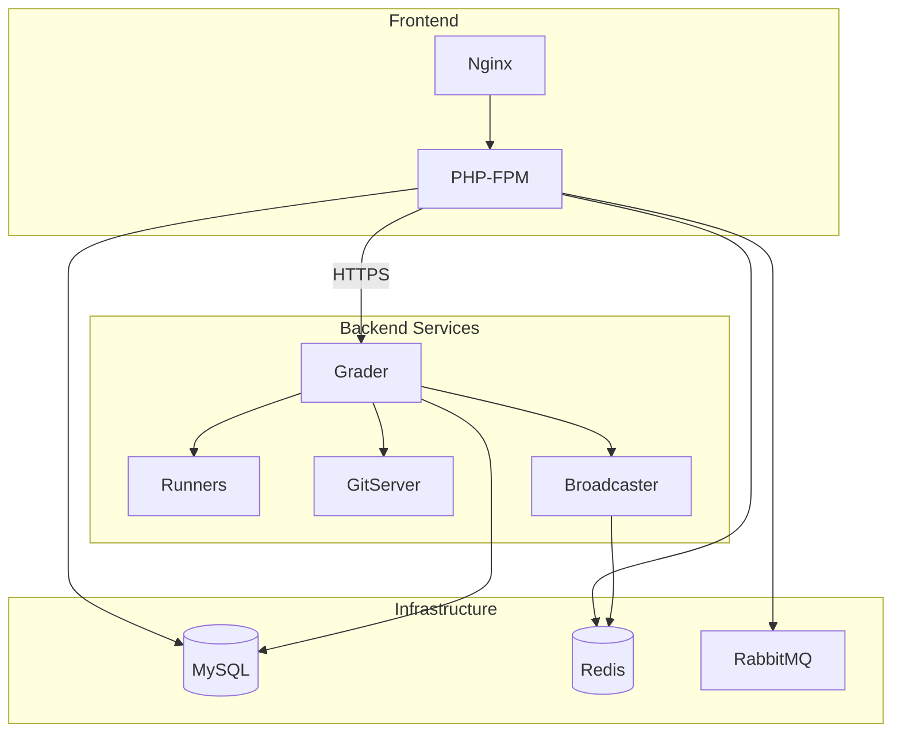
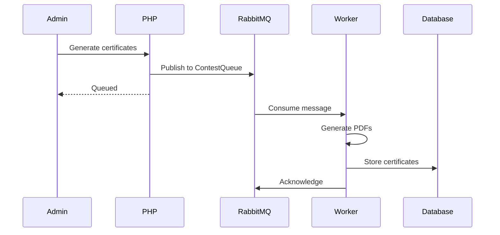
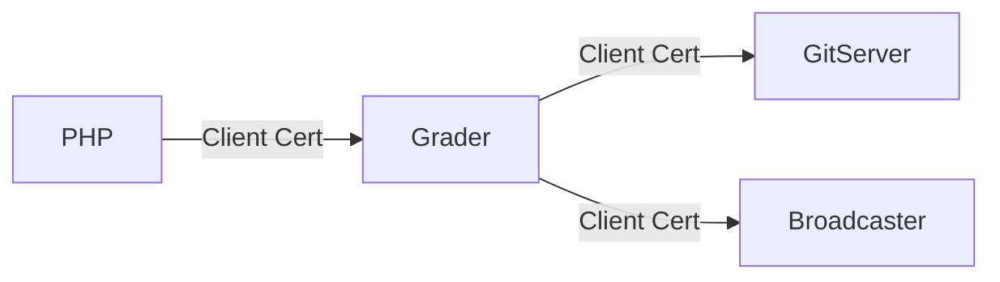

# Componentes de infraestrutura

Esta página documenta os componentes de infraestrutura de suporte que permitem a arquitetura distribuída do omegaUp: Redis para cache e sessões, RabbitMQ para enfileiramento de mensagens e padrões de comunicação entre serviços.

## Visão geral do sistema


## Redis

Redis serve como camada de cache e armazenamento de sessão para omegaUp.

### Casos de uso

| Caso de uso | Padrão Chave | TTL |
|----------|-------------|-----|
| Dados da sessão | `session:{token}` | 24h |
| Declarações de problemas | `problem:{alias}:statement:{lang}` | 1h |
| Cache do placar | `scoreboard:{contest}` | 30 anos |
| Limitação de taxa | `ratelimit:{ip}:{endpoint}` | 1min |
| Classificações escolares | `school_rank:{page}` | 1h |
| Cache de tags | `tags:{prefix}` | 1h |

### Armazenamento de Sessão

```php
// Session key format
$key = "session:{$authToken}";

// Session data structure
{
  "identity_id": 12345,
  "user_id": 67890,
  "login_time": 1704067200,
  "ip_address": "192.168.1.1"
}
```
### Padrão de cache

```php
// Get from cache or compute
$result = \OmegaUp\Cache::getFromCacheOrSet(
    \OmegaUp\Cache::SCHOOL_RANK,
    "{$page}-{$length}",
    fn () => \OmegaUp\DAO\Schools::getRank($page, $length),
    3600 // TTL in seconds
);
```
### Invalidação de cache

```php
// Delete specific key
\OmegaUp\Cache::deleteFromCache(
    \OmegaUp\Cache::SESSION_PREFIX,
    $authToken
);

// Pattern-based invalidation
\OmegaUp\Cache::invalidateAllKeys(
    \OmegaUp\Cache::PROBLEM_STATEMENT,
    $problemAlias
);
```
### Configuração

```yaml
# docker-compose.yml
redis:
  image: redis:7-alpine
  ports:
    - "6379:6379"
  volumes:
    - redis_data:/data
  command: redis-server --appendonly yes
```

```php
// PHP configuration
define('REDIS_HOST', 'redis');
define('REDIS_PORT', 6379);
define('REDIS_PASS', '');
```
## CoelhoMQ

RabbitMQ lida com processamento de tarefas assíncronas e mensagens entre serviços.

### Filas

| Fila | Finalidade | Consumidor |
|-------|------------|----------|
| `ContestQueue` | Geração de certificados | Trabalhador certificado |
| `SubmissionQueue` | Processamento de envio assíncrono | Graduador |
| `NotificationQueue` | Notificações por e-mail | Trabalhador de notificação |
| `AnalyticsQueue` | Análise de uso | Trabalhador analítico |

### Fluxo de geração de certificado


### Formato da mensagem

```json
{
  "type": "generate_certificates",
  "contest_id": 123,
  "certificate_cutoff": 10,
  "ranking": [
    {"username": "user1", "place": 1},
    {"username": "user2", "place": 2}
  ],
  "timestamp": 1704067200
}
```
### Publicação de mensagens

```php
// Get RabbitMQ channel
$channel = \OmegaUp\RabbitMQConnection::getInstance()->channel();

// Prepare message
$message = new \PhpAmqpLib\Message\AMQPMessage(
    json_encode($data),
    ['delivery_mode' => 2] // Persistent
);

// Publish to exchange
$channel->basic_publish(
    $message,
    'certificates',  // Exchange
    'ContestQueue'   // Routing key
);
```
### Configuração

```yaml
# docker-compose.yml
rabbitmq:
  image: rabbitmq:3-management
  ports:
    - "5672:5672"   # AMQP
    - "15672:15672" # Management UI
  environment:
    RABBITMQ_DEFAULT_USER: omegaup
    RABBITMQ_DEFAULT_PASS: omegaup
  volumes:
    - rabbitmq_data:/var/lib/rabbitmq
```
### IU de gerenciamento

Acesse em `http://localhost:15672`:

- Monitorar comprimentos de fila
- Ver taxas de mensagens
- Gerenciar trocas e ligações
- Limpar filas para depuração

## Comunicação de serviço

### HTTPS interno

Os serviços se comunicam via HTTPS com certificados de cliente:


### Configuração do certificado

```bash
# Generate CA
openssl genrsa -out ca.key 4096
openssl req -new -x509 -days 365 -key ca.key -out ca.crt

# Generate service certificates
openssl genrsa -out grader.key 2048
openssl req -new -key grader.key -out grader.csr
openssl x509 -req -in grader.csr -CA ca.crt -CAkey ca.key -out grader.crt
```
### PHP para comunicação entre alunos

```php
class Grader {
    private function call(string $endpoint, array $data): array {
        $curl = curl_init();
        curl_setopt_array($curl, [
            CURLOPT_URL => "https://grader:21680{$endpoint}",
            CURLOPT_POST => true,
            CURLOPT_POSTFIELDS => json_encode($data),
            CURLOPT_SSLCERT => '/etc/omegaup/ssl/frontend.crt',
            CURLOPT_SSLKEY => '/etc/omegaup/ssl/frontend.key',
            CURLOPT_CAINFO => '/etc/omegaup/ssl/ca.crt',
        ]);
        
        $response = curl_exec($curl);
        return json_decode($response, true);
    }
}
```
### Descoberta de serviço

No Docker Compose, os serviços usam descoberta baseada em DNS:

```yaml
services:
  frontend:
    environment:
      - GRADER_URL=https://grader:21680
      - GITSERVER_URL=http://gitserver:33861
      - BROADCASTER_URL=https://broadcaster:32672
```
## Verificações de integridade

### Pontos de extremidade de integridade do serviço

| Serviço | Ponto final | Porto |
|--------|----------|------|
| Interface | `/health/` | 80 |
| Graduador | `/health` | 21680 |
| GitServer | `/health` | 33861 |
| Emissora | `/health` | 32672 |
| MySQL | Verificação TCP | 3306 |
| Redis | `PING` | 6379 |
| CoelhoMQ | API HTTP | 15672 |

### Verificações de integridade do Docker Compose

```yaml
services:
  mysql:
    healthcheck:
      test: ["CMD", "mysqladmin", "ping", "-h", "localhost"]
      interval: 10s
      timeout: 5s
      retries: 3
      
  redis:
    healthcheck:
      test: ["CMD", "redis-cli", "ping"]
      interval: 10s
      timeout: 5s
      retries: 3
      
  rabbitmq:
    healthcheck:
      test: ["CMD", "rabbitmq-diagnostics", "check_running"]
      interval: 30s
      timeout: 10s
      retries: 3
```
## Monitoramento

### Métricas do Prometheus

Cada serviço expõe métricas:

```
# Grader metrics
grader_queue_length{queue="contest"} 5
grader_submissions_total 150000
grader_runners_available 3

# Redis metrics
redis_connected_clients 15
redis_used_memory_bytes 104857600

# RabbitMQ metrics
rabbitmq_queue_messages{queue="ContestQueue"} 10
```
### Painéis Grafana

Principais painéis:

1. **Visão geral do sistema**: taxas de solicitação, taxas de erro, latências
2. **Painel do avaliador**: comprimento das filas, utilização do corredor
3. **Painel de Cache**: Taxas de acertos, uso de memória
4. **Painel de filas**: taxas de mensagens, atraso do consumidor

## Failover e recuperação

### Failover do Redis

Para produção, use Redis Sentinel:

```yaml
redis-sentinel:
  image: redis:7-alpine
  command: redis-sentinel /etc/redis/sentinel.conf
  volumes:
    - ./sentinel.conf:/etc/redis/sentinel.conf
```
### Clustering RabbitMQ

Para alta disponibilidade:

```yaml
rabbitmq1:
  environment:
    - RABBITMQ_ERLANG_COOKIE=secret
    
rabbitmq2:
  environment:
    - RABBITMQ_ERLANG_COOKIE=secret
  command: rabbitmqctl join_cluster rabbit@rabbitmq1
```
### Replicação de banco de dados

Replicação MySQL para escalonamento de leitura:

```yaml
mysql-primary:
  environment:
    - MYSQL_REPLICATION_MODE=master
    
mysql-replica:
  environment:
    - MYSQL_REPLICATION_MODE=slave
    - MYSQL_MASTER_HOST=mysql-primary
```
## Ajuste de desempenho

### Otimização Redis

```conf
# redis.conf
maxmemory 2gb
maxmemory-policy allkeys-lru
tcp-keepalive 300
```
### Otimização RabbitMQ

```conf
# rabbitmq.conf
vm_memory_high_watermark.relative = 0.6
disk_free_limit.absolute = 2GB
channel_max = 2000
```
### Pool de conexões

PHP usa conexões persistentes:

```php
// Redis connection pool
$redis = new \Redis();
$redis->pconnect(REDIS_HOST, REDIS_PORT);

// RabbitMQ connection reuse
$connection = \OmegaUp\RabbitMQConnection::getInstance();
```
## Documentação Relacionada

- **[Configuração do Docker](../operations/docker-setup.md)** - Configuração completa do Docker
- **[Implantação](../operations/deployment.md)** - Implantação de produção
- **[Monitoramento](../operations/monitoring.md)** - Configuração de monitoramento
- **[Segurança](security.md)** - Arquitetura de segurança
