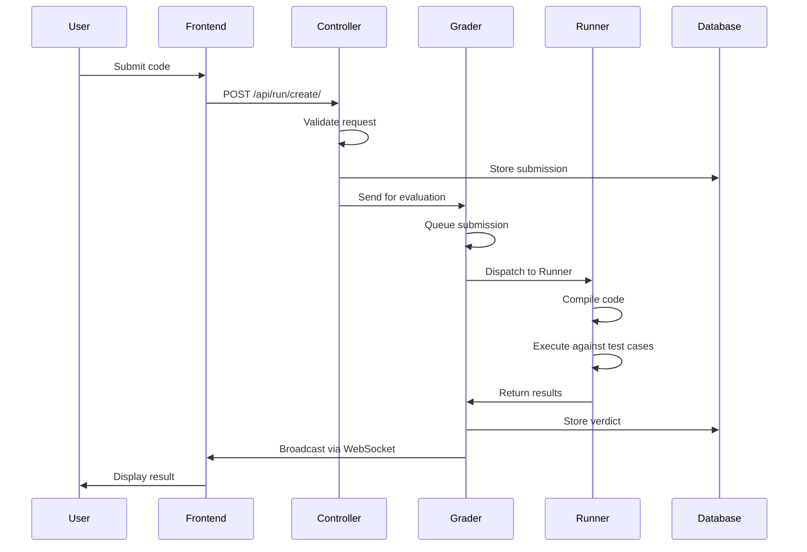

# Internos do sistema

Este documento explica como o omegaUp processa os envios do início ao fim.

## Fluxo de envio

## Processamento de front-end

Quando uma submissão é feita:

1. Código, alias do concurso, problema e idioma enviados via HTTP POST para `/api/run/create/`
2. Nginx encaminha para PHP (HHVM)
3. `bootstrap.php` carrega configuração e inicializa banco de dados
4. Objeto `Request` criado com parâmetros
5. URL tokenizado: `/api/run/create/` → `['run', 'create']`
6. `RunController::apiCreate()` invocado

## Autenticação e Validação

O controlador:

1. Valida o token de autenticação (cookie ou parâmetro POST)
2. Recupera ID do usuário
3. Valida permissões:
   - Elementos obrigatórios presentes
   - Problema pertence ao concurso
   - O prazo do concurso não expirou
   - Limite de taxa de envio (60 segundos por problema)
   - Visibilidade do concurso (pública ou listada pelo usuário)
4. Calcula a penalidade com base na política do concurso
5. Gera GUID aleatório
6. Armazena envio no banco de dados
7. Salva o código no sistema de arquivos
8. Envia solicitação HTTP para o Grader

## Processamento de niveladora

### Sistema de filas

O Grader mantém oito filas:

1. **Urgente** - Concursos de alta prioridade
2. **Lento Urgente** - Problemas urgentes, mas lentos
3. **Concurso** - Inscrições para concursos
4. **Concurso Lento** - Envios de concursos para problemas lentos
5. **Normal** - Envios no modo prático
6. **Lento Normal** - Problemas de lentidão no modo de prática
7. **Rejulgar** - Pedidos de rejulgamento
8. **Rejulgamento Lento** - Rejulgamento para problemas lentos

### Roteamento de fila

- Envios de concursos → Fila do concurso
- Pratique envios → Fila normal
- Solicitações de rejulgamento → Fila de rejulgamento
- Problemas lentos (>30s TLE) → Filas lentas

Apenas 50% dos Runners podem processar filas lentas simultaneamente para evitar a monopolização.

### Processo de Despacho

1. Envio adicionado à fila apropriada
2. `RunnerDispatcher.dispatchLocked()` seleciona envio de maior prioridade
3. Free Runner selecionado (round-robin)
4. Tempo de envio registrado
5. `GradeTask.gradeTask()` invocado no pool de threads
6. Prazo de 10 minutos aplicado

## Processamento do corredor

### Cadastro

- Os corredores se registram no Grader na inicialização
- Registre-se novamente a cada minuto para sinalizar vivacidade
- Implantado em VMs na nuvem

### Compilação

1. `Runner.compile()` invocado via HTTPS
2. Usa `Minijail` para compilação segura
3. Compila o arquivo principal (e validador, se presente)
4. Retorna token (caminho do sistema de arquivos) em caso de sucesso
5. Exclui arquivos temporários em caso de falha

### Execução

1. O avaliador envia token de compilação + hash SHA-1 de entrada
2. O executor verifica o cache em busca de arquivos de entrada
3. Se estiver faltando, solicita o arquivo `.zip` do Grader
4. Executa o programa compilado em cada arquivo `.in`
5. Armazena arquivos e metadados `.out`
6. Compacta com bzip2
7. Envia os resultados imediatamente para o Grader
8. Validador executado, se presente
9. Arquivos temporários excluídos

## Validação e pontuação

### Tipos de validadores

Todos os validadores tokenizam usando espaços:

- **token**: compare os tokens um por um
- **token-caseless**: comparação sem distinção entre maiúsculas e minúsculas
- **token-numérico**: Compare números com tolerância
- **personalizado**: validador definido pelo usuário

### Pontuação

1. Veredicto determinado para cada caso de teste
2. Se `/testplan` existir, analise e normalize os pesos
3. Caso contrário, pesos iguais (1/número de casos)
4. Casos agrupados por prefixo de nome de arquivo (antes do primeiro `.`)
5. O grupo concede pontos somente se todos os casos AC ou PA
6. Pontuação total = soma das pontuações do grupo × pontos do problema
7. Veredicto final armazenado em banco de dados

## Transmissão

A emissora:

1. Mantém conexões WebSocket para participantes do concurso
2. Filas `RunContext` após avaliação
3. Chama `/api/scoreboard/refresh` para envio de concursos
4. Atualiza o cache do placar
5. Notifica todos os participantes sobre alterações no placar
6. Registra dados de tempo e destrói `RunContext`

## Documentação Relacionada

- **[Visão geral da arquitetura](index.md)** - Arquitetura de alto nível
- **[Classificador](../features/grader.md)** - Detalhes do sistema do avaliador
- **[Runner](../features/runner.md)** - Detalhes do sistema do corredor
