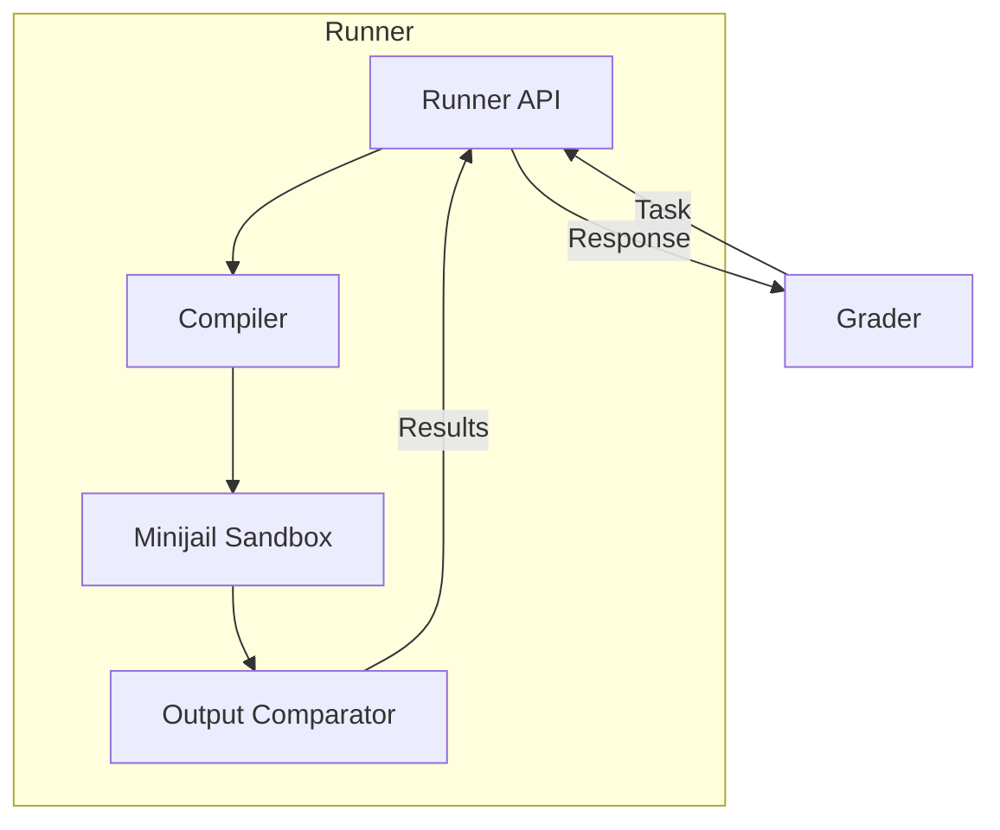
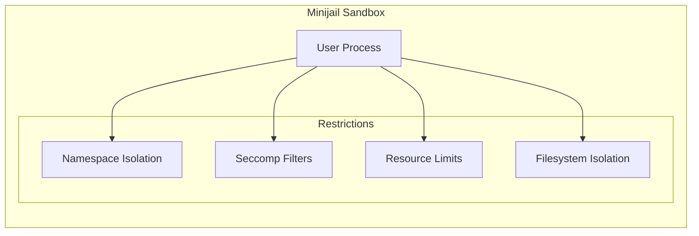
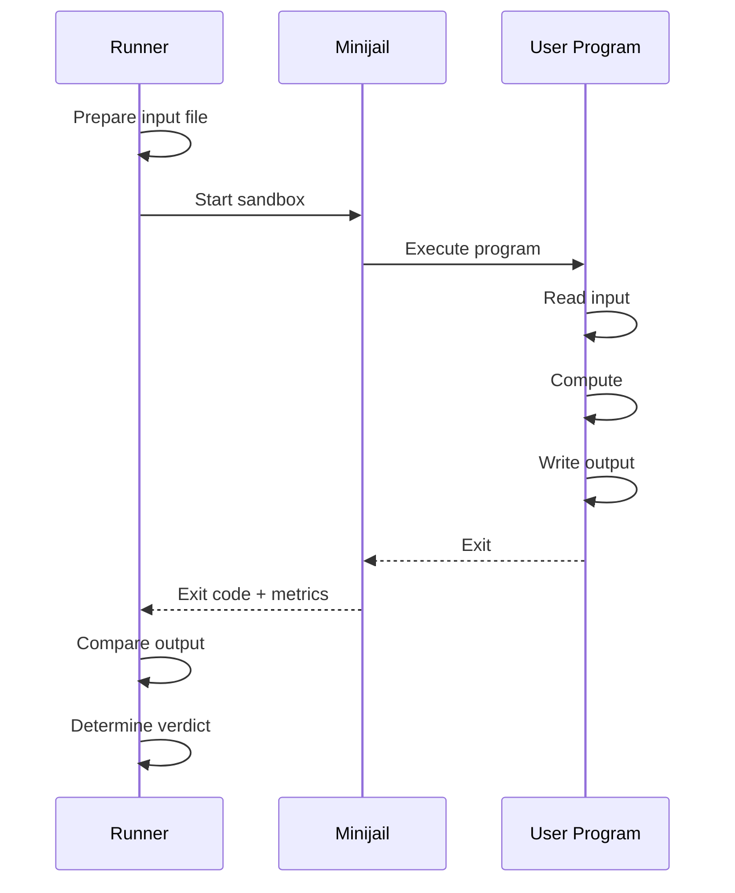
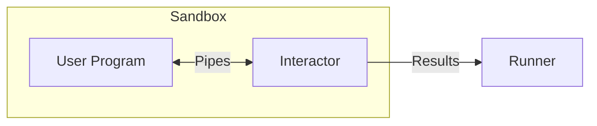

# Internos do corredor

Os executores são responsáveis por compilar e executar os envios dos usuários em um ambiente seguro e em área restrita. Eles recebem tarefas do avaliador e retornam os resultados da execução.

## Arquitetura


## Compilação

### Idiomas Suportados

| Idioma | Compilador/Intérprete | Versão |
|----------|---------------------|--------|
| C | CCG | 10+ |
| C++ (14/11/17/20) | G++ | 10+ |
| Java | OpenJDK | 17+ |
| Pitão 3 | CPython | 3.10+ |
| Python 2 (legado) | CPython | 2.7 |
| Karel (pascal/java) | Personalizado | - |
| Rubi | Rubi | 3.0+ |
| Pascal | Pascal grátis | 3.2+ |
| Haskel | GHC | 8.10+ |
| C# | Mono | 6.12+ |
| Lua | Lua | 5.4+ |

### Sinalizadores de compilação

####C/C++

```bash
# C
gcc -std=c11 -O2 -lm -o program program.c

# C++17 (default)
g++ -std=c++17 -O2 -lm -o program program.cpp

# C++20
g++ -std=c++20 -O2 -lm -o program program.cpp
```
####Java

```bash
# Compile
javac -encoding UTF-8 Main.java

# Run
java -Xmx{memory}m Main
```
####Píton

```bash
# Python 3 (no compilation)
python3 program.py

# Byte-compile check
python3 -m py_compile program.py
```
### Limites de compilação

| Recurso | Limite |
|----------|-------|
| Tempo | 30 segundos |
| Memória | 512 MB |
| Saída | 64 MB |
| Processos | 32 |

## Caixa de areia (Minijail)

O Runner usa [Minijail](https://android.googlesource.com/platform/external/minijail/), bifurcado do Chrome OS, para execução segura de código.

### Recursos de segurança


### Mecanismos de Isolamento

| Mecanismo | Descrição |
|-----------|------------|
| **Namespace PID** | Processo vê apenas a si mesmo |
| **Namespace de rede** | Sem acesso à rede |
| **Montar namespace** | Visão limitada do sistema de arquivos |
| **Seccomp** | Lista de permissões do Syscall |
| **cgrupos** | Limites de recursos |

### Syscalls permitidos

O filtro seccomp permite apenas syscalls essenciais:

- Operações de arquivo: `read`, `write`, `open`, `close`
- Memória: `mmap`, `munmap`, `brk`
- Processo: `exit`, `exit_group`
- Tempo: `clock_gettime` (limitado)

Operações proibidas:
- Syscalls de rede (`socket`, `connect`, etc.)
- Criação de processos (`fork`, `clone`, `execve`)
-IPC (`shmget`, `msgget`, etc.)

### Limites de recursos

Aplicado via cgroups e rlimits:

| Recurso | Mecanismo | Descrição |
|----------|-----------|------------|
| Tempo de CPU | cgrupo | Limite rígido por teste |
| Hora da parede | Temporizador | Limite de CPU 2x |
| Memória | cgrupo | Específico do problema |
| Tamanho do arquivo | limite | Limite de saída |
| Processos | cgrupo | 1 (sem bifurcação) |

## Fluxo de execução

### Execução por caso de teste


### Medição de recursos

O corredor mede:

- **Tempo de CPU**: ciclos reais de CPU usados
- **Tempo de parede**: tempo real decorrido
- **Memória**: Pico de uso de memória (via cgroup)
- **Tamanho de saída**: Bytes gravados em stdout

## Validação de saída

### Modos de comparação

| Modo | Descrição |
|------|-------------|
| **Exato** | Correspondência byte por byte |
| **Token** | Tokens normalizados por espaço em branco |
| **Numérico** | Tolerância de ponto flutuante |
| **Personalizado** | Validador específico do problema |

### Comparação de tokens

Modo de comparação padrão:
1. Divida a saída em tokens (separados por espaços em branco)
2. Compare sequências de tokens
3. Ignore os espaços em branco à direita
4. Ignore as novas linhas finais

### Validadores personalizados

Os problemas podem incluir validadores personalizados:

```
problem/
├── cases/
│   ├── 1.in
│   └── 1.out
└── validator
    └── validator.cpp
```
O validador recebe:
- Caminho do arquivo de entrada
- Caminho de saída esperado
- Caminho de saída do usuário
- Limite de pontuação

Retorna:
- Pontuação (0,0 a 1,0)
- Mensagem de veredicto

## Problemas interativos

Para problemas interativos, o Runner usa `libinteractive`:


O interator:
1. Funciona junto com o programa do usuário
2. Comunica-se via tubos stdin/stdout
3. Valida respostas em tempo real
4. Relata o veredicto final

## Tratamento de erros

### Determinação do veredicto

| Condição | Veredicto |
|-----------|---------|
| Saída correta | AC |
| Saída errada | WA |
| Tempo de CPU excedido | TLE |
| Tempo de parede excedido | TLE |
| Memória excedida | MLE |
| Saída muito grande | OLE |
| Saída diferente de zero | RTE |
| Sinal recebido | RTE |
| Chamada de sistema proibida | RFE |
| Falha na compilação | CE |

### Detalhes do erro de tempo de execução

O Corredor captura:
- Código de saída
- Número do sinal (se morto)
- Última syscall (se RFE)
- Memória em caso de acidente

## Configuração

### Configuração do corredor

```json
{
  "Runner": {
    "RuntimePath": "/var/lib/omegaup/runner",
    "GraderURL": "https://grader:21680/",
    "CompileTimeLimit": 30,
    "CompileMemoryLimit": 536870912,
    "PreserveFiles": false
  },
  "Sandbox": {
    "Path": "/usr/bin/minijail0",
    "TimeLimit": 60,
    "OutputLimit": 67108864
  }
}
```
### Estrutura de diretório

```
/var/lib/omegaup/runner/
├── cache/           # Compiled binaries cache
├── input/           # Test input files
├── runs/            # Active execution directories
│   └── {guid}/
│       ├── source   # User source code
│       ├── program  # Compiled binary
│       ├── input    # Current test input
│       ├── output   # User output
│       └── error    # Stderr capture
└── problems/        # Problem files cache
```
## Desempenho

### Cache

- **Cache de compilação**: Reutilize binários para fontes idênticas
- **Cache de entrada**: arquivos de teste problemáticos armazenados em cache localmente
- **Cache de problemas**: metadados e validadores de problemas

### Execução Paralela

- Cada corredor lida com uma submissão de cada vez
- Os casos de teste dentro de um envio podem ser executados em paralelo
- Vários corredores fornecem escala horizontal

## Considerações de segurança

### Defesa em profundidade

1. **Validação de código**: verificações básicas do código-fonte
2. **Sandbox de compilação**: ambiente de compilação limitado
3. **Sandbox de execução**: Isolamento completo do Minijail
4. **Limites de recursos**: limites rígidos para todos os recursos
5. **Isolamento de rede**: Sem comunicação externa

### Limitações conhecidas

- Possíveis ataques de temporização (tempo de CPU visível)
- Canais laterais de memória não totalmente mitigados
- Problemas interativos têm maior superfície de ataque

## Código Fonte

O Runner faz parte do repositório [`quark`](https://github.com/omegaup/quark):

- `runner/` - Lógica do corredor principal
- `sandbox/` - Integração Minijail
- `compiler/` - Compilação específica do idioma

## Documentação Relacionada

- **[Modern Internals](grader-internals.md)** - Fila e envio
- **[Recurso Sandbox](../features/sandbox.md)** - Visão geral do Sandbox
- **[Veredictos](../features/verdicts.md)** - Tipos de veredictos
