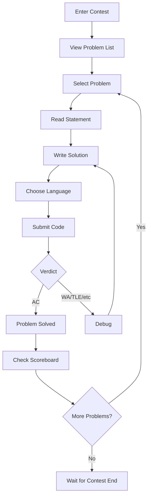

#Arena

Arena é a interface do concurso onde os participantes resolvem problemas durante as competições. Ele fornece um ambiente de resolução de problemas em tempo real com atualizações de placar ao vivo, envio de código e feedback instantâneo.

## Visão geral

A Arena é o coração da experiência do concurso omegaUp, oferecendo:

- **Exibição do problema**: visualize declarações de problemas com renderização matemática
- **Editor de Código**: editor baseado em Mônaco com destaque de sintaxe
- **Sistema de envio**: envie soluções e visualize resultados detalhados
- **Placar ao vivo**: classificações do concurso em tempo real
- **Esclarecimentos**: Sistema de perguntas e respostas para questões do concurso
- **Timer**: contagem regressiva do concurso e controle de tempo

## Layout da Arena

```
┌─────────────────────────────────────────────────────────────┐
│  Contest Title                              Timer: 01:30:00 │
├─────────┬───────────────────────────────────────────────────┤
│         │                                                   │
│ Problem │              Problem Statement                    │
│  List   │                                                   │
│         │  - Description                                    │
│  [A]    │  - Input/Output format                           │
│  [B]    │  - Constraints                                   │
│  [C]    │  - Examples                                      │
│         │                                                   │
│─────────┼───────────────────────────────────────────────────│
│         │                                                   │
│ Submit  │              Code Editor                          │
│ History │                                                   │
│         │  [Language: C++17 ▼]  [Submit]                   │
│         │                                                   │
├─────────┴───────────────────────────────────────────────────┤
│                    Scoreboard / Clarifications              │
└─────────────────────────────────────────────────────────────┘
```
## Fluxo do usuário


## Componentes principais

### Painel de Problemas

O painel de problemas exibe:

| Elemento | Descrição |
|--------|-------------|
| **Declaração** | Descrição do problema com suporte matemático LaTeX |
| **Formato de entrada** | Especificação de entrada esperada |
| **Formato de saída** | Formato de saída necessário |
| **Restrições** | Limite de tempo, limite de memória, limites de entrada |
| **Exemplos** | Amostra de pares de entrada/saída |
| **Notas** | Dicas ou esclarecimentos adicionais |

**Renderização matemática**:
```latex
$$ \sum_{i=1}^{n} a_i \leq 10^9 $$
```
### Editor de código

Recursos do Editor de Mônaco:

- **Destaque de sintaxe**: coloração específica do idioma
- **Preenchimento automático**: preenchimento básico de código
- **Números de linha**: referência fácil
- **Atalhos de teclado**: atalhos padrão do editor
- **Tema**: suporte ao modo claro/escuro

**Idiomas suportados**:

| Idioma | Extensão | Versão |
|----------|-----------|--------|
| C++ 17 | `.cpp` | CCG 10+ |
| C++ 11 | `.cpp` | CCG 10+ |
| Java | `.java` | OpenJDK 17 |
| Pitão 3 | `.py` | 3.10+ |
| Pitão 2 | `.py` | 2.7 |
| C | `.c` | CCG 10+ |
| Karel | `.kp`, `.kj` | Personalizado |
| Pascal | `.pas` | FPC 3.2 |

### Sistema de envio

#### Enviar Fluxo

1. Selecione o idioma no menu suspenso
2. Cole ou digite o código no editor
3. Clique no botão "Enviar"
4. Aguarde o veredicto (atualizações em tempo real)

#### Exibição do veredicto

| Veredicto | Cor | Significado |
|--------|-------|---------|
| AC | Verde | Aceito - todos os testes aprovados |
| PA | Amarelo | Parcial - alguns testes aprovados |
| WA | Vermelho | Resposta errada |
| TLE | Laranja | Prazo excedido |
| MLE | Laranja | Limite de memória excedido |
| RTE | Vermelho | Erro de tempo de execução |
| CE | Cinza | Erro de compilação |

#### Detalhes do envio

Clicar em um envio mostra:

- **Veredicto por caso de teste** (se permitido)
- **Tempo de execução e uso de memória**
- **Saída de compilação** (se CE)
- **Detalhamento da pontuação** (pontuação parcial)

### Placar

Placar em tempo real mostrando:

| Coluna | Descrição |
|--------|------------|
| Classificação | Posição atual |
| Usuário | Nome do participante |
| Pontuação | Total de pontos |
| Pena | Penalidade de tempo (ICPC) |
| Por problema | Situação por problema |

**Ícones de status de problema**:

- ✓ (verde): Aceito
- ✗ (vermelho): Tentativas de resposta errada
- ? (amarelo): Pendente de julgamento
- - (cinza): Não tentado

### Esclarecimentos

Sistema de perguntas e respostas para concursos:

1. **Pergunte**: envie uma pergunta sobre um problema
2. **Ver**: Veja esclarecimentos públicos
3. **Notificações**: alertas em tempo real para respostas

**Tipos de esclarecimento**:

- **Público**: Visível para todos os participantes
- **Privado**: Somente para o participante solicitante

## Modos de concurso

### Modo de prática

Fora dos horários do concurso:

- Sem pressão de tempo
- Detalhes completos do veredicto visíveis
- Sem impacto no placar
- Envios ilimitados

### Modo Concurso

Durante o concurso:

- Temporizador em contagem regressiva
- Informações de veredicto limitadas (configuráveis)
- Placar ao vivo
- Limites de envio podem ser aplicados

### Concurso Virtual

Simule concursos anteriores:

- Prazos originais
- Problemas originais
- Temporizador pessoal
- Compare com os resultados originais

## Recursos em tempo real

### Atualizações do WebSocket

Arena usa WebSocket para atualizações em tempo real:

```javascript
// Events received
- 'run_update': Submission verdict changed
- 'scoreboard_update': Scoreboard refreshed
- 'clarification': New clarification posted
```
### Notificações

Notificações na área de trabalho para:

- Envio julgado
- Novo esclarecimento
- Concurso terminando em breve (15 min, 5 min)

## Atalhos de teclado

| Atalho | Ação |
|----------|--------|
| `Ctrl+Enter` | Enviar código |
| `Ctrl+S` | Salvar rascunho (local) |
| `Esc` | Fechar modal |
| `1-9` | Mude para o problema 1-9 |

## Visualização do administrador do concurso

Os administradores do concurso veem recursos adicionais:

- **Todos os envios**: veja todos os envios dos participantes
- **Rejulgar**: Rejulgar envios específicos
- **Transmissão**: Envie anúncios
- **Responder Esclarecimentos**: Responder a perguntas
- **Prorrogação do Tempo**: Adicione o tempo do concurso

## Suporte móvel

Arena é responsivo e suporta:

- Visualização de tablet (problema de leitura)
- Envio móvel (limitado)
- Visualização do placar

## Desempenho

Otimizações de arena:

- **Carregamento lento**: problemas carregados sob demanda
- **Cache**: placar armazenado em cache e atualizado por comparação
- **Compressão**: respostas compactadas em Gzip
- **CDN**: ativos estáticos em CDN

## Documentação Relacionada

- **[Concursos](contests/index.md)** - Gerenciamento de concursos
- **[Problemas](problems/index.md)** - Criação de problema
- **[Atualizações em tempo real](realtime.md)** - Sistema WebSocket
- **[Veredictos](verdicts.md)** - Explicações do veredicto
- **[API de concursos](../api/contests.md)** - Pontos de extremidade da API
