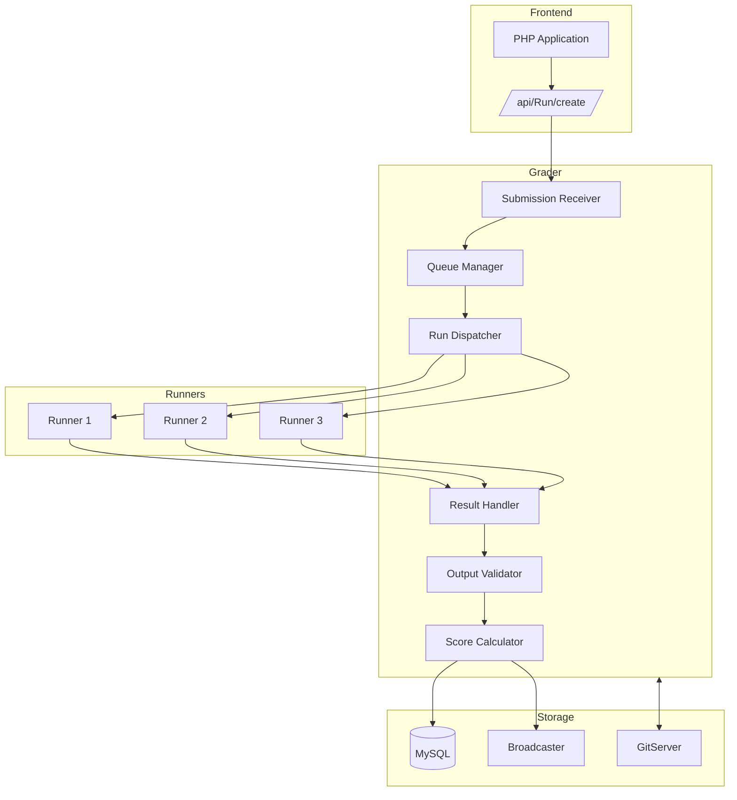
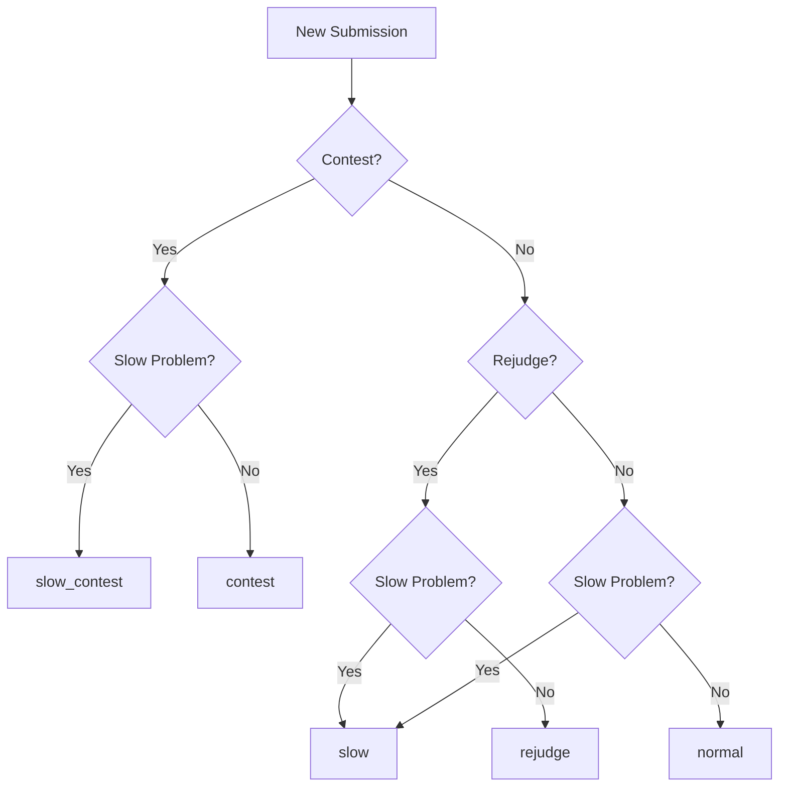
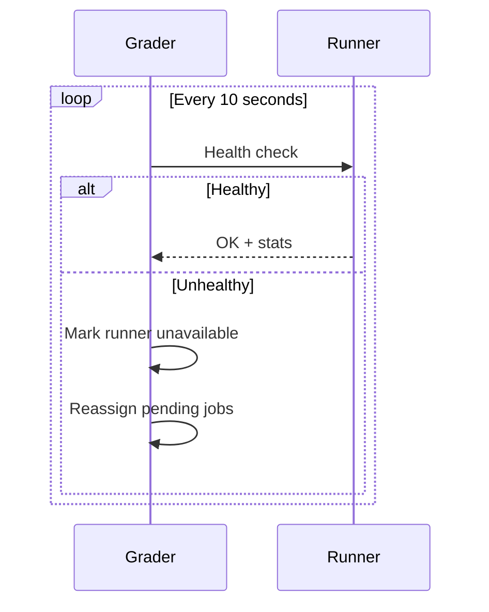
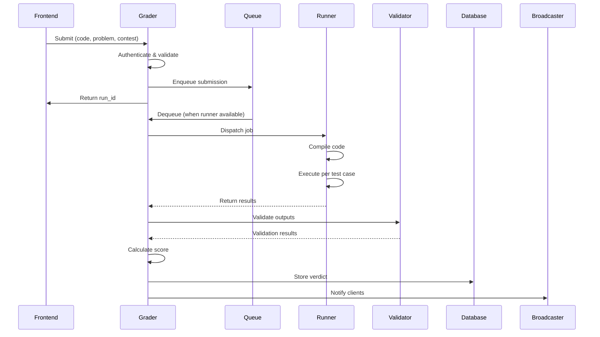

# Graduador

O Grader é o microsserviço Go central responsável por gerenciar filas de envio, coordenar a avaliação de código em vários Runners e determinar os veredictos finais. Ele atua como despachante entre o frontend PHP e a infraestrutura de execução.

## Visão geral

O Grader cuida de todo o ciclo de vida do envio:

1. Recebe envios do frontend
2. Coloca-os em filas de prioridade apropriadas
3. Envios para Corredores disponíveis
4. Coleta resultados de execução
5. Executa validadores e calcula pontuações
6. Armazena resultados e notifica os clientes

## Arquitetura


## Sistema de filas

### Tipos de fila

O Grader mantém 8 filas diferentes para priorização:

| Fila | Prioridade | Finalidade |
|-------|----------|--------|
| `contest` | 1 (mais alto) | Inscrições ativas para concursos |
| `urgent` | 2 | Concursos de alta prioridade |
| `contest_rejudge` | 3 | Pedidos de rejulgamento de concurso |
| `normal` | 4 | Inscrições no modo prático |
| `rejudge` | 5 | Pedidos gerais de rejulgamento |
| `slow_contest` | 6 | Problemas de lentidão em concursos |
| `slow_urgent` | 7 | Problemas lentos (alta prioridade) |
| `slow` | 8 (mais baixo) | Problemas lentos (geral) |

### Lógica de roteamento de fila


### Detecção lenta de problemas

Os problemas são marcados como "lentos" se apresentarem:

- Limite de tempo> 30 segundos
- Limite de memória > 512 MB
- Histórico de longos tempos de execução

## Gerenciamento de corredor

### Registro do Corredor

Os corredores se registram no Grader na inicialização:

```go
type RunnerInfo struct {
    Name     string
    Hostname string
    Port     int
    MaxJobs  int
    Features []string  // e.g., ["cpp", "java", "python"]
}
```
### Balanceamento de carga

O Dispatcher usa round-robin ponderado:

1. Verifique a disponibilidade dos corredores
2. Considere a carga atual por corredor
3. Combine os recursos do runner com o idioma de envio
4. Envio para o corredor adequado com menos carga

### Monitoramento de Saúde


## Fluxo de avaliação

### Sequência detalhada


### Estrutura do Resultado

```json
{
  "run_id": 12345,
  "verdict": "PA",
  "score": 0.75,
  "contest_score": 75.0,
  "runtime": 0.234,
  "memory": 16384,
  "compile_error": null,
  "cases": [
    {"name": "1", "verdict": "AC", "score": 1.0, "runtime": 0.05},
    {"name": "2", "verdict": "AC", "score": 1.0, "runtime": 0.08},
    {"name": "3", "verdict": "WA", "score": 0.0, "runtime": 0.06},
    {"name": "4", "verdict": "AC", "score": 1.0, "runtime": 0.05}
  ]
}
```
## Validação

### Tipos de validadores

| Tipo | Descrição | Caso de uso |
|------|-------------|----------|
| `token-caseless` | Tokenizar, comparação sem distinção entre maiúsculas e minúsculas | A maioria dos problemas |
| `token-numeric` | Compare números com tolerância | Ponto flutuante |
| `literal` | Correspondência exata byte a byte | Saída precisa |
| `custom` | Programa validador fornecido pelo usuário | Respostas múltiplas |

### Interface do validador personalizado

```cpp
// validator.cpp
#include <iostream>
#include <fstream>

int main(int argc, char* argv[]) {
    // argv[1] = input file
    // argv[2] = expected output (may be empty)
    // argv[3] = contestant output
    
    std::ifstream input(argv[1]);
    std::ifstream expected(argv[2]);
    std::ifstream contestant(argv[3]);
    
    // Validation logic...
    
    // Output score (0.0 to 1.0)
    std::cout << 1.0 << std::endl;
    return 0;
}
```
## Lógica de pontuação

### Cálculo de pontuação

```python
def calculate_score(test_results, scoring_mode):
    if scoring_mode == "all_or_nothing":
        # All tests must pass
        return 1.0 if all(r.verdict == "AC" for r in test_results) else 0.0
    
    elif scoring_mode == "partial":
        # Sum of individual test scores
        return sum(r.score * r.weight for r in test_results)
    
    elif scoring_mode == "max_per_group":
        # Group tests, take max per group
        groups = group_by(test_results, lambda r: r.group)
        return sum(max(r.score for r in g) * g.weight for g in groups)
```
### Hierarquia de veredictos

Ao combinar veredictos de casos de teste:

```
1. CE (Compilation Error) - if compile failed
2. JE (Judge Error) - if judge had issues
3. TLE - if any test exceeded time
4. MLE - if any test exceeded memory
5. RTE - if any test crashed
6. WA - if any test wrong answer
7. PA - if partial score > 0 but < 1
8. AC - if all tests passed
```
## Terminais de API

### API interna (executores)

| Ponto final | Método | Descrição |
|----------|--------|------------|
| `/register` | POSTAR | Cadastro de corredor |
| `/job` | OBTER | Obter próximo emprego |
| `/result` | POSTAR | Enviar resultados |
| `/health` | OBTER | Exame de saúde |

###Interface Web

Acesse em `http://grader:36663/grader/`:

- Status e comprimentos da fila
- Status do corredor
- Envios recentes
- Registros de erros

## Configuração

### Configurações principais

```json
{
  "grader": {
    "port": 21680,
    "web_port": 36663,
    "max_queue_length": 10000,
    "runner_timeout": 300,
    "validation_timeout": 60,
    "db_connection_pool": 20
  },
  "queues": {
    "contest": {"workers": 4},
    "normal": {"workers": 8},
    "slow": {"workers": 2}
  }
}
```
### Variáveis de ambiente

| Variável | Padrão | Descrição |
|----------|------------|-------------|
| `GRADER_DB_HOST` | host local | Hospedeiro MySQL |
| `GRADER_DB_NAME` | ômegaup | Nome do banco de dados |
| `GRADER_LOG_LEVEL` | informações | Detalhamento do registro |
| `GRADER_METRICS_PORT` | 6060 | Métricas do Prometheus |

## Monitoramento

### Principais métricas

| Métrica | Tipo | Descrição |
|--------|------|-------------|
| `grader_queue_length` | Medidor | Itens por fila |
| `grader_runs_total` | Contador | Total processado |
| `grader_run_duration` | Histograma | Tempo de processamento |
| `grader_runners_active` | Medidor | Corredores ativos |
| `grader_validation_errors` | Contador | Falhas do validador |

### Alertas

```yaml
- alert: GraderQueueBacklog
  expr: grader_queue_length{queue="contest"} > 50
  for: 5m
  annotations:
    summary: "Contest queue backlog"

- alert: NoRunnersAvailable  
  expr: grader_runners_active == 0
  for: 1m
  annotations:
    summary: "No runners available"
```
## Solução de problemas

### Problemas comuns

**Envios presos na fila**:
```bash
# Check queue status
curl http://grader:36663/grader/status/

# Check runner connectivity
curl http://runner1:port/health
```
**Erros do validador**:
```bash
# Check grader logs
docker-compose logs grader | grep -i validator
```
**Processamento lento**:
```bash
# Check metrics
curl http://grader:6060/metrics | grep queue
```
## Documentação Relacionada

- **[Modern Internals](../architecture/grader-internals.md)** - Detalhes técnicos detalhados
- **[Runner](runner.md)** - Sistema de execução de código
- **[Veredictos](verdicts.md)** - Explicações do veredicto
- **[Arquitetura](../architecture/index.md)** - Visão geral do sistema
