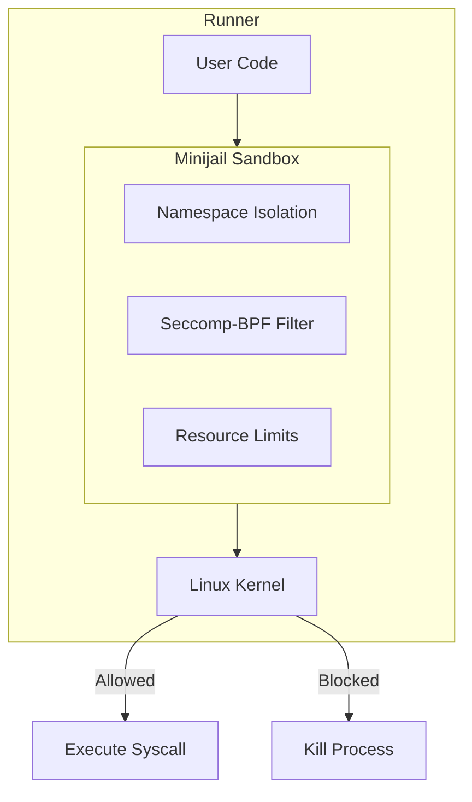
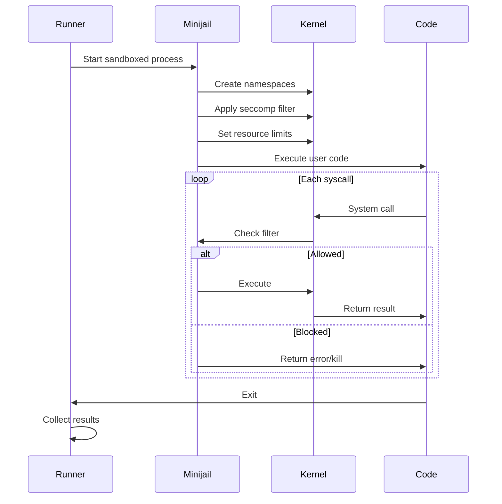

# Caixa de areia

omegaUp usa **Minijail**, uma ferramenta de sandbox originalmente desenvolvida pelo Google para o Chrome OS, para executar com segurança o código enviado pelo usuário. A sandbox fornece isolamento robusto para evitar que códigos maliciosos afetem o sistema.

## Visão geral

A sandbox intercepta e controla todas as interações do sistema a partir do código do usuário, garantindo:

- **Isolamento de processos**: o código é executado em namespaces isolados
- **Filtragem Syscall**: chamadas de sistema perigosas são bloqueadas
- **Limites de recursos**: memória, CPU e acesso a arquivos são restritos
- **Bloqueio de rede**: nenhum acesso à rede a partir do código enviado

## Arquitetura


## Camadas de segurança

### 1. Namespaces Linux

Minijail usa namespaces para isolar o processo:

| Espaço para nome | Isolamento fornecido |
|-----------|-------------------|
| **PID** | Isolamento de ID do processo – não é possível ver outros processos |
| **NET** | Isolamento de rede - sem acesso à rede |
| **MNT** | Isolamento de montagem - visualização restrita do sistema de arquivos |
| **IPC** | Isolamento de comunicação entre processos |
| **USUÁRIO** | Mapeamento de ID de usuário – executado como usuário sem privilégios |
| **UTS** | Isolamento de nome de host |

### 2. Filtragem Seccomp-BPF

As chamadas do sistema são filtradas usando seccomp-BPF:

```c
// Allowed syscalls (essential for execution)
read, write, open, close, fstat, mmap, mprotect, 
munmap, brk, exit_group, arch_prctl, access, 
execve, getpid, getuid, getgid, geteuid, getegid

// Blocked syscalls (dangerous operations)
socket, connect, bind, listen, accept,  // No networking
fork, clone, vfork,                      // No process creation
kill, tkill, tgkill,                     // No signal sending
ptrace,                                  // No debugging
mount, umount, pivot_root,               // No filesystem changes
```
### 3. Limites de recursos

Limites impostos usando `setrlimit`:

| Recurso | Limite típico | Finalidade |
|----------|-------------|---------|
| **Tempo de CPU** | 1-60 segundos | Evite loops infinitos |
| **Memória** | 256 MB | Evitar o esgotamento da memória |
| **Tamanho do arquivo** | 64 MB | Limitar produção |
| **Abrir arquivos** | 20 | Evitar o esgotamento do descritor de arquivo |
| **Processos** | 1 | Sem bifurcação |
| **Tamanho da pilha** | 8 MB | Evitar estouro de pilha |

## Manipulação de Syscall

A sandbox pode lidar com chamadas do sistema de três maneiras:

### Permitir

Syscalls inofensivos prosseguem normalmente:

```
read() → Allow (needed for input)
write() → Allow (needed for output)
mmap() → Allow (needed for memory allocation)
```
### Bloquear/Matar

Syscalls perigosos encerram o processo:

```
socket() → EPERM (no networking)
fork() → EPERM (no process creation)
ptrace() → SIGKILL (no debugging)
```
### Substituir/Emular

Algumas syscalls são substituídas por alternativas seguras:

```
getpid() → Returns fixed value
gettimeofday() → Returns controlled time
```
## Fluxo de execução


## Isolamento do sistema de arquivos

### Caminhos Visíveis

O código do usuário só pode ver:

```
/usr/lib/          # Shared libraries (read-only)
/lib/              # System libraries (read-only)
/tmp/              # Temporary files (read-write, limited)
/dev/null          # Null device
/dev/urandom       # Random numbers (limited)
```
### Caminhos ocultos

Protegido do código do usuário:

```
/home/             # User data
/etc/              # System configuration
/proc/             # Process information (mostly)
/sys/              # System information
/var/              # Variable data
```
## Configurações específicas de idioma

Idiomas diferentes exigem perfis de sandbox diferentes:

###C/C++

```
Syscalls: minimal set
Filesystem: standard libraries only
Memory: direct allocation
```
###Java

```
Syscalls: extended for JVM
Filesystem: JRE paths added
Memory: JVM heap management
```
###Píton

```
Syscalls: interpreter requirements
Filesystem: Python stdlib paths
Memory: interpreter overhead
```
### Linguagens Interpretadas

Considerações adicionais:

- Binários de intérprete acessíveis
- Bibliotecas padrão no caminho
- Restrições de importação de módulos

## Configuração do Minijail

### Opções de linha de comando

```bash
minijail0 \
    -c 0                    # No capabilities
    -n                      # No new privileges
    -v                      # Mount namespace
    -p                      # PID namespace
    -l                      # IPC namespace
    -e                      # Network namespace
    -r                      # Remount /proc read-only
    -t                      # Mount tmpfs at /tmp
    -b /usr/lib,/usr/lib,0  # Bind mount (read-only)
    -S /path/to/policy.bpf  # Seccomp policy
    -T static               # Static seccomp
    -- /path/to/program     # Program to run
```
### Arquivo de política Seccomp

```bpf
# policy.bpf - Example seccomp policy
read: 1
write: 1
open: 1
close: 1
fstat: 1
mmap: arg2 in ~0x4  # No PROT_EXEC with PROT_WRITE
munmap: 1
brk: 1
exit_group: 1
```
## Detecção de erros

### Sinais de erro de tempo de execução

| Sinal | Significado | Causa Comum |
|--------|---------|-------------|
| SIGSEGV | Falha de segmentação | Acesso à memória inválido |
| SIGFPE | Exceção de ponto flutuante | Divisão por zero |
| SIGABRT | Abortar | Falha na afirmação |
| SIGKILL | Morto | Violação de Syscall |
| SIGXCPU | Tempo de CPU excedido | Laço infinito |

### Violações de sandbox

Detectado e relatado como RTE com detalhes:

```
Syscall violation: socket (blocked)
Memory limit exceeded: 267386880 > 268435456
Time limit exceeded: 1.023s > 1.000s
```
## Comparação com alternativas

| Recurso | Minijail | Docker | chroot | rastreamento |
|--------|----------|--------|--------|--------|
| Despesas gerais | Muito Baixo | Baixo | Muito Baixo | Alto |
| Isolamento | Forte | Forte | Fraco | Médio |
| Filtro Syscall | Sim | Sim | Não | Sim |
| Suporte a namespaces | Sim | Sim | Não | Não |
| Limites de recursos | Sim | Sim | Não | Não |
| Complexidade de configuração | Médio | Baixo | Baixo | Alto |

## Considerações de segurança

### Defesa em profundidade

A sandbox é uma camada de múltiplas medidas de segurança:

1. **Sandbox** (Minijail) - Isolamento de processo
2. **Container** (Docker) - Isolamento de serviço  
3. **Rede** – Regras de firewall
4. **Autenticação** - Controle de acesso

### Limitações conhecidas

- Não é possível impedir todos os ataques de temporização
- Algum vazamento de informações através do uso de recursos
- Requer recursos do kernel Linux

### Prevenção de fuga

Auditorias regulares de segurança verificam:

- Bypass do filtro Syscall
- Técnicas de escape de namespace
- Contorno do limite de recursos

## Solução de problemas

### Problemas comuns

**Falha na inicialização do sandbox**:
```bash
# Check kernel capabilities
cat /proc/sys/kernel/unprivileged_userns_clone
# Should be 1
```
**Syscall bloqueado inesperadamente**:
```bash
# Run with verbose logging
minijail0 -L -- /path/to/program
```
**Problemas de limite de memória**:
```bash
# Check cgroup limits
cat /sys/fs/cgroup/memory/omegaup/memory.limit_in_bytes
```
## Documentação Relacionada

- **[Runner Internals](../architecture/runner-internals.md)** - Detalhes de execução do código
- **[Modern Internals](../architecture/grader-internals.md)** - Processamento de envio
- **[Segurança](../architecture/security.md)** - Arquitetura geral de segurança
- **[Veredictos](verdicts.md)** - Noções básicas sobre resultados de execução
