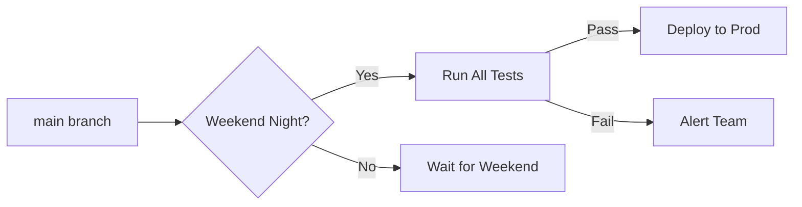
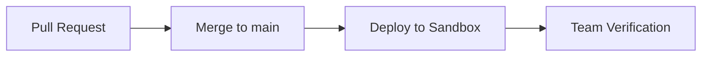
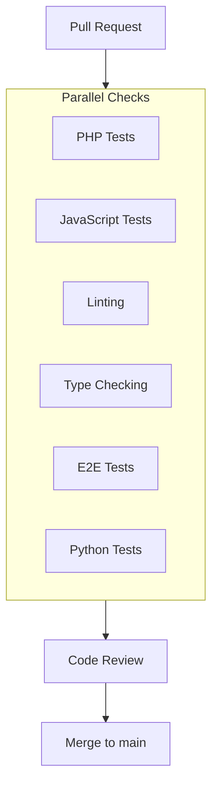
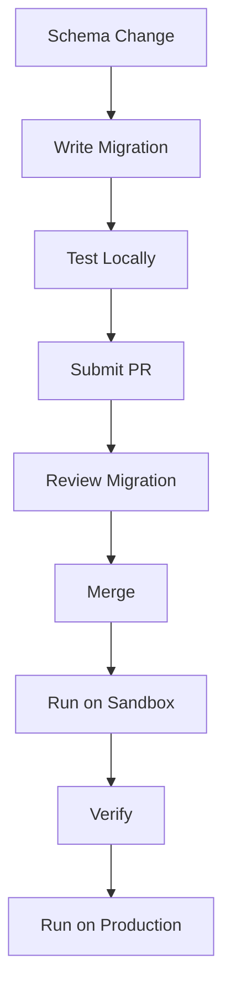

# Liberação e implantação

omegaUp usa GitHub Actions para integração contínua e implantações automatizadas. Este guia aborda o processo de implantação, os ambientes e os procedimentos de liberação.

## Ambientes de implantação

### Produção

| Atributo | Valor |
|-----------|-------|
| **URL** | [omegaup.com](https://omegaup.com) |
| **Programação** | Noites automáticas de fim de semana (horário do México Central) |
| **Gatilho** | Ação agendada do GitHub |
| **Requisitos** | Todos os testes foram aprovados, sem problemas de bloqueio |

As implantações de produção são programadas para minimizar o impacto do usuário:


### Sandbox (preparação)

| Atributo | Valor |
|-----------|-------|
| **URL** | [sandbox.omegaup.com](https://sandbox.omegaup.com) |
| **Gatilho** | Cada mesclagem com a ramificação `main` |
| **Objetivo** | Testes de pré-produção |
| **Dados** | Subconjunto de dados de produção |

As implantações de sandbox acontecem automaticamente:


### Correções

Para problemas críticos de produção:

| Atributo | Valor |
|-----------|-------|
| **Gatilho** | Implantação manual |
| **Processo** | Validação interna necessária |
| **Aprovação** | Mínimo de 2 membros da equipe |

## Pipeline de CI/CD

### Verificações de solicitação pull

Cada PR deve passar por estas verificações antes da fusão:


### Conjuntos de testes

| Suíte | Ferramenta | Cobertura | Tempo |
|-------|------|----------|------|
| Testes de Unidade PHP | Unidade PHP | Controladores, Bibliotecas | ~5 minutos |
| Testes de JavaScript | Brincadeira | Componentes Vue | ~3 minutos |
| Testes ponta a ponta | Cipreste | Fluxos críticos | ~15 minutos |
| Testes Python | pytest | Cronjobs, scripts | ~2 minutos |
| Verificação de tipo | Salmo | Tipos PHP | ~2 minutos |
| Linting | ESLint, PHP-CS-Fixer | Estilo | ~1 minuto |

### Regras de Linting

Padrões aplicados:

```yaml
# PHP
- PSR-12 coding standard
- Strict types required
- Psalm type annotations

# TypeScript
- ESLint strict mode
- Prettier formatting
- No any types (where possible)

# Python
- PEP 8 style
- Type hints required
```
## Cobertura de código

Usamos **Codecov** para rastrear a cobertura do teste:

| Idioma | Cobertura Atual | Alvo |
|----------|-----------------|--------|
| PHP | ~70% | 80% |
| Datilografado | ~60% | 70% |
| Cipreste E2E | Não medido | A definir |

Requisitos de cobertura:

- Os RP não devem diminuir a cobertura
- Novo código deve ter testes
- Caminhos críticos requerem >80% de cobertura

## Processo de implantação

### Implantação de produção automatizada

```yaml
# .github/workflows/deploy-production.yml (simplified)
name: Deploy Production

on:
  schedule:
    - cron: '0 6 * * 0'  # Sunday 6 AM UTC (midnight CDT)

jobs:
  deploy:
    runs-on: ubuntu-latest
    steps:
      - name: Run All Tests
        run: ./stuff/run-tests.sh
        
      - name: Build Assets
        run: yarn build
        
      - name: Deploy to Production
        run: ./stuff/deploy.sh production
        
      - name: Smoke Tests
        run: ./stuff/smoke-tests.sh
        
      - name: Notify Team
        run: ./stuff/notify.sh
```
### Implantação manual de hotfix

1. **Criar ramificação de hotfix**:
   ```bash
   git checkout -b hotfix/critical-bug main
   ```
2. **Aplicar correção e testar**:
   ```bash
   # Make changes
   ./stuff/run-tests.sh
   ```
3. **Solicitar aprovação**:
   - Criar PR com rótulo `hotfix`
   - Obtenha 2 aprovações

4. **Implante manualmente**:
   ```bash
   ./stuff/deploy.sh production --hotfix
   ```
## Lista de verificação de implantação

### Pré-implantação

- [] Todas as verificações de CI são aprovadas
- [] Revisão de código aprovada
- [] Migrações de banco de dados testadas
- [] Sem problemas de bloqueio no backlog
- [] Plano de reversão documentado

### Pós-implantação

- [] Testes de fumaça aprovados
- [] Monitorar taxas de erro
- [] Verifique as principais métricas
- [ ] Verificar fluxos críticos
- [] Atualizar página de status

## Migrações de banco de dados

### Processo de migração


### Melhores Práticas

1. **Compatível com versões anteriores**: as migrações não devem interromper o código em execução
2. **Reversível**: Inclui migração descendente
3. **Pequenas alterações**: uma alteração de esquema por migração
4. **Testado**: Execute localmente antes do PR

```php
// Example migration
class AddUserPreferences extends Migration {
    public function up() {
        $this->execute('
            ALTER TABLE Users 
            ADD COLUMN preferences JSON DEFAULT NULL
        ');
    }
    
    public function down() {
        $this->execute('
            ALTER TABLE Users 
            DROP COLUMN preferences
        ');
    }
}
```
## Procedimentos de reversão

### Reversão rápida

Se os problemas forem detectados imediatamente:

```bash
# Revert to previous deployment
./stuff/deploy.sh production --rollback

# Verify rollback
./stuff/smoke-tests.sh
```
### Reversão do banco de dados

Se a migração causou problemas:

```bash
# Run down migration
docker-compose exec frontend php stuff/database/migrate.php down

# Verify schema
docker-compose exec mysql mysql -u omegaup -p omegaup -e "DESCRIBE Users"
```
## Monitoramento após a implantação

### Principais métricas a serem observadas

| Métrica | Normais | Aviso | Crítico |
|--------|--------|---------|----------|
| Taxa de erro | <0.1% | >1% | >5% |
| Tempo de resposta (pág. 95) | <500ms | >1s | >3s |
| Comprimento da fila | <10 | >50 | >100 |

### Alertas

Acionadores de alertas automatizados para:

- Aumento da taxa de erro (>5x normal)
- Degradação do tempo de resposta
- Indisponibilidade do serviço
- Problemas de conexão com o banco de dados

## Documentação Relacionada

- **[Monitoramento](monitoring.md)** - Configuração de monitoramento
- **[Solução de problemas](troubleshooting.md)** - Problemas comuns
- **[Configuração do Docker](docker-setup.md)** - Configuração do contêiner
- **[Teste](../development/testing.md)** - Diretrizes de teste
