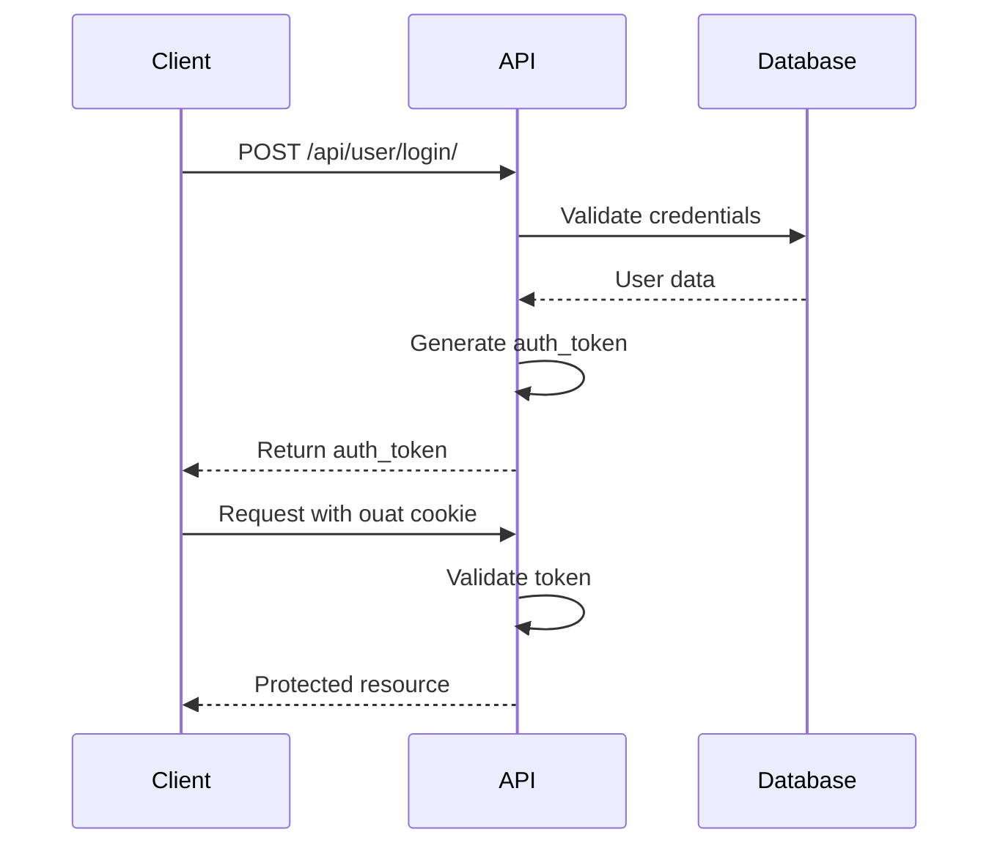

# Autenticação API

A API do omegaUp usa autenticação baseada em token para acesso seguro a endpoints protegidos.

## Fluxo de autenticação


## Obtendo um token de autenticação

### Ponto final de login

**Solicitação:**
```bash
POST https://omegaup.com/api/user/login/
Content-Type: application/json

{
  "usernameOrEmail": "user@example.com",
  "password": "password"
}
```
**Resposta:**
```json
{
  "status": "ok",
  "auth_token": "abc123def456..."
}
```
## Usando o token

Inclua o token em um cookie chamado `ouat` (omegaUp Auth Token):

```bash
curl -X POST https://omegaup.com/api/problem/create/ \
  -H "Cookie: ouat=abc123def456..." \
  -H "Content-Type: application/json" \
  -d '{"title": "My Problem", ...}'
```
Alternativamente, inclua como parâmetro POST:

```bash
curl -X POST https://omegaup.com/api/problem/create/ \
  -d "ouat=abc123def456..." \
  -d "title=My Problem" \
  ...
```
## Gerenciamento de sessão

!!! importante "Sessão Ativa Única"
    omegaUp suporta apenas uma sessão ativa por vez. O login programaticamente invalidará a sessão do navegador e vice-versa.

## Considerações de segurança

- **Somente HTTPS**: toda comunicação de API deve usar HTTPS
- **Armazenamento de tokens**: armazene tokens com segurança, nunca se comprometa com o controle de versão
- **Expiração do Token**: Os tokens podem expirar; lidar com erros de autenticação normalmente

## Documentação Relacionada

- **[API de usuários](users.md)** - Endpoints de gerenciamento de usuários
- **[API REST](rest-api.md)** - Informações gerais da API
