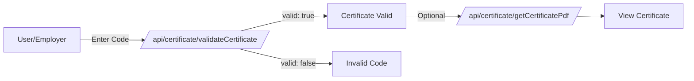

# API de certificados

Os certificados são documentos PDF que reconhecem as conquistas dos usuários em concursos e cursos. Esta API fornece terminais para geração, recuperação e validação de certificados.

## Visão geral

omegaUp emite certificados para:

- **Participação no Concurso**: Reconhecimento da colocação ou participação no concurso
- **Conclusão do curso**: conclusão de cursos educacionais
- **Codificador do Mês**: prêmios mensais de reconhecimento

Cada certificado possui um código de verificação exclusivo que pode ser validado.

## Pontos finais

### Gerar certificados de concurso

Gera certificados para todos os participantes qualificados em um concurso.

**`POST /api/certificate/generateContestCertificates/`**

**Parâmetros:**

| Parâmetro | Tipo | Obrigatório | Descrição |
|-----------|------|----------|------------|
| `contest_alias` | corda | Sim | Apelido do concurso |
| `certificates_cutoff` | interno | Não | Limite de classificação para certificados |

**Resposta:**

```json
{
  "status": "ok"
}
```
**Privilégios:** Gerador de certificado + administrador do concurso

**Requisitos:**

- O concurso deve ter terminado
- Os certificados ainda não devem ter sido gerados (status `uninitiated` ou `retryable_error`)

**Processo:**

1. A solicitação está na fila via RabbitMQ
2. Os certificados são gerados de forma assíncrona
3. Mudanças de status para `queued` → `generated`

---

### Obtenha o certificado em PDF

Recupera o PDF de um certificado por código de verificação.

**`GET /api/certificate/getCertificatePdf/`**

**Parâmetros:**

| Parâmetro | Tipo | Obrigatório | Descrição |
|-----------|------|----------|------------|
| `verification_code` | corda | Sim | Código de verificação do certificado |

**Resposta:**

```json
{
  "certificate": "base64-encoded-pdf-content"
}
```
Retorna `null` para `certificate` se o código de verificação for inválido.

**Privilégios:** Público

---

### Obtenha certificados de usuário

Retorna todos os certificados pertencentes a um usuário.

**`GET /api/certificate/getUserCertificates/`**

**Parâmetros:**

| Parâmetro | Tipo | Obrigatório | Descrição |
|-----------|------|----------|------------|
| `user_id` | interno | Sim | ID do usuário |

**Resposta:**

```json
{
  "certificates": [
    {
      "certificate_type": "contest",
      "name": "Annual Programming Contest 2024",
      "date": { "time": 1704067200 },
      "verification_code": "ABC123XYZ"
    },
    {
      "certificate_type": "course",
      "name": "Introduction to Algorithms",
      "date": { "time": 1701388800 },
      "verification_code": "DEF456UVW"
    }
  ]
}
```
**Privilégios:** Certificados próprios ou administrador do sistema

---

### Validar certificado

Verifica se um certificado é válido.

**`GET /api/certificate/validateCertificate/`**

**Parâmetros:**

| Parâmetro | Tipo | Obrigatório | Descrição |
|-----------|------|----------|------------|
| `verification_code` | corda | Sim | Código de verificação do certificado |

**Resposta:**

```json
{
  "valid": true
}
```
**Privilégios:** Público

---

## Tipos de certificado

### Certificados do Concurso

Emitido para:
- **Colocação**: 1º, 2º, 3º lugar (com sufixo de lugar)
- **Participação**: Reconhecimento geral de participação

O certificado inclui:
- Nome do participante
- Nome do concurso
- Colocação (se aplicável)
- Data
- Código de verificação

### Certificados de Curso

Emitido após a conclusão do curso.

O certificado inclui:
- Nome do aluno
- Nome do curso
- Data de conclusão
- Código de verificação

### Codificador do Mês

Emitido para vencedores mensais.

O certificado inclui:
- Nome do vencedor
- Mês/Ano
- Código de verificação

---

## Estrutura do PDF do certificado

Os certificados são gerados usando um modelo padrão com:

- cabeçalho e logotipo omegaUp
- Texto de reconhecimento
- Nome do destinatário (destaque)
- Descrição da conquista
- Data e local
- Assinatura do diretor
- Código de verificação e URL

---

## Fluxo de verificação


---

## Status do certificado

Para certificados do concurso:

| Estado | Descrição |
|--------|------------|
| `uninitiated` | Ainda não gerado |
| `queued` | Geração em andamento |
| `generated` | Criado com sucesso |
| `retryable_error` | Falha, pode tentar novamente |

---

## Casos de uso

### Verifique um certificado

```bash
# Check if certificate is valid
curl "https://omegaup.com/api/certificate/validateCertificate/?verification_code=ABC123XYZ"

# Download PDF if valid
curl "https://omegaup.com/api/certificate/getCertificatePdf/?verification_code=ABC123XYZ" \
  | jq -r '.certificate' | base64 -d > certificate.pdf
```
### Administrador do concurso: gerar certificados

```bash
# Generate certificates for top 10 finishers
curl -X POST https://omegaup.com/api/certificate/generateContestCertificates/ \
  -d "contest_alias=annual-contest-2024&certificates_cutoff=10"
```
---

## Documentação Relacionada

- **[API de concursos](contests.md)** - Gerenciamento de concursos
- **[API de usuários](users.md)** - Informações do usuário

## Referência completa

Para obter detalhes completos de implementação, consulte o código-fonte do [Controlador de Certificado](https://github.com/omegaup/omegaup/blob/main/frontend/server/src/Controllers/Certificate.php).
