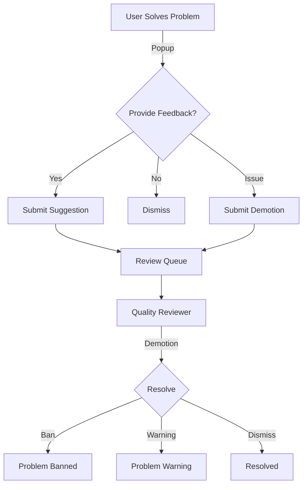

# API de nomeações de qualidade

A API Quality Nominations permite que os usuários forneçam feedback sobre a qualidade do problema, sugiram melhorias e relatem problemas. Os revisores de qualidade podem então processar essas nomeações.

## Visão geral

O sistema de nomeação de qualidade permite:

- **Sugestões**: Avalie a dificuldade, a qualidade e as tags do problema
- **Promoções**: indique problemas para status de qualidade
- **Rebaixamentos**: denunciar conteúdo problemático
- **Demissões**: dispensa pop-ups de qualidade sem feedback

## Tipos de nomeação

| Tipo | Finalidade | Quem pode enviar |
|------|---------|----------------|
| `suggestion` | Avalie dificuldade, qualidade, tags | Usuários que resolveram o problema |
| `promotion` | Nomear para status de problema de qualidade | Usuários que resolveram o problema |
| `demotion` | Relatar problemas (spam, ofensivos, etc.) | Qualquer usuário autenticado |
| `dismissal` | Dispensar solicitação de feedback | Usuários que tentaram/resolveram |
| `quality_tag` | Atribuir selo e tags de qualidade | Apenas revisores de qualidade |

## Pontos finais

### Criar nomeação

Cria uma nova nomeação de qualidade.

**`POST /api/qualityNomination/create/`**

**Parâmetros:**

| Parâmetro | Tipo | Obrigatório | Descrição |
|-----------|------|----------|------------|
| `problem_alias` | corda | Sim | Alias ​​do problema |
| `nomination` | corda | Sim | Tipo: `suggestion`, `promotion`, `demotion`, `dismissal`, `quality_tag` |
| `contents` | JSON | Sim | Conteúdo específico da nomeação |

#### Sugestão de conteúdo

```json
{
  "difficulty": 2,
  "quality": 3,
  "tags": ["problemTopicDynamicProgramming", "problemTopicGraphTheory"],
  "before_ac": false
}
```
- `difficulty`: escala de 0 a 4 (0=trivial, 4=muito difícil)
- `quality`: escala de 0 a 4 (0=ruim, 4=excelente)
- `tags`: Matriz de tags de tópico permitidas
- `before_ac`: Verdadeiro se enviado antes da resolução

#### Conteúdo da promoção

```json
{
  "statements": {
    "es": { "markdown": "# Problema\n\nDescripción..." },
    "en": { "markdown": "# Problem\n\nDescription..." }
  },
  "source": "Original problem by John Doe",
  "tags": ["problemTopicArrays", "problemTopicSorting"]
}
```
#### Conteúdo de rebaixamento

```json
{
  "reason": "duplicate",
  "original": "original-problem-alias",
  "rationale": "This is a duplicate of the original problem."
}
```
Motivos válidos: `duplicate`, `no-problem-statement`, `offensive`, `other`, `spam`, `wrong-test-cases`, `poorly-described`

**Resposta:**

```json
{
  "qualitynomination_id": 12345
}
```
**Privilégios:** Varia de acordo com o tipo de nomeação (veja acima)

---

### Listar nomeações

Retorna uma lista paginada de indicações (somente revisores).

**`GET /api/qualityNomination/list/`**

**Parâmetros:**

| Parâmetro | Tipo | Obrigatório | Descrição |
|-----------|------|----------|------------|
| `offset` | interno | Não | Número da página (padrão: 1) |
| `rowcount` | interno | Não | Itens por página (padrão: 100) |
| `status` | corda | Não | Filtro: `all`, `open`, `resolved`, `banned`, `warning` |
| `types` | matriz | Não | Filtrar por tipo: `promotion`, `demotion` |
| `query` | corda | Não | Termo de pesquisa |
| `column` | corda | Não | Coluna de pesquisa: `problem_alias`, `nominator_username`, `author_username` |

**Resposta:**

```json
{
  "nominations": [
    {
      "qualitynomination_id": 123,
      "problem": { "alias": "sum-two", "title": "Sum Two Numbers" },
      "nominator": { "username": "user1", "name": "User One" },
      "author": { "username": "author", "name": "Problem Author" },
      "nomination": "demotion",
      "status": "open",
      "time": { "time": 1609459200 },
      "contents": { "reason": "spam" },
      "votes": []
    }
  ],
  "pager_items": [...]
}
```
**Privilégios:** Revisor de qualidade

---

### Minhas nomeações

Retorna nomeações criadas pelo usuário atual.

**`GET /api/qualityNomination/myList/`**

**Parâmetros:**

| Parâmetro | Tipo | Obrigatório | Descrição |
|-----------|------|----------|------------|
| `offset` | interno | Não | Número da página |
| `rowcount` | interno | Não | Itens por página |
| `types` | matriz | Não | Filtrar por tipo |

**Privilégios:** Usuário autenticado

---

### Nomeações atribuídas

Retorna nomeações atribuídas ao revisor atual.

**`GET /api/qualityNomination/myAssignedList/`**

**Parâmetros:**

| Parâmetro | Tipo | Obrigatório | Descrição |
|-----------|------|----------|------------|
| `page` | interno | Não | Número da página |
| `page_size` | interno | Não | Itens por página |

**Privilégios:** Revisor de qualidade

---

### Obtenha detalhes da nomeação

Retorna informações detalhadas sobre uma nomeação.

**`GET /api/qualityNomination/details/`**

**Parâmetros:**

| Parâmetro | Tipo | Obrigatório | Descrição |
|-----------|------|----------|------------|
| `qualitynomination_id` | interno | Sim | ID de nomeação |

**Resposta:**

```json
{
  "qualitynomination_id": 123,
  "nomination": "promotion",
  "nomination_status": "open",
  "time": { "time": 1609459200 },
  "problem": { "alias": "my-problem", "title": "My Problem" },
  "nominator": { "username": "user1", "name": "User One" },
  "author": { "username": "author", "name": "Author" },
  "contents": {
    "statements": {...},
    "source": "Original",
    "tags": [...]
  },
  "original_contents": {
    "statements": {...},
    "source": "Current source",
    "tags": [...]
  },
  "reviewer": true,
  "votes": []
}
```
**Privilégios:** Nomeador ou Revisor de qualidade

---

### Resolver nomeação

Resolve uma indicação de rebaixamento (somente revisores).

**`POST /api/qualityNomination/resolve/`**

**Parâmetros:**

| Parâmetro | Tipo | Obrigatório | Descrição |
|-----------|------|----------|------------|
| `qualitynomination_id` | interno | Sim | ID de nomeação |
| `problem_alias` | corda | Sim | Alias ​​do problema |
| `status` | corda | Sim | `open`, `resolved`, `banned`, `warning` |
| `rationale` | corda | Sim | Explicação da decisão |
| `all` | bool | Não | Resolva todos os rebaixamentos para este problema |

**Resposta:**

```json
{
  "status": "ok"
}
```
**Efeitos de status:**

| Estado | Visibilidade do problema |
|--------|-------------------|
| `banned` | Escondido do público |
| `warning` | Visível com aviso |
| `resolved` | Visibilidade normal |
| `open` | Sem alterações |

**Privilégios:** Revisor de qualidade

---

## Tags permitidas

### Tags de tópico (para sugestões/promoções)

-`problemTopic2Sat`
-`problemTopicArrays`
-`problemTopicBinarySearch`
-`problemTopicDynamicProgramming`
-`problemTopicGraphTheory`
-`problemTopicGreedy`
- ... (veja a lista completa na fonte)

### Tags de nível (para quality_tag)

-`problemLevelBasicKarel`
-`problemLevelBasicIntroductionToProgramming`
-`problemLevelIntermediateDataStructuresAndAlgorithms`
-`problemLevelAdvancedCompetitiveProgramming`
- ... (veja a lista completa na fonte)

---

## Fluxo de trabalho


---

## Casos de uso

### Enviar feedback de qualidade

```bash
curl -X POST https://omegaup.com/api/qualityNomination/create/ \
  -d 'problem_alias=sum-two' \
  -d 'nomination=suggestion' \
  -d 'contents={"difficulty":1,"quality":3,"tags":["problemTopicArrays"]}'
```
### Relatar problema duplicado

```bash
curl -X POST https://omegaup.com/api/qualityNomination/create/ \
  -d 'problem_alias=duplicate-problem' \
  -d 'nomination=demotion' \
  -d 'contents={"reason":"duplicate","original":"original-problem"}'
```
---

## Documentação Relacionada

- **[API de problemas](problems.md)** - Gerenciamento de problemas
- **[API de usuários](users.md)** - Funções e permissões do usuário

## Referência completa

Para obter listas completas de implementação e tags, consulte o código-fonte do [QualityNomination Controller](https://github.com/omegaup/omegaup/blob/main/frontend/server/src/Controllers/QualityNomination.php).
