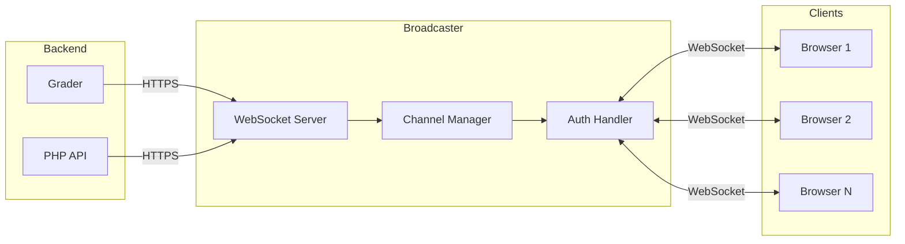
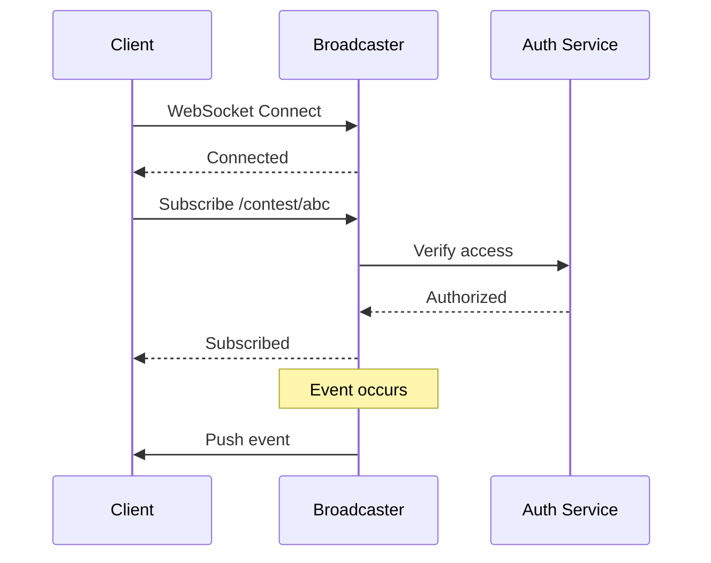
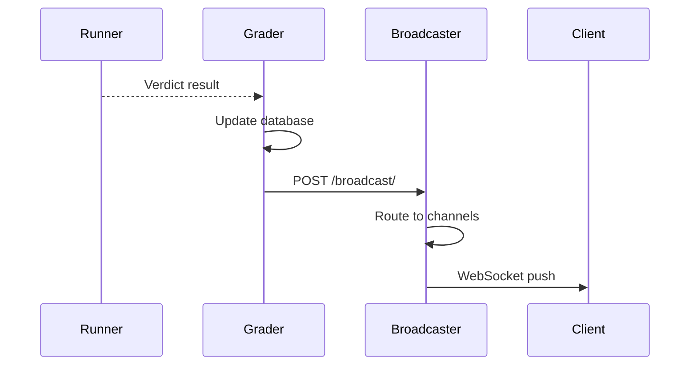
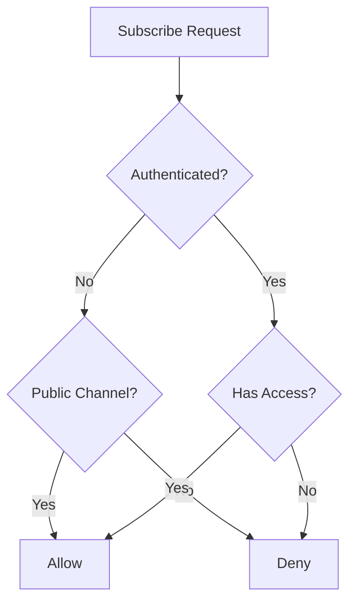
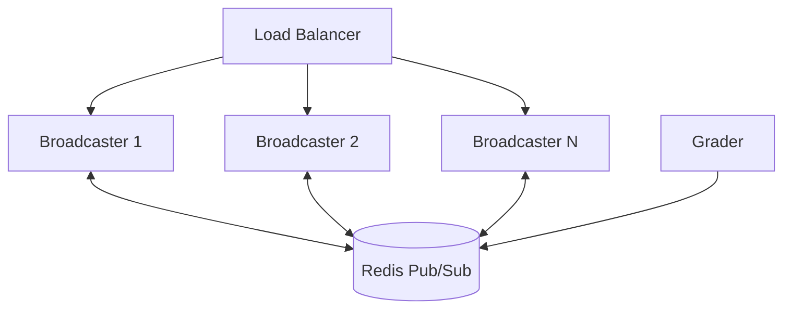

# Arquitetura de emissora

O Broadcaster é um servidor WebSocket que permite a comunicação em tempo real entre o backend e os clientes web. Ele alimenta placares ao vivo, atualizações de envio e notificações de esclarecimento.

## Visão geral


## Eventos em tempo real

### Tipos de eventos

| Evento | Descrição | Canal |
|-------|-------------|---------|
| `run_update` | Veredicto de envio alterado | Usuário, Concurso |
| `scoreboard_update` | Placar alterado | Concurso |
| `clarification` | Novo esclarecimento | Concurso, Problema |
| `contest_update` | Configurações do concurso alteradas | Concurso |

### Estrutura de carga útil do evento

```json
{
  "type": "run_update",
  "timestamp": 1704067200,
  "data": {
    "run_id": 12345,
    "verdict": "AC",
    "score": 1.0,
    "contest_alias": "contest-2024",
    "problem_alias": "sum-two"
  }
}
```
## Sistema de canais

### Tipos de canais

| Padrão de canal | Descrição | Autenticação necessária |
|-----------------|-------------|---------------|
| `/user/{username}` | Eventos específicos do usuário | Sim (proprietário) |
| `/contest/{alias}` | Eventos de concurso | Acesso ao concurso |
| `/contest/{alias}/admin` | Eventos administrativos | Administrador do concurso |
| `/problem/{alias}` | Eventos problemáticos | Acesso problemático |
| `/scoreboard/{token}` | Placar público | Token válido |

### Fluxo de inscrição no canal


## Protocolo WebSocket

### Conexão

```javascript
const ws = new WebSocket('wss://omegaup.com/events/');

ws.onopen = () => {
  // Authenticate
  ws.send(JSON.stringify({
    type: 'auth',
    token: authToken
  }));
};
```
### Inscreva-se no canal

```javascript
ws.send(JSON.stringify({
  type: 'subscribe',
  channel: '/contest/annual-2024'
}));
```
### Cancelar inscrição

```javascript
ws.send(JSON.stringify({
  type: 'unsubscribe',
  channel: '/contest/annual-2024'
}));
```
### Receber eventos

```javascript
ws.onmessage = (event) => {
  const data = JSON.parse(event.data);
  
  switch (data.type) {
    case 'run_update':
      updateSubmissionStatus(data.data);
      break;
    case 'scoreboard_update':
      refreshScoreboard();
      break;
    case 'clarification':
      showClarificationNotification(data.data);
      break;
  }
};
```
## Integração de back-end

### Graduador para Emissora

Quando um envio é avaliado:


### PHP para emissora

Para esclarecimentos e atualizações do concurso:

```php
// In Clarification Controller
\OmegaUp\Grader::getInstance()->broadcast(
    contestAlias: $contest->alias,
    problemAlias: $problem->alias,
    message: json_encode([
        'type' => 'clarification',
        'data' => $clarification
    ]),
    public: false,
    username: $identity->username
);
```
## Autenticação

### Autenticação baseada em token

As conexões WebSocket são autenticadas usando:

1. **Token de autenticação**: mesmo token da API REST (do cookie `ouat`)
2. **Token de placar**: para URLs de placar público

### Verificação de permissão

Para cada assinatura:


## Escalabilidade

### Manipulação de conexão

- Cada instância do Broadcaster lida com milhares de conexões
- As conexões não têm estado (assinaturas armazenadas na memória)
- Pulsação a cada 30 segundos para detectar conexões inoperantes

### Escala horizontal


Com múltiplas instâncias:
- O balanceador de carga distribui conexões WebSocket
- Redis Pub/Sub distribui eventos entre instâncias
- Qualquer instância pode publicar em qualquer canal

## Configuração

### Configuração da emissora

```json
{
  "Broadcaster": {
    "Port": 32672,
    "TLS": {
      "CertFile": "/etc/omegaup/ssl/broadcaster.crt",
      "KeyFile": "/etc/omegaup/ssl/broadcaster.key"
    },
    "EventsPort": 39613,
    "PingInterval": 30,
    "WriteTimeout": 10
  },
  "Redis": {
    "URL": "redis://redis:6379",
    "Channel": "omegaup:events"
  }
}
```
### Docker Compor

```yaml
broadcaster:
  image: omegaup/broadcaster
  ports:
    - "32672:32672"  # Internal API
    - "39613:39613"  # WebSocket
  depends_on:
    - redis
  environment:
    - REDIS_URL=redis://redis:6379
```
## Implementação do cliente

### Serviço de front-end

O frontend Vue.js usa um serviço WebSocket:

```typescript
class EventService {
  private ws: WebSocket | null = null;
  private subscriptions: Map<string, Set<Function>> = new Map();
  
  connect(authToken: string): void {
    this.ws = new WebSocket(EVENTS_URL);
    this.ws.onopen = () => this.authenticate(authToken);
    this.ws.onmessage = (e) => this.handleMessage(e);
  }
  
  subscribe(channel: string, callback: Function): void {
    if (!this.subscriptions.has(channel)) {
      this.subscriptions.set(channel, new Set());
      this.ws?.send(JSON.stringify({
        type: 'subscribe',
        channel
      }));
    }
    this.subscriptions.get(channel)!.add(callback);
  }
  
  private handleMessage(event: MessageEvent): void {
    const data = JSON.parse(event.data);
    const callbacks = this.subscriptions.get(data.channel);
    callbacks?.forEach(cb => cb(data));
  }
}
```
## Monitoramento

### Exame de saúde

```bash
curl https://broadcaster:32672/health
```
### Métricas

Disponível em `/metrics`:

| Métrica | Descrição |
|--------|------------|
| `connections_active` | Conexões WebSocket atuais |
| `subscriptions_total` | Total de assinaturas ativas |
| `messages_sent_total` | Mensagens enviadas aos clientes |
| `messages_received_total` | Mensagens de back-ends |

## Solução de problemas

### Problemas de conexão

| Edição | Causa | Solução |
|-------|-------|----------|
| Conexão recusada | Emissora desligada | Verifique o status do serviço |
| Falha na autenticação | Token inválido | Reautenticar |
| Nenhum evento | Não inscrito | Verifique a assinatura |
| Eventos atrasados ​​| Latência da rede | Verifique a conexão |

### Modo de depuração

Ative o registro detalhado:

```json
{
  "Logging": {
    "Level": "debug",
    "IncludeMessages": true
  }
}
```
## Código Fonte

O Broadcaster faz parte do repositório [`quark`](https://github.com/omegaup/quark):

- `cmd/omegaup-broadcaster/` - Ponto de entrada principal
- `broadcaster/` - Lógica principal do WebSocket

## Documentação Relacionada

- **[Recursos em tempo real](../features/realtime.md)** - Visão geral dos recursos
- **[Modern Internals](grader-internals.md)** - Fonte do evento
- **[Infraestrutura](infrastructure.md)** - Integração Redis
