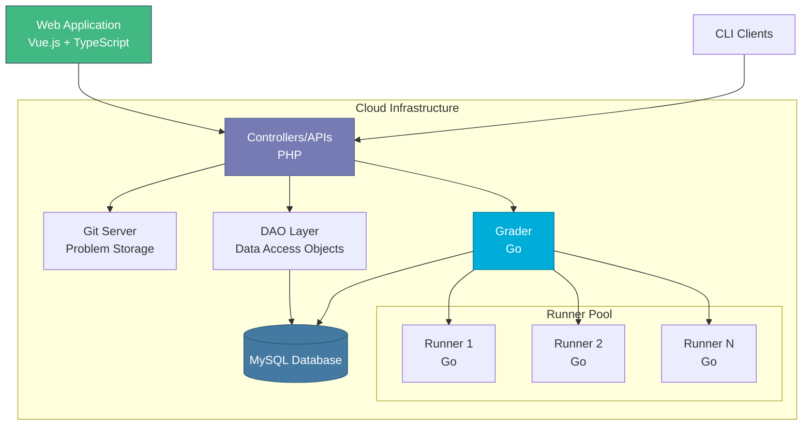

# Visão geral da arquitetura

omegaUp é construído usando o padrão de arquitetura **Model-View-Controller (MVC)**, fornecendo uma separação clara de preocupações entre dados, lógica de negócios e apresentação.

## Navegação Rápida

- :material-sitemap:{ .lg .middle } __[Padrão MVC](mvc-pattern.md)__

    ---

    Aprenda como omegaUp implementa o padrão MVC e separa preocupações.

    [:octicons-arrow-right-24: Saiba mais](mvc-pattern.md)

- :material-code-tags:{ .lg .middle } __[Arquitetura de front-end](frontend.md)__

    ---

    Estrutura e organização de front-end Vue.js, TypeScript e Bootstrap 4.

    [Explorar :octicons-arrow-right-24:](frontend.md)

- :material-server:{ .lg .middle } __[Arquitetura de back-end](backend.md)__

    ---

    Controladores PHP, padrões DAO/VO e estrutura API.

    [Explorar :octicons-arrow-right-24:](backend.md)

- :material-database:{ .lg .middle } __[Esquema de banco de dados](database-schema.md)__

    ---

    Estrutura do banco de dados, relacionamentos e padrões de acesso a dados.

    [Explorar :octicons-arrow-right-24:](database-schema.md)

## Componentes do sistema

omegaUp consiste em vários componentes principais:

### Front-end (PHP + MySQL)
A camada de aplicação web que lida com interações de usuários, administração de problemas e concursos, gerenciamento de usuários, classificações e placares. Escrito em PHP com banco de dados MySQL.

### Back-end (Ir)
O subsistema de avaliação responsável por compilar e executar envios de usuários.

- **Avaliador**: Mantém a fila de envio, envia para os Corredores e determina veredictos
- **Runner**: compila e executa programas em um ambiente sandbox seguro
- **Minijail**: sandbox Linux (bifurcado do Chrome OS) para execução segura de código

## Arquitetura de alto nível

## Pilha de tecnologia

| Tecnologia | Finalidade | Versão |
|------------|---------|---------|
| MySQL | Banco de dados | 8.0.39 |
| PHP | Controladores/API | 8.1.2 |
| Pitão | Cronjobs | 3.10.12 |
| Datilografado | Interface | 4.4.4 |
| Vue.js | Estrutura de front-end | 2.5.22 |
| Inicialização | Estrutura de IU | 4.6.0 |
| Vá | Graduador e Corredor | 20.0.1 |

!!! informações "Atualizações de versão"
    As versões tecnológicas são atualizadas periodicamente para manter a plataforma suportada e segura.

## Fluxo de solicitação

Quando um usuário envia um código, eis o que acontece:

1. **Frontend** envia HTTP POST para `/api/run/create/`
2. **Nginx** encaminha solicitação para PHP (HHVM)
3. **Bootstrap** carrega a configuração e inicializa o banco de dados
4. **Controlador** (`RunController::apiCreate`) processa solicitação
5. **Autenticação** valida o token do usuário
6. **Validação** verifica permissões, status do concurso e limites de taxas
7. **Banco de dados** armazena envios com GUID
8. **Aluno** recebe envio para avaliação
9. **Runner** compila e executa código
10. **Resultado** retornado ao frontend via WebSocket

Para obter informações detalhadas, consulte [Interiores do Sistema](internals.md).

## Princípios de Design

### Segurança em primeiro lugar
- Toda a comunicação criptografada (HTTPS)
- Execução segura de código via sandbox Minijail
- Tokens de autenticação para acesso à API
- Limitação de taxa para evitar abusos

### Escalabilidade
- Arquitetura Runner Distribuída
- Processamento de envio baseado em fila
- Cache para desempenho
- Otimização de banco de dados

### Manutenção
- Padrão MVC para separação de interesses
- Padrão DAO/VO para acesso a dados
- Cobertura abrangente de testes
- Organização clara do código

## Documentação Relacionada

- **[Padrão MVC](mvc-pattern.md)** - Implementação detalhada do MVC
- **[Arquitetura Frontend](frontend.md)** - Estrutura e componentes do frontend
- **[Arquitetura de back-end](backend.md)** - Controladores e design de API
- **[Esquema de banco de dados](database-schema.md)** - Estrutura e relacionamentos do banco de dados
- **[Interiores do Sistema](internals.md)** - Aprofundamento na operação do sistema

## Referências Acadêmicas

omegaUp foi documentado em artigos acadêmicos:

- Luis Héctor CHÁVEZ, Alan GONZÁLEZ, Joemmanuel PONCE.  
  [omegaUp: Sistema de gerenciamento de concursos e plataforma de treinamento baseado em nuvem na Olimpíada Mexicana de Informática](http://ioinformatics.org/oi/pdf/v8_2014_169_178.pdf)
- Luis Héctor CHÁVEZ.  
  [libinteractive: uma maneira melhor de escrever tarefas interativas](https://ioinformatics.org/journal/v9_2015_3_14.pdf)

---

**Próximas etapas:** Explore o [padrão MVC](mvc-pattern.md) para entender como o omegaUp organiza seu código.
