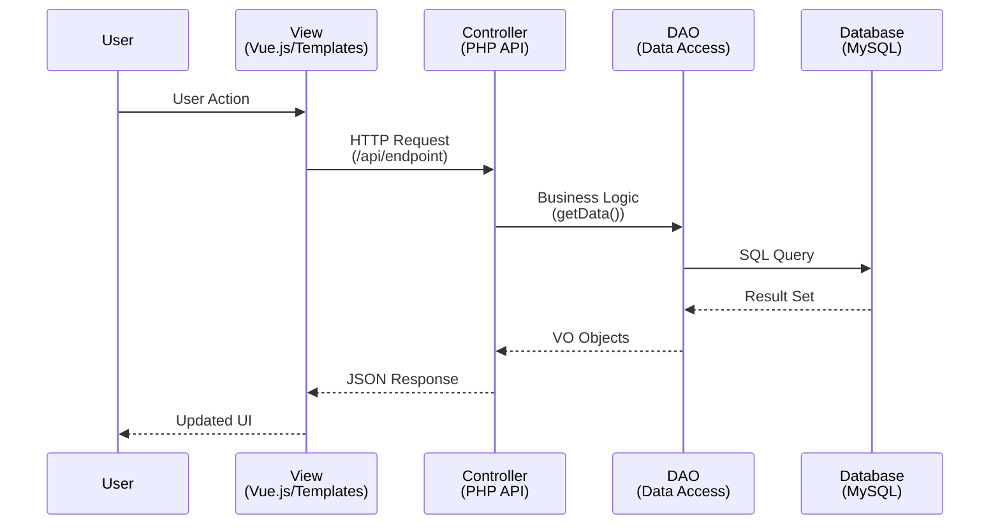
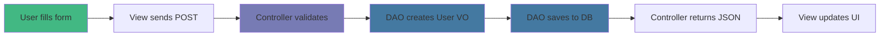

# Padrão MVC no omegaUp

omegaUp segue o padrão de arquitetura **Model-View-Controller (MVC)**, que separa um aplicativo em três componentes lógicos principais.

## Componentes MVC

### Modelo
Representa os dados e a lógica de negócios. No ômegaUp:
- **DAOs (Data Access Objects)**: Classes para interação com banco de dados
- **VOs (Value Objects)**: Classes que mapeiam para tabelas de banco de dados
- Localizado em `frontend/server/src/DAO/`

### Ver
Representa a interface do usuário. No ômegaUp:
- **Modelos**: modelos Smarty (sendo migrados para Vue.js)
- **Componentes Vue**: componentes de UI modernos
- **TypeScript**: lógica de front-end
- Localizado em `frontend/www/` e `frontend/templates/`

### Controlador
Atua como intermediário entre Model e View. No ômegaUp:
- **Controladores de API**: lidam com solicitações HTTP e lógica de negócios
- Localizado em `frontend/server/src/Controllers/`
- Nunca acesse diretamente o banco de dados (usa DAOs)
- Nunca renderize HTML (retorna JSON)

## Diagrama de Fluxo MVC


## Exemplo de fluxo de dados

Veja como funciona um registro de usuário:


## Princípios Chave

### Separação de Preocupações
- **Modelo**: somente dados e regras de negócios
- **Ver**: apenas apresentação
- **Controlador**: Somente coordenação

### Sem acesso direto ao banco de dados
Os controladores nunca escrevem SQL diretamente. Eles usam DAOs:

```php
// ✅ Good: Using DAO
$user = new Users();
$user->setEmail('user@example.com');
$results = UsersDAO::search($user);

// ❌ Bad: Direct SQL in Controller
$results = $conn->query("SELECT * FROM Users WHERE email = ...");
```
### Design que prioriza a API
Os controladores retornam JSON, tornando-os reutilizáveis:
- Front-end da Web
- Ferramentas CLI
- Aplicativos móveis
- Integrações de terceiros

## Benefícios

1. **Manutenção**: A separação clara torna o código mais fácil de entender
2. **Testabilidade**: Cada componente pode ser testado de forma independente
3. **Reutilização**: os controladores servem como terminais de API
4. **Escalabilidade**: Fácil de adicionar novas visualizações ou modificar as existentes

## Documentação Relacionada

- **[Arquitetura de Backend](backend.md)** - Controlador detalhado e estrutura DAO
- **[Arquitetura Frontend](frontend.md)** - Implementação da camada de visualização
- **[Esquema de banco de dados](database-schema.md)** - Estrutura da camada do modelo
