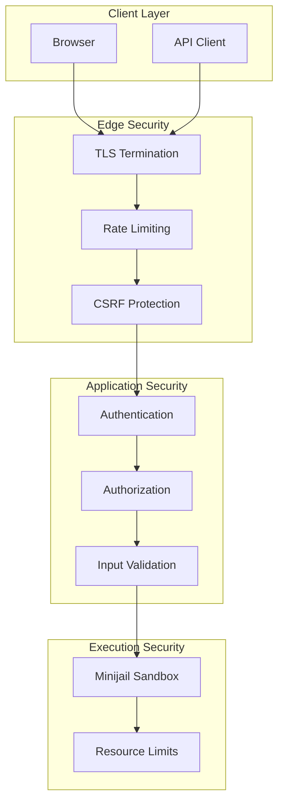
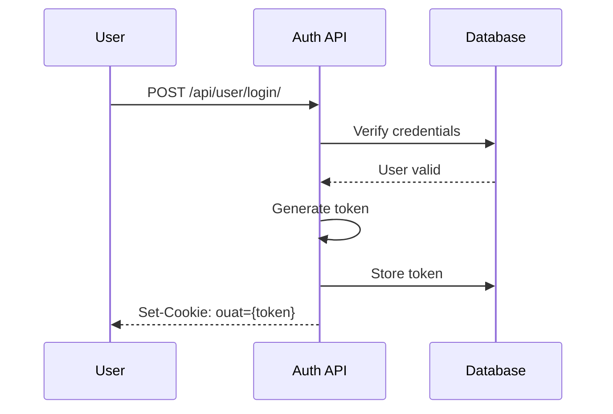
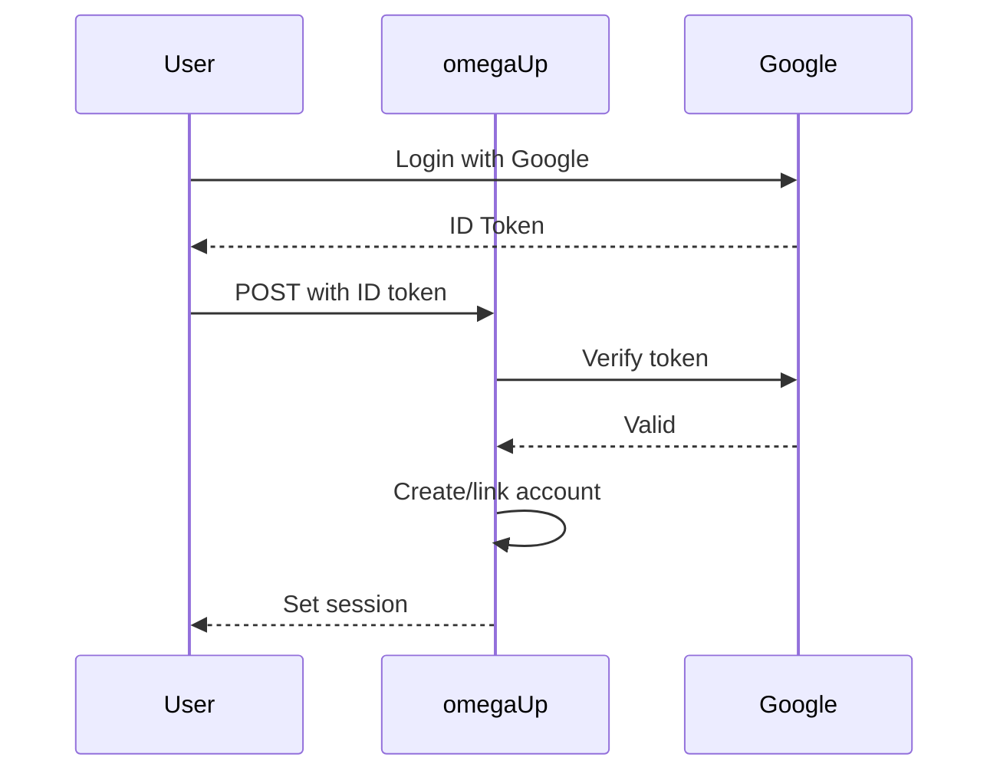
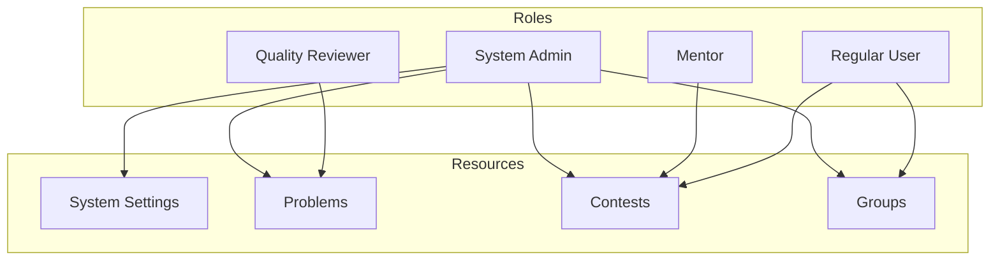
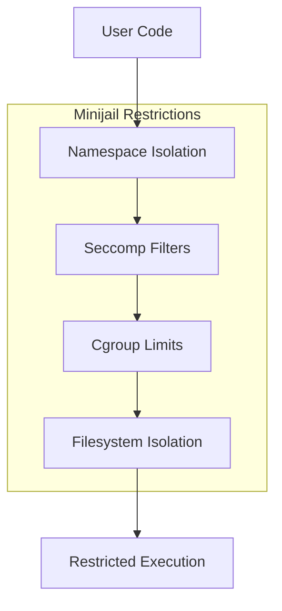

# Arquitetura de segurança

Esta página documenta a arquitetura de segurança do omegaUp, incluindo mecanismos de autenticação, modelo de autorização, limitação de taxa e sistema de sandbox para execução de código.

## Visão geral da segurança


## Autenticação

### Autenticação baseada em token

omegaUp usa autenticação baseada em token por meio do cookie `ouat` (omegaUp Auth Token).

#### Geração de Tokens


#### Estrutura do token

```
{entropy}-{identity_id}-{hash}
```
- `entropy`: 15 bytes de dados aleatórios (codificação hexadecimal)
- `identity_id`: ID de identidade do usuário
- `hash`: SHA-256(sal + identidade_id + entropia)

#### Validação de token

```php
// Token validated on each request
$identityExt = \OmegaUp\DAO\AuthTokens::getIdentityByToken($authToken);
if (is_null($identityExt)) {
    throw new UnauthorizedException('loginRequired');
}
```
### Autenticação de token de API

Para acesso programático, os usuários podem criar tokens de API:

```bash
# Authorization header format
Authorization: token {api_token}

# With identity selection
Authorization: token Credential={api_token},Username={identity}
```
#### Limites de taxa

Os tokens de API têm limites de taxa configuráveis:

| Tipo de limite | Padrão | Cabeçalhos |
|------------|---------|---------|
| Solicitações/hora | 1000 | `X-RateLimit-Limit` |
| Restante | - | `X-RateLimit-Remaining` |
| Redefinir hora | - | `X-RateLimit-Reset` |

### Integração OAuth

Autenticação de terceiros por meio de:

- **Google**: OAuth 2.0 com verificação de token de ID
- **Facebook**: OAuth 2.0 com token de acesso


## Autorização

### Controle de acesso baseado em função


### Níveis de permissão

| Nível | Descrição | Exemplo |
|-------|-------------|---------|
| Administrador do sistema | Acesso total à plataforma | Configuração do site |
| Revisor de Qualidade | Revise a qualidade do problema | Nomeações de qualidade |
| Mentor | Guia codificadores do mês | Selecione os vencedores |
| Administrador do concurso | Gerenciar concurso específico | Adicionar problemas, usuários |
| Administrador de problemas | Gerenciar problema específico | Atualizar declarações |
| Administrador de grupo | Gerenciar grupo | Adicionar membros |

### Verificações de autorização

```php
// Check system admin
if (!\OmegaUp\Authorization::isSystemAdmin($identity)) {
    throw new ForbiddenAccessException();
}

// Check contest admin
if (!\OmegaUp\Authorization::isContestAdmin($identity, $contest)) {
    throw new ForbiddenAccessException();
}

// Check group membership
if (!\OmegaUp\Authorization::isGroupAdmin($identity, $group)) {
    throw new ForbiddenAccessException();
}
```
### Sistema ACL

Os recursos usam listas de controle de acesso:

```sql
-- ACL table
CREATE TABLE `ACLs` (
    `acl_id` int NOT NULL AUTO_INCREMENT,
    `owner_id` int NOT NULL,
    PRIMARY KEY (`acl_id`)
);

-- User permissions
CREATE TABLE `User_Roles` (
    `user_id` int NOT NULL,
    `role_id` int NOT NULL,
    `acl_id` int NOT NULL,
    PRIMARY KEY (`user_id`, `role_id`, `acl_id`)
);

-- Group permissions
CREATE TABLE `Group_Roles` (
    `group_id` int NOT NULL,
    `role_id` int NOT NULL,
    `acl_id` int NOT NULL,
    PRIMARY KEY (`group_id`, `role_id`, `acl_id`)
);
```
## Validação de entrada

### Validação de parâmetros

Todas as entradas da API são validadas:

```php
// Required string
$alias = $r->ensureString('alias', 
    fn ($alias) => \OmegaUp\Validators::alias($alias)
);

// Optional int with bounds
$page = $r->ensureOptionalInt('page', 
    lowerBound: 1, 
    upperBound: 1000
);

// Enum validation
$status = $r->ensureEnum('status', 
    ['open', 'resolved', 'banned']
);
```
### Prevenção de injeção SQL

Todas as consultas ao banco de dados usam instruções preparadas:

```php
// Safe query with parameters
$result = \OmegaUp\MySQLConnection::getInstance()->GetAll(
    'SELECT * FROM Problems WHERE alias = ?',
    [$problemAlias]
);
```
### Prevenção XSS

A saída tem escape por padrão nos modelos:

```twig
{# Auto-escaped #}
{{ problem.title }}

{# Raw HTML (explicit) #}
{{ problem.description | raw }}
```
## Limitação de taxa

### Limites de taxa de endpoint

| Ponto final | Limite | Janela |
|----------|-------|--------|
| `/api/user/login/` | 10 | 1 minuto |
| `/api/run/create/` | 1 por problema | 60 segundos |
| `/api/*` (padrão) | 100 | 1 minuto |

### Implementação

```php
// Check rate limit
$key = "ratelimit:{$ip}:{$endpoint}";
$count = $redis->incr($key);

if ($count === 1) {
    $redis->expire($key, 60);
}

if ($count > $limit) {
    throw new RateLimitExceededException();
}
```
### Ignorar para concursos

Durante os concursos, os limites da taxa de envio são relaxados:

- Normal: 1 envio a cada 60 segundos por problema
- Concurso: `submissions_gap` configurável

## Proteção CSRF

### Validação de token

Os formulários incluem tokens CSRF:

```html
<input type="hidden" name="csrf_token" value="{{ csrf_token }}">
```

```php
// Validate on POST
if ($request->method === 'POST') {
    if ($request['csrf_token'] !== $session['csrf_token']) {
        throw new CSRFException();
    }
}
```
### Cookies do mesmo site

Os cookies de sessão usam o atributo SameSite:

```php
setcookie(
    OMEGAUP_AUTH_TOKEN_COOKIE_NAME,
    $token,
    [
        'path' => '/',
        'secure' => true,
        'httponly' => true,
        'samesite' => 'Lax'
    ]
);
```
## Sandbox de execução de código

### Caixa de areia Minijail

O código do usuário é executado em um ambiente altamente restrito:


### Isolamento de namespace

| Espaço para nome | Restrição |
|-----------|------------|
| PID | Não é possível ver outros processos |
| Rede | Sem acesso à rede |
| Monte | Raiz somente leitura, gravações limitadas |
| Usuário | Usuário não root |
| IPC | Sem memória compartilhada |

### Lista de permissões do Seccomp

Somente syscalls essenciais são permitidos:

```c
// Allowed syscalls
read, write, open, close, fstat, mmap, mprotect,
munmap, brk, rt_sigaction, rt_sigprocmask, 
ioctl, access, exit_group, arch_prctl

// Blocked (examples)
socket, connect, fork, execve, ptrace, 
shmget, msgget, semget
```
### Limites de recursos

| Recurso | Limite | Aplicação |
|----------|-------|-------------|
| Tempo de CPU | Específico do problema | cgrupo |
| Hora da parede | Limite de CPU 2x | Temporizador |
| Memória | Específico do problema | cgrupo |
| Tamanho do arquivo | 10 MB | limite |
| Processos | 1 | cgrupo |
| Abrir arquivos | 10 | limite |

## Configuração TLS

### Requisitos de certificado

- TLS 1.2 mínimo
- Somente conjuntos de cifras fortes
- HSTS habilitado

### Configuração Nginx

```nginx
ssl_protocols TLSv1.2 TLSv1.3;
ssl_ciphers ECDHE-ECDSA-AES128-GCM-SHA256:ECDHE-RSA-AES128-GCM-SHA256;
ssl_prefer_server_ciphers on;

add_header Strict-Transport-Security "max-age=31536000" always;
```
### TLS de serviço interno

Os serviços usam TLS mútuo:

```yaml
grader:
  volumes:
    - ./ssl/grader.crt:/etc/omegaup/ssl/grader.crt
    - ./ssl/grader.key:/etc/omegaup/ssl/grader.key
    - ./ssl/ca.crt:/etc/omegaup/ssl/ca.crt
```
## Cabeçalhos de segurança

```nginx
# Security headers
add_header X-Content-Type-Options "nosniff" always;
add_header X-Frame-Options "SAMEORIGIN" always;
add_header X-XSS-Protection "1; mode=block" always;
add_header Content-Security-Policy "default-src 'self'" always;
add_header Referrer-Policy "strict-origin-when-cross-origin" always;
```
## Registro de auditoria

### Eventos de login

```sql
CREATE TABLE `Identity_Login_Log` (
    `identity_id` int NOT NULL,
    `ip` int UNSIGNED NOT NULL,
    `time` timestamp NOT NULL DEFAULT CURRENT_TIMESTAMP
);
```
### Ações Administrativas

As ações críticas são registradas:

- Mudanças na função do usuário
- Mudanças na visibilidade do problema
- Modificações do concurso
- Resoluções de nomeação de qualidade

## Resposta a Incidentes

### Modo de bloqueio

O bloqueio de emergência desativa operações confidenciais:

```php
if (OMEGAUP_LOCKDOWN) {
    throw new ForbiddenAccessException('forbiddenInLockdown');
}
```
### Invalidação de Sessão

Forçar logout de todas as sessões:

```php
// Delete all auth tokens for user
\OmegaUp\DAO\AuthTokens::deleteAllByUser($userId);
```
## Documentação Relacionada

- **[API de autenticação](../api/authentication.md)** - Pontos de extremidade de autenticação
- **[Runner Internals](runner-internals.md)** - Detalhes do sandbox
- **[Códigos de erro](../api/error-codes.md)** - Códigos de erro de segurança
