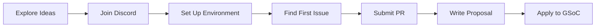

# Verão de código do Google

A omegaUp tem participado do Google Summer of Code (GSoC), oferecendo oportunidades para estudantes de todo o mundo contribuírem para a tecnologia educacional de código aberto enquanto ganham experiência valiosa no desenvolvimento de software.

## Sobre GSoC em omegaUp

O Google Summer of Code é um programa global que traz estudantes desenvolvedores para o desenvolvimento de software de código aberto. Desde que ingressou no GSoC, a omegaUp orientou vários alunos que fizeram contribuições significativas para a nossa plataforma.

### Por que trabalhar com omegaUp?

- **Impacto**: seu código ajuda milhões de estudantes a aprender programação
- **Aprendizado**: trabalhe com mentores experientes em problemas do mundo real
- **Comunidade**: junte-se a uma equipe internacional e acolhedora
- **Tecnologia**: Pilha moderna (Vue.js, TypeScript, PHP, Go, Python)
- **Flexibilidade**: trabalho remoto com horários flexíveis

## Anos do programa

### Programa Atual

- :material-rocket-launch: **[GSoC 2025](2025.md)**

    ---

    Programa do ano atual com 6 ideias de projetos, incluindo AI Teaching Assistant, Problem Editorial Generation e muito mais.

    [:octicons-arrow-right-24: Ver ideias](2025.md)

### Anos anteriores

| Ano | Projetos | Destaques |
|------|----------|-----------|
| **[2024](2024.md)** | 2 | Migração do Problem Creator para Vue.js, Cursos Públicos no GitHub |
| **[2023](2023.md)** | 2 | Contas infantis em conformidade com COPPA, migração de teste Cypress |

## Envolvendo-se

### Guia passo a passo

### 1. Explore ideias de projetos

Revise as [ideias de projetos](2025.md) do ano atual para encontrar algo de seu interesse. Você também pode propor suas próprias ideias!

### 2. Junte-se à nossa comunidade

Conecte-se conosco no [Discord](https://discord.gg/gMEMX7Mrwe) - nosso principal canal de comunicação. Não hesite em fazer perguntas!

### 3. Configure seu ambiente

Siga o [guia de configuração de desenvolvimento](../../getting-started/development-setup.md) para executar o omegaUp localmente.

### 4. Faça sua primeira contribuição

Encontre um problema marcado como ["Bom primeiro problema"](https://github.com/omegaup/omegaup/labels/Good%20first%20issue) e envie uma solicitação pull. A fusão de um PR demonstra sua capacidade de trabalhar com nossa base de código.

### 5. Escreva sua proposta

Use nosso [modelo de proposta](https://docs.google.com/document/d/1_FKfpc2M3VLDVYqvT8ZgsgwIJ3zaZnyUVmSm-H3h6UQ/edit) para criar um documento de design detalhado para o projeto escolhido.

### 6. Inscreva-se no Google

Envie sua proposta final através do [site oficial do GSoC](https://summerofcode.withgoogle.com/).

## Linha do tempo (típica)

| Fase | Período | Atividades |
|-------|--------|--------|
| Aplicativo da Organização | Janeiro-Fevereiro | omegaUp se aplica ao GSoC |
| Exploração do Aluno | Fev-Mar | Alunos exploram projetos, junte-se ao Discord |
| Período de Contribuição | Março-Abril | Os alunos contribuem, fundem os PRs |
| Envio de Proposta | Final de março a abril | Alunos submetem propostas |
| Revisão e Seleção | Abril-Maio | Avaliação dos mentores, entrevistas realizadas |
| União Comunitária | Maio | Alunos selecionados conhecem mentores |
| Período de codificação 1 | Junho-julho | Primeira metade da codificação |
| Avaliação intercalar | julho | Verificação do progresso |
| Período de codificação 2 | Julho-agosto | Segunda metade da codificação |
| Avaliação Final | Ago-Set | Submissão final e avaliação |

## Histórias de sucesso

### Criador de Problemas (GSoC 2024)

Aritra Chakraborty migrou o Problem Creator para Vue.js + TypeScript, permitindo a criação visual de problemas diretamente em omegaUp.com.

**Impacto**: Fluxo de trabalho simplificado de criação de problemas para milhares de criadores de problemas.

### Migração Cypress (GSoC 2023)

Migrei mais de 100 testes Selenium para Cypress, melhorando a confiabilidade dos testes de ~80% para ~98%.

**Impacto**: pipelines de CI/CD mais rápidos e implantações mais confiáveis.

## Perguntas frequentes

**Preciso falar espanhol?**
: Não! Aceitamos colaboradores que falem qualquer idioma. Todas as discussões técnicas podem ser em inglês.

**Quantos colaboradores você aceita?**
: normalmente 2 a 3 por ano, dependendo da alocação do Google.

**Posso propor meu próprio projeto?**
: Sim! Incentivamos ideias originais. Discuta-os primeiro com mentores no Discord.

**E se eu não for selecionado?**
: Damos as boas-vindas a voluntários contínuos! Muitos colaboradores não GSoC tornaram-se membros valiosos da equipe.

## Documentação Relacionada

- **[Guia de contribuição](../../getting-started/contributing.md)** - Como contribuir
- **[Obtendo ajuda](../../getting-started/getting-help.md)** - Suporte da comunidade
- **[Configuração de desenvolvimento](../../getting-started/development-setup.md)** - Configuração do ambiente
- **[Visão geral da arquitetura](../../architecture/index.md)** - Arquitetura do sistema
