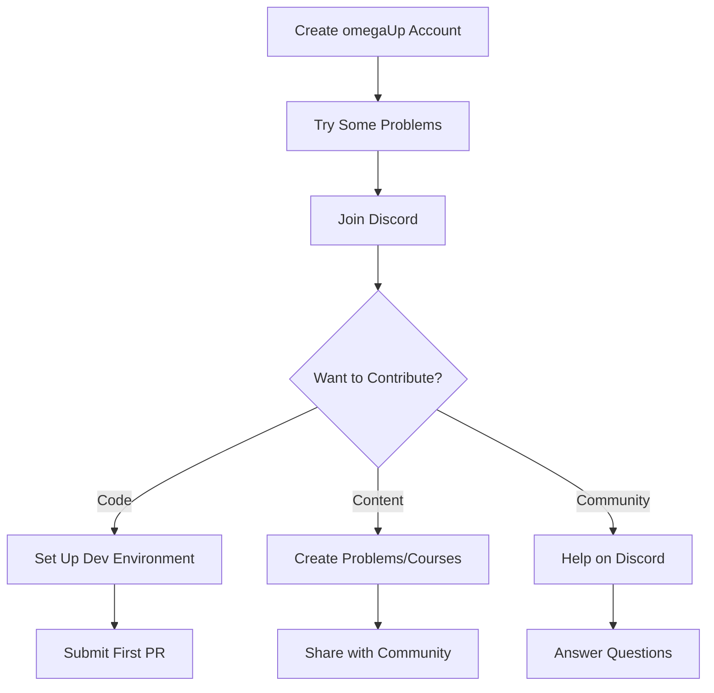

# Comunidade

Bem-vindo à comunidade omegaUp! Somos um grupo diversificado de desenvolvedores, educadores e entusiastas que trabalham juntos para tornar o ensino de programação acessível a todos.

## Sobre nossa comunidade

omegaUp é um projeto de código aberto conduzido por voluntários que acreditam no poder da educação em programação. Nossa comunidade abrange vários países e inclui:

- **Desenvolvedores**: contribuição de código, análises e conhecimento técnico
- **Configuradores de Problemas**: Criando desafios de programação educacional
- **Tradutores**: tornando o conteúdo acessível em vários idiomas
- **Educadores**: Usando omegaUp em salas de aula e competições

## Maneiras de contribuir

### Google Summer of Code

Nosso principal programa para estudantes contribuintes:

| Ano | Estado | Descrição |
|------|--------|---------|
| **[GSoC 2025](gsoc/2025.md)** | Ativo | 6 ideias de projetos, mentores disponíveis |
| **[GSoC 2024](gsoc/2024.md)** | Concluído | Criador de Problemas, Cursos Públicos |
| **[GSoC 2023](gsoc/2023.md)** | Concluído | Contas infantis, migração Cypress |

[:octicons-arrow-right-24: Saiba mais sobre GSoC](gsoc/index.md)

### Desenvolvimento Voluntário

Contribua com código a qualquer momento, não apenas durante o GSoC:

1. **Configure** seu [ambiente de desenvolvimento](../getting-started/development-setup.md)
2. **Encontre** uma [boa primeira edição](https://github.com/omegaup/omegaup/labels/Good%20first%20issue)
3. **Enviar** uma solicitação pull
4. **Torne-se** um colaborador regular

### Outras contribuições

- **Documentação**: Melhore nossos documentos e tutoriais
- **Tradução**: ajude a traduzir conteúdo para mais idiomas
- **Testes**: reporte bugs e teste novos recursos
- **Configuração de problemas**: Crie problemas de programação
- **Mentoria**: ajude novos colaboradores a começar

## Canais de comunicação

### Discord (Primário)

Junte-se ao nosso [servidor Discord](https://discord.gg/gMEMX7Mrwe) para:

- Discussões em tempo real
- Ajuda no desenvolvimento
- Coordenação GSoC
- Anúncios da comunidade

### GitHub

- **[Problemas](https://github.com/omegaup/omegaup/issues)**: Relatórios de bugs e solicitações de recursos
- **[Discussões](https://github.com/omegaup/omegaup/discussions)**: Conversas gerais
- **[Pull Requests](https://github.com/omegaup/omegaup/pulls)**: contribuições de código

###Blog

Visite nosso [blog](https://blog.omegaup.com/) para:

- Atualizações da plataforma
- Aprofundamentos técnicos
- Destaques da comunidade
- Anúncios de competição

## Junte-se à equipe

Interessado em se tornar um membro oficial da equipe omegaUp?

- **[Recrutamento](recruitment.md)** - Como fazer parte da nossa equipe principal

## Código de Conduta

Temos o compromisso de fornecer um ambiente acolhedor para todos:

- Seja respeitoso e inclusivo
- Ajude os outros a aprender e crescer
- Concentre-se em feedback construtivo
- Comemore diversas perspectivas

## Primeiros passos

Novo no omegaUp? Aqui está o seu roteiro:

## Estatísticas da comunidade

| Métrica | Contagem |
|-------|-------|
| Estrelas do GitHub | 300+ |
| Bifurcações do GitHub | 430+ |
| Colaboradores | 100+ |
| Participantes do GSoC | 10+ |

## Documentação Relacionada

- **[Primeiros passos](../getting-started/index.md)** - Comece a contribuir
- **[Guia de contribuição](../getting-started/contributing.md)** - Como enviar PRs
- **[Como obter ajuda](../getting-started/getting-help.md)** - Onde fazer perguntas
- **[Visão geral do desenvolvimento](../development/index.md)** - Recursos técnicos
