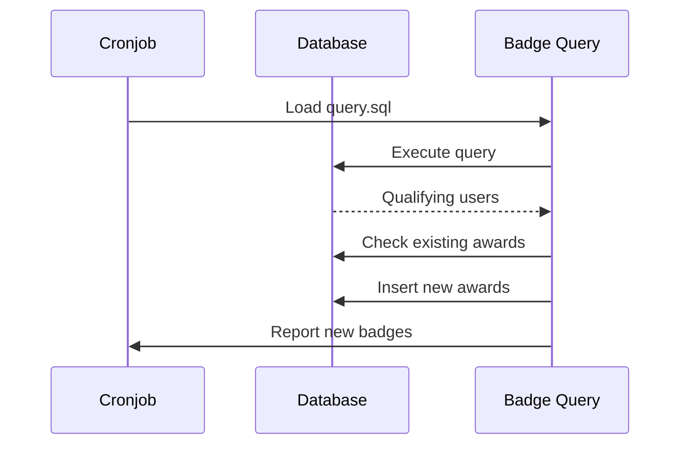

# Emblemas

omegaUp inclui um sistema abrangente de emblemas para reconhecer as conquistas, marcos e contribuições dos usuários para a plataforma.

## Visão geral

Os emblemas são concedidos automaticamente com base em consultas SQL executadas periodicamente por meio de cronjobs. Cada emblema possui seu próprio diretório contendo a lógica de consulta, descrições localizadas e casos de teste.

## Categorias de emblemas

### Marcos de resolução de problemas

| Distintivo | Requisito | Descrição |
|-------|------------|-------------|
| **100 problemas resolvidos** | Resolva mais de 100 problemas | Reconhece solucionadores de problemas dedicados |
| **Pontuação 500** | Alcance mais de 500 pontuação total | Marco de pontuação geral |

### Sequência de emblemas

| Distintivo | Requisito | Descrição |
|-------|------------|-------------|
| **Sequência de 7 dias** | Resolver problemas 7 dias consecutivos | Consistência de uma semana |
| **Sequência de 15 dias** | Resolver problemas 15 dias consecutivos | Dedicação de duas semanas |
| **Sequência de 30 dias** | Resolver problemas 30 dias consecutivos | Compromisso de um mês |

### Selos de especialista em idiomas

| Distintivo | Requisito | Descrição |
|-------|------------|-------------|
| **Especialista em C++** | Resolva mais de 10 problemas em C++ | Proficiência em C++ |
| **Especialista em Java** | Resolva mais de 10 problemas em Java | Proficiência em Java |
| **Especialista em Python** | Resolva mais de 10 problemas em Python | Proficiência em Python |
| **Especialista Pascal** | Resolva mais de 10 problemas em Pascal | Proficiência Pascal |
| **Karel Especialista** | Resolva mais de 10 problemas em Karel | Proficiência de Karel |

### Conclusão do curso

| Distintivo | Requisito | Descrição |
|-------|------------|-------------|
| **Graduação em C++** | Curso completo de C++ | Conclusão do curso |
| **Graduação do curso Python** | Curso completo de Python | Conclusão do curso |
| **Introdução à Pós-Graduação em Algoritmos** | Curso completo de algoritmos | Conclusão do curso |
| **Introdução aos Algoritmos 2 Pós-Graduação** | Curso avançado completo | Conclusão do curso |

### Comunidade e contribuição

| Distintivo | Requisito | Descrição |
|-------|------------|-------------|
| **Definidor de problemas** | Crie um problema público | Criador de conteúdo |
| **Gerente de concurso** | Organize um concurso | Organizador do concurso |
| **Gerenciador de Concurso Virtual** | Crie concursos virtuais | Facilitador de práticas |
| **Fornecedor de comentários** | Envie indicações de qualidade | Contribuidor da comunidade |
| **Codificador do Mês** | Seja selecionado como Coder do Mês | Reconhecimento mensal |

### Emblemas Especiais

| Distintivo | Requisito | Descrição |
|-------|------------|-------------|
| **Usuário legado** | Conta criada antes de 2020 | Adepto pioneiro |
| **Usuário atualizado** | Informações completas do perfil | Conclusão do perfil |
| **Problema da Semana** | Resolva o problema em destaque | Desafio semanal |
| **Problema de Natal 2021** | Resolver problema de férias | Participação em eventos |

## Implementação do selo

### Estrutura de diretório

Cada emblema é definido em `frontend/badges/[badge-name]/`:

```
frontend/badges/
├── 100solvedProblems/
│   ├── icon.svg          # Badge icon
│   ├── localizations.json # Translations
│   ├── query.sql         # Award criteria
│   └── test.json         # Test cases
├── cppExpert/
│   └── ...
└── default_icon.svg      # Fallback icon
```
### Estrutura de consulta

As consultas de selo retornam IDs de usuários qualificados:

```sql
-- Example: 100solvedProblems/query.sql
SELECT DISTINCT
    i.user_id
FROM
    Identities i
INNER JOIN
    (
        SELECT
            s.identity_id,
            COUNT(DISTINCT s.problem_id) AS solved_count
        FROM
            Submissions s
        INNER JOIN
            Runs r ON s.current_run_id = r.run_id
        WHERE
            r.verdict = 'AC'
        GROUP BY
            s.identity_id
        HAVING
            solved_count >= 100
    ) AS solved ON i.identity_id = solved.identity_id
WHERE
    i.user_id IS NOT NULL;
```
### Formato de localização

Suporte multilíngue em `localizations.json`:

```json
{
  "es": {
    "name": "100 Problemas resueltos",
    "description": "Otorgado a personas que han resuelto 100 problemas o más."
  },
  "en": {
    "name": "100 Solved Problems",
    "description": "User has solved 100 or more problems."
  },
  "pt": {
    "name": "100 Problemas Resolvidos",
    "description": "Concedido a pessoas que resolveram 100 ou mais problemas."
  }
}
```
### Casos de teste

Validação em `test.json`:

```json
{
  "users": ["test_user_1", "test_user_2"],
  "expected": {
    "test_user_1": true,
    "test_user_2": false
  }
}
```
## Processamento de crachás

### Execução do Cronjob

Os emblemas são concedidos por meio do cronjob de atribuição de emblemas:

```bash
# Run badge assignment
python3 stuff/cron/assign_badges.py
```
### Fluxo de processamento


## Exibição de crachá

### Perfil do usuário

Os emblemas aparecem nos perfis de usuário no `/profile/{username}/`:

- Ícone do emblema (SVG)
- Nome localizado
- Data da premiação
- Descrição do emblema ao passar o mouse

### API de emblema

Recuperar emblemas programaticamente:

```bash
# Get all badges
GET /api/Badge/list/

# Get user's badges
GET /api/Badge/myList/

# Get specific user's badges
GET /api/Badge/userList/?target_user={username}

# Get badge details
GET /api/Badge/badgeDetails/?badge_alias={alias}
```
## Criando novos emblemas

### Etapa 1: Criar diretório

```bash
mkdir frontend/badges/newBadgeName
```
### Etapa 2: Escrever consulta

Crie `query.sql` que retorne valores `user_id` qualificados:

```sql
SELECT DISTINCT
    i.user_id
FROM
    Identities i
WHERE
    -- Your criteria here
    i.user_id IS NOT NULL;
```
### Etapa 3: adicionar localizações

Crie `localizations.json`:

```json
{
  "es": {
    "name": "Nuevo Badge",
    "description": "Descripción del badge."
  },
  "en": {
    "name": "New Badge",
    "description": "Badge description."
  }
}
```
### Etapa 4: Adicionar ícone (opcional)

Crie `icon.svg` ou use o ícone padrão.

### Etapa 5: Adicionar testes

Crie `test.json` com os resultados esperados.

### Etapa 6: teste localmente

```bash
# Run badge tests
python3 stuff/cron/assign_badges.py --dry-run --badge=newBadgeName
```
## Documentação Relacionada

- **[API de emblemas](../api/badges.md)** - Pontos de extremidade da API para emblemas
- **[Padrões de banco de dados](../development/database-patterns.md)** - Padrões de consulta
- **[Cronjobs](../architecture/infrastructure.md)** - Processamento em segundo plano
