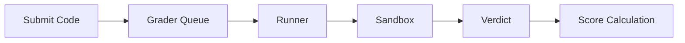

# Documentação de recursos

Documentação detalhada para recursos e funcionalidades do omegaUp. Esta seção cobre tudo, desde a criação de problemas até atualizações de concursos em tempo real.

## Recursos principais

- :material-puzzle:{ .lg .middle } **[Problemas](problems/index.md)**

    ---

    Criação, gerenciamento e formatação de problemas de programação. Aprenda sobre declarações de problemas, casos de teste, validadores e o ciclo de vida completo do problema.

    [:octicons-arrow-right-24: Saiba mais](problems/index.md)

- :material-trophy:{ .lg .middle } **[Concursos](contests/index.md)**

    ---

    Organização e gerenciamento de concursos de programação. Configure modos de pontuação, gerencie participantes e realize competições de sucesso.

    [:octicons-arrow-right-24: Saiba mais](contests/index.md)

- :material-code-braces:{ .lg .middle } **[Arena](arena.md)**

    ---

    A interface do concurso onde os participantes resolvem problemas. Possui editor de código, placar em tempo real e sistema de esclarecimento.

    [:octicons-arrow-right-24: Saiba mais](arena.md)

## Sistema de Avaliação

O sistema de avaliação é o coração do omegaUp, lidando com compilação, execução e pontuação de código.

| Componente | Descrição | Documentação |
|-----------|-------------|---------------|
| **Aluno** | Gestão de filas e determinação de veredictos | [Classificadora](grader.md) |
| **Corredor** | Compilação de código e execução em sandbox | [Corredor](runner.md) |
| **Caixa de areia** | Execução segura usando Minijail | [Caixa de areia](sandbox.md) |
| **Veredictos** | Tipos de resultados e modelos de pontuação | [Veredictos](verdicts.md) |

### Fluxo de avaliação

## Gerenciamento de Problemas

| Recurso | Descrição | Documentação |
|--------|-------------|---------------|
| **Criando problemas** | Escreva declarações, casos de teste, validadores | [Criando Problemas](problems/creating-problems.md) |
| **Formato do problema** | Estrutura e configurações de arquivos | [Formato do problema](problems/problem-format.md) |
| **Controle de versão** | Versionamento de problemas baseado em Git | [Controle de versão do problema](problem-versioning.md) |

## Recursos em tempo real

| Recurso | Descrição | Documentação |
|--------|-------------|---------------|
| **Atualizações ao vivo** | Notificações baseadas em WebSocket | [Tempo real](realtime.md) |
| **Painéis de avaliação** | Classificações do concurso ao vivo | [Arena](arena.md) |
| **Esclarecimentos** | Sistema de perguntas e respostas do concurso | [Arena](arena.md) |

## Sistema de conquistas

| Recurso | Descrição | Documentação |
|--------|-------------|---------------|
| **Selos** | Recompensas por conquistas do usuário | [Selos](badges.md) |

### Categorias de emblemas

- **Resolução de problemas**: 100 problemas resolvidos, 500 pontos
- **Sequências**: sequências de resolução de 7 dias, 15 dias, 30 dias
- **Experiência em linguagem**: especialistas em C++, Java, Python
- **Comunidade**: definidor de problemas, gerente de concurso, provedor de feedback

## Matriz de recursos

| Recurso | Prática | Concurso | Curso |
|--------|----------|---------|--------|
| Resolução de problemas | ✅ | ✅ | ✅ |
| Placar ao vivo | ❌ | ✅ | ❌ |
| Prazos | ❌ | ✅ | Configurável |
| Esclarecimentos | ❌ | ✅ | ✅ |
| Acompanhamento do progresso | ✅ | ❌ | ✅ |
| Certificados | ❌ | ✅ | ✅ |
| Participação virtual | ✅ | ✅ | ❌ |

## Documentação Relacionada

- **[Referência de API](../api/index.md)** - Endpoints de API para todos os recursos
- **[Arquitetura](../architecture/index.md)** - Detalhes da arquitetura do sistema
- **[Guias de desenvolvimento](../development/index.md)** - Guias de implementação de recursos
