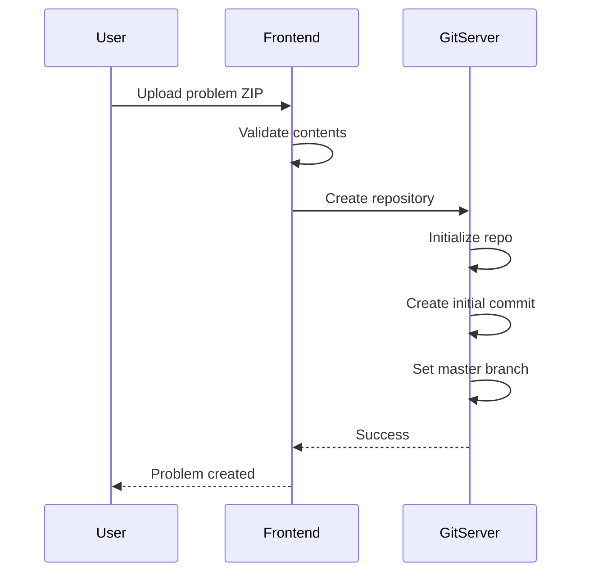
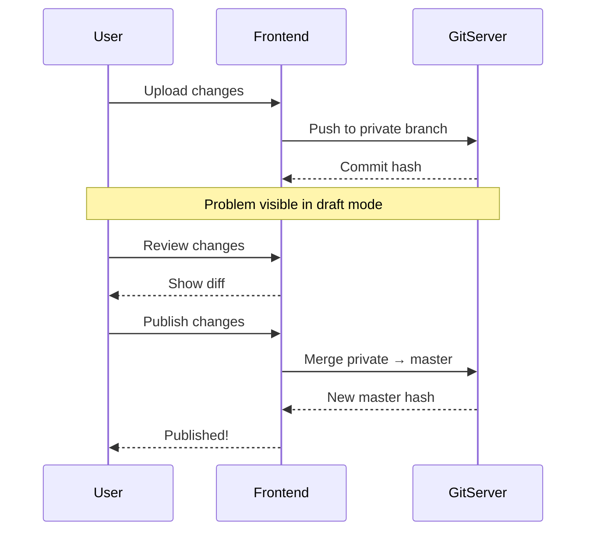
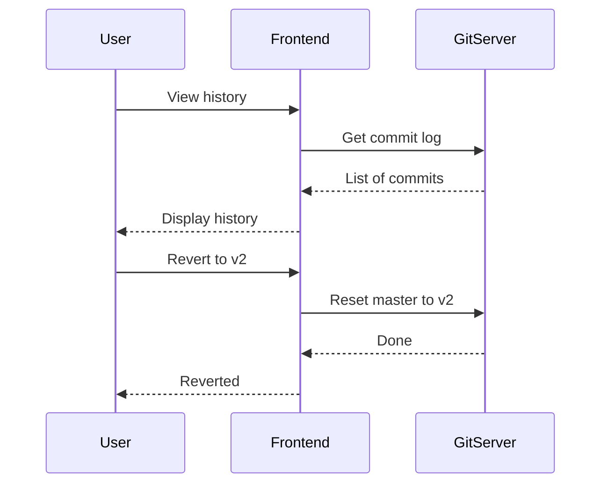
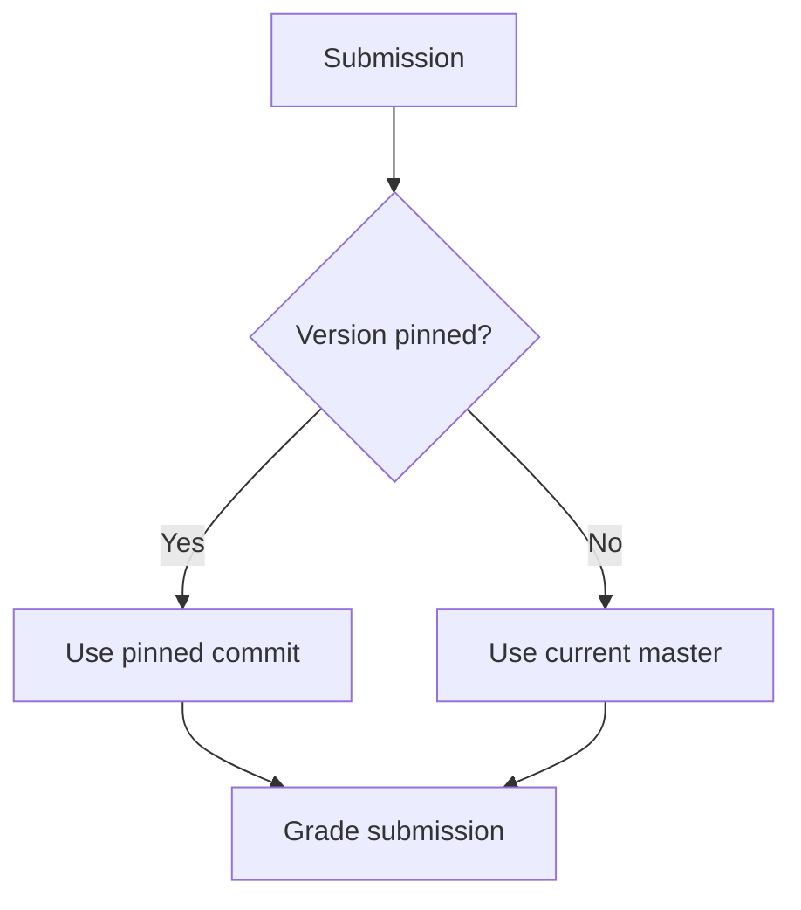

# Problema de versionamento

omegaUp usa Git para controle de versão de problemas, permitindo rastreamento de histórico completo, atualizações atômicas e fixação de versão para concursos.

## Visão geral

Cada problema é um repositório Git contendo:

- Declarações de problemas (vários idiomas)
- Casos de teste (entradas e saídas esperadas)
- Validadores personalizados (opcional)
- Arquivos de problemas interativos (opcional)
- Definições de configuração

## Benefícios do controle de versão

### Para criadores de problemas

- **Acompanhamento de histórico**: veja todas as alterações ao longo do tempo
- **Reversão**: Reverter para qualquer versão anterior
- **Modo rascunho**: teste as alterações antes de publicar
- **Colaboração**: vários editores com controle de alterações

### Para organizadores de concursos

- **Fixação de versão**: problema de bloqueio em versão específica
- **Consistência**: Mesma versão durante todo o concurso
- **Independência**: atualizações de problemas não afetam a realização de concursos

## Filiais

### Estrutura da Filial

```
refs/
├── heads/
│   ├── master      # Published version
│   ├── private     # Draft version
│   └── published   # Alias for master
└── tags/
    ├── v1
    ├── v2
    └── contest-2024
```
### Objetivos da Filial

| Filial | Finalidade | Visibilidade |
|--------|---------|--------|
| `master` | Versão publicada e ao vivo | Público (se o problema for público) |
| `private` | Trabalho em andamento | Problema apenas para administradores |
| `published` | Alias ​​para mestre | O mesmo que mestre |

## Fluxo de trabalho

### Criando um problema


### Atualizando um problema


### Revertendo alterações


## Fixação de versão

### Em concursos

Ao adicionar um problema a um concurso:

```json
{
  "problem_alias": "sum-two",
  "commit": "abc123def456",  // Optional: pin to specific version
  "points": 100
}
```
Se `commit` for omitido, utiliza o `master` atual no início do concurso.

### Durante o concurso


### Após o concurso

O problema pode ser atualizado sem afetar:

- Placares do concurso
- Envios históricos
- Integridade do concurso

## Histórico de commits

### Visualizando histórico

Acesso via API ou UI:

```bash
GET /api/problem/versions/?problem_alias=sum-two
```
Resposta:

```json
{
  "versions": [
    {
      "commit": "abc123",
      "message": "Fixed test case 5",
      "author": "admin",
      "timestamp": 1704067200
    },
    {
      "commit": "def456",
      "message": "Added edge cases",
      "author": "admin",
      "timestamp": 1703980800
    }
  ]
}
```
### Confirmar mensagens

Mensagens automáticas para operações comuns:

| Operação | Formato da mensagem |
|-----------|---------------|
| Criar | "Comprometimento inicial" |
| Declaração de atualização | "Declaração atualizada para {lang}" |
| Adicionar casos de teste | "Adicionados casos de teste {n}" |
| Alterar limites | "Limites atualizados: tempo={t}s, memória={m}MB" |

## Estrutura de diretório

### Conteúdo do problema

```
problem/
├── statements/
│   ├── es.markdown       # Spanish statement
│   ├── en.markdown       # English statement
│   └── images/
│       └── diagram.png
├── cases/
│   ├── easy.1.in
│   ├── easy.1.out
│   ├── easy.2.in
│   ├── easy.2.out
│   ├── hard.1.in
│   └── hard.1.out
├── solutions/
│   └── solution.cpp
├── validators/
│   └── validator.cpp     # Optional
├── interactive/
│   ├── Main.idl          # Optional
│   └── Main.cpp
├── settings.json
└── testplan              # Optional
```
### configurações.json

```json
{
  "Limits": {
    "TimeLimit": "1s",
    "MemoryLimit": "256MiB",
    "OverallWallTimeLimit": "30s",
    "OutputLimit": "10240KiB"
  },
  "Validator": {
    "Name": "token-numeric",
    "Tolerance": 1e-6
  },
  "Cases": [
    {
      "Name": "easy",
      "Cases": ["easy.1", "easy.2"],
      "Weight": 30
    },
    {
      "Name": "hard",
      "Cases": ["hard.1"],
      "Weight": 70
    }
  ]
}
```
## Detalhes do formato do arquivo

### Remarcação de extrato

```markdown
# Problem Title

## Description
Problem description here...

## Input
Input format description...

## Output
Output format description...

## Constraints
- $1 \leq n \leq 10^6$

## Examples

### Input
```
5
1 2 3 4 5
```

### Output
```
15
```

## Notes
Additional notes...
```
### Casos de teste

| Extensão | Finalidade |
|-----------|---------|
| `.in` | Arquivo de entrada |
| `.out` | Produção esperada |

Convenção de nomenclatura:

```
{group}.{number}.in
{group}.{number}.out
```
## Operações de API

### Obtenha a versão atual

```bash
GET /api/problem/details/?problem_alias=sum-two
```
Retorna o campo `current_version`.

### Listar versões

```bash
GET /api/problem/versions/?problem_alias=sum-two
```
### Problema de atualização

```bash
POST /api/problem/update/
  problem_alias=sum-two
  message="Fixed edge case"
  contents=<zip file>
  update_published=none|non-problemset|all
```
### Publicar rascunho

```bash
POST /api/problem/updateProblemLevel/
  problem_alias=sum-two
  update_published=all
```
## Melhores práticas

### Gerenciamento de versão

1. **Use mensagens significativas**: descreva o que mudou
2. **Teste antes de publicar**: Use filial privada
3. **Fixar concursos**: Sempre fixe concursos críticos
4. **Arquive versões antigas**: marque lançamentos importantes

### Colaboração

1. **Edições coordenadas**: um editor por vez
2. **Revise as alterações**: verifique as diferenças antes de publicar
3. **Decisões de documentos**: Use mensagens de commit

### Preparação para o Concurso

1. **Congelar antecipadamente**: fixar versões bem antes do concurso
2. **Versão fixada de teste**: verifique com envios de teste
3. **Não atualizar durante o concurso**: pode causar problemas

## Documentação Relacionada

- **[Arquitetura GitServer](../architecture/gitserver.md)** - Detalhes técnicos
- **[API de problemas](../api/problems.md)** - referência da API
- **[Criando Problemas](problems/creating-problems.md)** - Guia de criação de problemas
