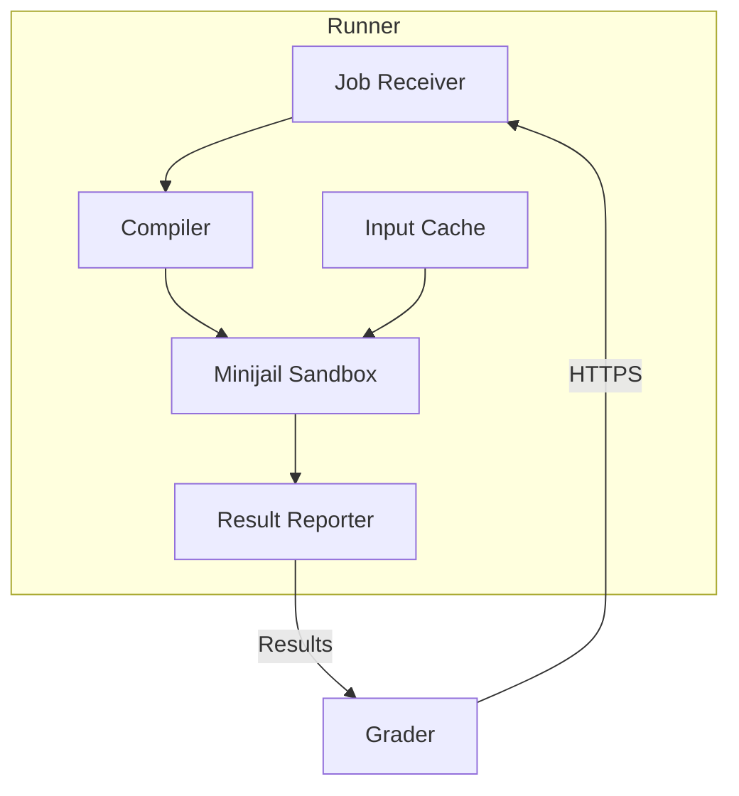
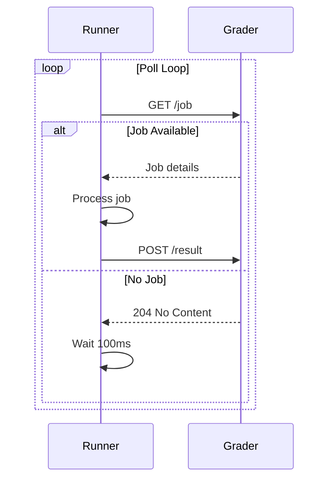
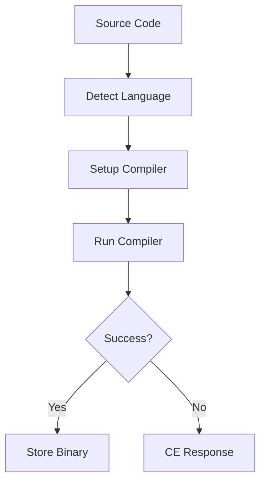
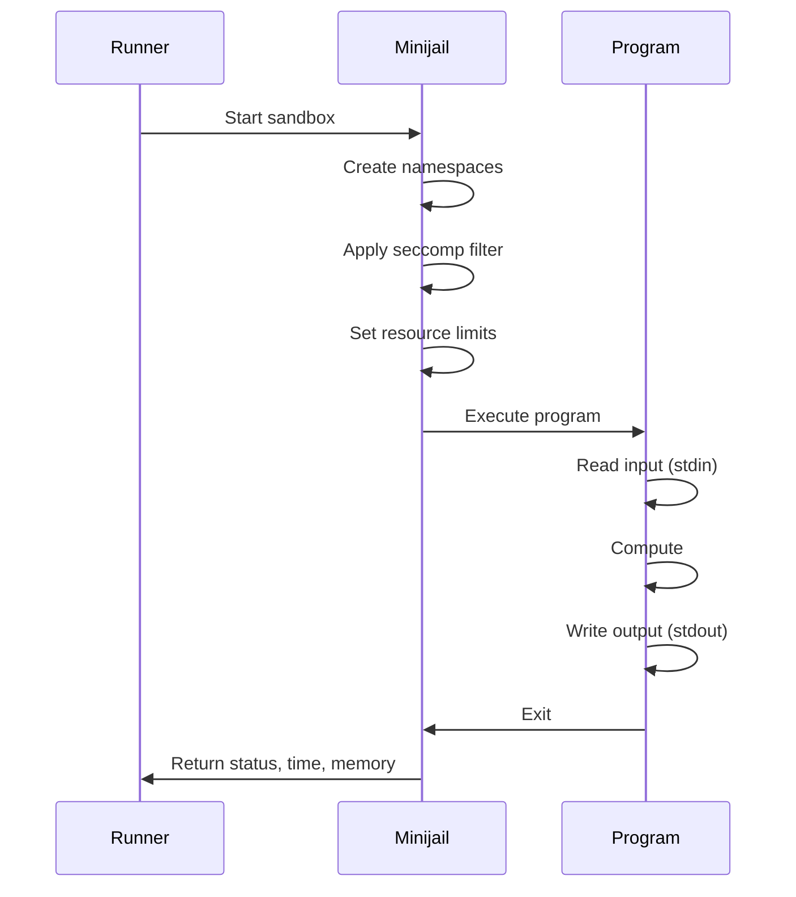

# Corredor

Runners são serviços Go distribuídos responsáveis por compilar e executar código enviado pelo usuário em um ambiente sandbox seguro. Vários Runners trabalham em paralelo para lidar com a carga de envios durante as competições.

## Visão geral

Cada Runner é implantado em uma máquina virtual em nuvem e se comunica com o Grader via HTTPS usando autenticação de certificado mútuo. Os executores lidam com todo o ciclo de vida de execução: compilação, execução em área restrita e coleta de resultados.

## Arquitetura


## Principais recursos

- **Execução segura**: usa sandbox Minijail para isolamento de processos
- **Distribuído**: Vários executores para escalabilidade horizontal
- **Suporte a idiomas**: mais de 10 linguagens de programação
- **Cache**: entradas de casos de teste armazenadas em cache para maior eficiência
- **Autenticação Mútua**: Autenticação baseada em certificado com Grader

## Idiomas Suportados

| Idioma | Compilador/Intérprete | Versão | Extensões |
|----------|----------|------------|-----------|
| C | CCG | 10+ | `.c` |
| C++ 14/11/17/20 | G++ | 10+ | `.cpp` |
| Java | OpenJDK | 17+ | `.java` |
| Pitão 3 | CPython | 3.10+ | `.py` |
| Pitão 2 | CPython | 2.7 | `.py` |
| Rubi | ressonância magnética | 3.0+ | `.rb` |
| Pascal | Pascal grátis | 3.2+ | `.pas` |
| Karel (Pascal) | Personalizado | - | `.kp` |
| Carlos (Java) | Personalizado | - | `.kj` |
| Haskel | GHC | 8.10+ | `.hs` |
| C# | Mono | 6.12+ | `.cs` |
| Lua | Lua | 5.4+ | `.lua` |

## Fluxo de execução

### 1. Recepção de trabalho

O Runner pesquisa o avaliador sobre empregos disponíveis:


### 2. Compilação


**Comandos de compilação por idioma**:

```bash
# C++17
g++ -std=c++17 -O2 -lm -o program main.cpp

# Java
javac -encoding UTF-8 Main.java

# Python (no compilation, syntax check)
python3 -m py_compile solution.py

# Pascal
fpc -O2 program.pas
```
### 3. Execução em sandbox

Para cada caso de teste:


### 4. Coleta de resultados

Runner coleta resultados por caso de teste:

```json
{
  "verdict": "OK",
  "runtime_ms": 45,
  "memory_kb": 16384,
  "output_hash": "d41d8cd98f00b204e9800998ecf8427e",
  "wall_time_ms": 50,
  "signal": 0
}
```
## Terminais de API

###`/compile/`

Compila um envio de forma síncrona.

**Solicitar**:
```json
{
  "lang": "cpp17",
  "code": {
    "main.cpp": "#include <iostream>\nint main() { ... }"
  }
}
```
**Resposta (sucesso)**:
```json
{
  "token": "ABJdfoeKFPer9183409dsfDFPOfkaR834JFDJF=",
  "compile_time_ms": 1234
}
```
**Resposta (Erro)**:
```json
{
  "error": "main.cpp:5:1: error: expected ';' before '}'"
}
```
###`/run/`

Executa programa compilado em casos de teste.

**Solicitar**:
```json
{
  "token": "ABJdfoeKFPer9183409dsfDFPOfkaR834JFDJF=",
  "input_hash": "d41d8cd98f00b204e9800998ecf8427e",
  "time_limit_ms": 1000,
  "memory_limit_kb": 262144,
  "output_limit_kb": 65536
}
```
**Resposta**:
```json
{
  "results": [
    {
      "name": "1",
      "status": "OK",
      "time_ms": 45,
      "memory_kb": 16384,
      "output_hash": "abc123..."
    },
    {
      "name": "2",
      "status": "TLE",
      "time_ms": 1000,
      "memory_kb": 16384
    }
  ]
}
```
###`/input/`

Carrega entradas de casos de teste para cache.

**Solicitar**:
```json
{
  "hash": "d41d8cd98f00b204e9800998ecf8427e",
  "cases": [
    {"name": "1", "input": "5\n1 2 3 4 5"},
    {"name": "2", "input": "3\n10 20 30"}
  ]
}
```
###`/health`

Ponto final de verificação de integridade.

**Resposta**:
```json
{
  "status": "healthy",
  "uptime_seconds": 86400,
  "jobs_completed": 12345,
  "current_jobs": 2
}
```
## Limites de recursos

### Limites padrão

| Recurso | Padrão | Máximo configurável |
|----------|---------|------------------|
| Tempo | 1 segundo | 60 segundos |
| Memória | 256 MB | 1 GB |
| Saída | 64 MB | 256 MB |
| Tamanho do arquivo | 64 MB | 256 MB |
| Processos | 1 | 1 (sem garfo) |
| Abrir arquivos | 20 | 50 |

### Medição de Tempo

Três métricas de tempo são rastreadas:

- **Tempo de CPU**: ciclos reais de CPU usados
- **Tempo de parede**: tempo real decorrido
- **Tempo do sistema**: tempo do kernel (deve ser mínimo)

```
Total Time = User Time + System Time
Wall Time >= Total Time (due to I/O waits)
```
## Cache

### Cache de entrada

Os casos de teste são armazenados em cache para evitar transferências redundantes:

```
/var/lib/omegaup/runner/cache/
├── d41d8cd98f00b204e9800998ecf8427e/
│   ├── 1.in
│   ├── 2.in
│   └── 3.in
└── abc123.../
    └── ...
```
### Remoção de cache

- **Política LRU**: Insumos menos usados recentemente despejados primeiro
- **Tamanho máximo**: configurável (padrão 10 GB)
- **TTL**: as entradas expiram após 24 horas

### Cache Binário Compilado

Binários compilados armazenados em cache para reavaliação:

```
/var/lib/omegaup/runner/compiled/
└── {token}/
    └── program
```
## Segurança

### Configuração da área restrita

Consulte a [documentação do sandbox](sandbox.md) para obter detalhes:

- Isolamento de processos por meio de namespaces Linux
- Filtragem Syscall via seccomp-BPF
- Limites de recursos via cgroups/setrlimit
- Isolamento do sistema de arquivos

### Segurança de Rede

- **Somente HTTPS**: Todas as comunicações criptografadas
- **TLS mútuo**: autenticação baseada em certificado
- **Sem Internet**: Corredores isolados da Internet

### Autenticação

```yaml
# Runner certificate configuration
tls:
  cert_file: /etc/omegaup/runner.crt
  key_file: /etc/omegaup/runner.key
  ca_file: /etc/omegaup/ca.crt
```
## Configuração

### Configuração do corredor

```json
{
  "runner": {
    "port": 6161,
    "grader_url": "https://grader:21680",
    "sandbox_path": "/usr/bin/minijail0",
    "cache_dir": "/var/lib/omegaup/runner/cache",
    "max_cache_size_gb": 10,
    "max_concurrent_jobs": 4
  },
  "languages": {
    "cpp17": {
      "compiler": "/usr/bin/g++",
      "flags": ["-std=c++17", "-O2", "-lm"]
    }
  }
}
```
### Variáveis de ambiente

| Variável | Padrão | Descrição |
|----------|------------|-------------|
| `RUNNER_GRADER_URL` | - | URL do avaliador (obrigatório) |
| `RUNNER_PORT` | 6161 | Porta de escuta HTTP |
| `RUNNER_MAX_JOBS` | 4 | Trabalhos simultâneos |
| `RUNNER_CACHE_DIR` | `/var/lib/omegaup/runner` | Diretório de cache |

## Monitoramento

### Métricas

| Métrica | Tipo | Descrição |
|--------|------|-------------|
| `runner_jobs_total` | Contador | Total de trabalhos processados ​​|
| `runner_job_duration_seconds` | Histograma | Tempo de processamento do trabalho |
| `runner_compilation_errors` | Contador | Falhas de compilação |
| `runner_execution_errors` | Contador | Erros de tempo de execução |
| `runner_cache_hits` | Contador | Contagem de acessos ao cache |
| `runner_cache_size_bytes` | Medidor | Tamanho atual do cache |

## Solução de problemas

### Problemas comuns

**Tempo limite de compilação**:
```bash
# Check compiler is working
docker exec runner /usr/bin/g++ --version
```
**Falhas no sandbox**:
```bash
# Check kernel features
cat /proc/sys/kernel/unprivileged_userns_clone
```
**Problemas de cache**:
```bash
# Check cache disk space
df -h /var/lib/omegaup/runner
```
## Documentação Relacionada

- **[Runner Internals](../architecture/runner-internals.md)** - Detalhes técnicos detalhados
- **[Avaliador](grader.md)** - Sistema de gerenciamento de filas
- **[Sandbox](sandbox.md)** - Segurança e isolamento
- **[Idiomas](../reference/languages.md)** - Especificidades do idioma
