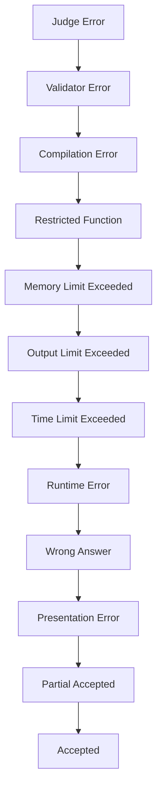

# Veredictos e pontuação

Esta página documenta todos os tipos de veredictos retornados pelo sistema de juízes omegaUp e explica os diferentes modelos de pontuação disponíveis para concursos e problemas.

## Tipos de veredicto

### Veredictos de sucesso

| Veredicto | Código | Descrição |
|--------|------|---------|
| **Aceito** | `AC` | Todos os casos de teste foram aprovados |
| **Parcialmente aceito** | `PA` | Alguns casos de teste foram aprovados |

### Veredictos de respostas erradas

| Veredicto | Código | Descrição |
|--------|------|---------|
| **Resposta errada** | `WA` | A saída não corresponde ao esperado |
| **Erro de apresentação** | `PE` | Problemas de formato de saída (espaços em branco extras, etc.) |

### Veredictos de tempo de execução

| Veredicto | Código | Descrição |
|--------|------|---------|
| **Erro de tempo de execução** | `RTE` | Programa travou (segfault, exceção, etc.) |
| **Prazo excedido** | `TLE` | Prazo excedido |
| **Limite de memória excedido** | `MLE` | Limite de memória excedido |
| **Limite de saída excedido** | `OLE` | Muita produção gerada |
| **Função restrita** | `RFE` | Chamada de sistema proibida usada |

### Veredictos de compilação

| Veredicto | Código | Descrição |
|--------|------|---------|
| **Erro de compilação** | `CE` | Falha ao compilar |

### Veredictos do sistema

| Veredicto | Código | Descrição |
|--------|------|---------|
| **Erro do juiz** | `JE` | Erro de classificação interna |
| **Erro do validador** | `VE` | Validador personalizado travou |

## Hierarquia de veredicto

Quando vários casos de teste têm veredictos diferentes, o veredicto geral segue esta prioridade:


## Modelos de pontuação

### Tudo ou Nada (`all_or_nothing`)

Pontos concedidos apenas para solução completa:

```
Score = 100% if ALL cases pass
Score = 0%   otherwise
```
Melhor para:
- Problemas simples
- Problemas do tipo IOI onde o crédito parcial não é desejado

### Crédito Parcial (`partial`)

Pontos proporcionais aos casos aprovados:

```
Score = (passing_cases / total_cases) × max_points
```
Melhor para:
- Problemas com casos de teste independentes
- Ambientes educacionais

### Máximo por grupo (`max_per_group`)

Pontos baseados em grupos de casos de teste:

```
Group Score = max_points × (passing_cases_in_group / total_cases_in_group)
Total Score = sum(Group Scores weighted by group weights)
```
Melhor para:
- Problemas com subtarefas
- Problemas do tipo IOI com pontuação parcial

## Grupos de casos de teste

### Definição de grupo

Os grupos são definidos em `settings.json` ou inferidos a partir de nomes de arquivos:

```json
{
  "Cases": [
    {
      "Name": "small",
      "Cases": ["1", "2", "3"],
      "Weight": 30
    },
    {
      "Name": "large",
      "Cases": ["4", "5", "6"],
      "Weight": 70
    }
  ]
}
```
### Agrupamento Automático

Sem grupos explícitos, os casos são agrupados por prefixo de nome de arquivo:

```
small.1.in  → Group "small"
small.2.in  → Group "small"
large.1.in  → Group "large"
large.2.in  → Group "large"
```
### Arquivo de plano de teste

Agrupamento alternativo via `testplan`:

```
# Format: group_name weight
small 30
large 70

# Test cases (order matters for display)
small.1
small.2
small.3
large.1
large.2
large.3
```
## Modelos de penalidade

### Sem penalidade (`none`)

A pontuação é puramente baseada na correção:

```
Final Score = Best Score
```
### Penalidade de tempo de execução (`runtime`)

Pontuação penalizada pelo tempo de execução:

```
Final Score = Points × (1 - time_factor)
```
Onde `time_factor` é baseado no tempo de execução relativo.

### Penalidade por contagem de envios (`submission_count`)

Penalidade estilo ICPC:

```
Penalty = Σ(wrong_submissions × penalty_minutes + solve_time)
```
## Pontuação do concurso

### Estilo IOI

- Crédito parcial permitido
- Melhores contagens de envio
- Nenhuma penalidade de submissão errada

```
Total = Σ(max_score_per_problem)
```
### Estilo ICPC

- Tudo ou nada por problema
- Tempo + penalidade por envio errado
- Problemas que valem pontos iguais

```
Solved = count(AC_problems)
Penalty = Σ(solve_time + wrong_attempts × 20)
Rank by: Solved DESC, Penalty ASC
```
### Pontuação personalizada

Configurável por concurso:

| Configuração | Opções |
|--------|---------|
| `score_mode` | `all_or_nothing`, `partial`, `max_per_group` |
| `penalty` | `none`, `runtime`, `submission_count` |
| `penalty_calc_policy` | `sum`, `max` |

## Exibição do placar

### Representação de pontuação

| Formato | Exemplo | Quando usado |
|--------|---------|-----------|
| Pontos | `100.00` | Pontuação parcial |
| Fração | `3/5` | Tudo ou nada |
| Tempo | `45:30` | Penalidade do ICPC |
| Combinado | `100 (+2)` | IOI com tentativas |

### Codificação de cores

| Cor | Significado |
|-------|---------|
| 🟢 Verde | Aceito/Pontuação completa |
| 🟡 Amarelo | Pontuação parcial |
| 🔴Vermelho | Sem pontuação/Resposta errada |
| ⚪ Cinza | Aguardando julgamento |

## Detalhes do veredicto

### Sinais de erro de tempo de execução

| Sinal | Descrição |
|--------|------------|
| SIGSEGV (11) | Falha de segmentação |
| SIGFPE (8) | Exceção de ponto flutuante |
| SIGABRT (6) | Abortar (afirmação falhou) |
| SIGKILL (9) | Morto pelo sistema |

### Notas sobre limite de tempo

- **Tempo de CPU**: tempo de cálculo real
- **Wall Time**: Tempo real decorrido (normalmente 2× limite da CPU)
- TLE pode resultar de:
  - Algoritmo lento
  - Laço infinito
  - E/S excessiva

### Notas sobre limite de memória

- Medido via cgroups (pico RSS)
- Inclui:
  - Alocações de heap
  - Uso de pilha
  - Variáveis estáticas
- NÃO inclui:
  - Bibliotecas compartilhadas
  - Segmento de código

## Validadores personalizados

### Interface do validador

Validadores personalizados recebem:

```bash
./validator <input_file> <expected_output> <user_output> <score_limit>
```
E saída:

```
<score>
<message>
```
Onde `score` está entre 0,0 e 1,0.

### Casos de uso

- Tolerância de ponto flutuante
- Múltiplas saídas válidas
- Verificação interativa
- Lógica de crédito parcial

## Melhores práticas

### Para criadores de problemas

1. **Use grupos significativos**: casos de teste relacionados ao grupo
2. **Equilibrar pesos**: certifique-se de que as subtarefas tenham dificuldade apropriada
3. **Incluir casos extremos**: testar condições de limite
4. **Estabeleça limites apropriados**: Não torne os limites muito rígidos ou frouxos

### Para Concorrentes

1. **Verifique todos os veredictos**: Leia as mensagens do veredicto com atenção
2. **Entenda a pontuação**: saiba se o crédito parcial está disponível
3. **Otimize de forma incremental**: obtenha primeiro a pontuação parcial e depois otimize
4. **Fique atento a casos extremos**: fonte comum de WA

## Documentação Relacionada

- **[Modern Internals](../architecture/grader-internals.md)** - Como os veredictos são determinados
- **[Runner Internals](../architecture/runner-internals.md)** - Detalhes de execução
- **[API de problemas](../api/problems.md)** - Configuração do problema
- **[API de concursos](../api/contests.md)** - Configurações de pontuação do concurso
