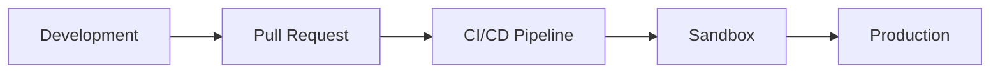

# Operações

Guias para implantação, monitoramento e manutenção do omegaUp em ambientes de desenvolvimento e produção.

## Navegação Rápida

| Guia | Descrição |
|-------|------------|
| [Implantação](deployment.md) | Processo de liberação e procedimentos de implantação |
| [Configuração do Docker](docker-setup.md) | Desenvolvimento local com Docker Compose |
| [Configuração Nginx](nginx-configuration.md) | Instalação e configuração do servidor Web |
| [Monitoramento](monitoring.md) | Monitoramento e alerta do sistema |
| [Solução de problemas](troubleshooting.md) | Problemas e soluções comuns |

## Visão geral do ambiente

| Meio Ambiente | Finalidade | URL |
|------------|---------|-----|
| **Local** | Desenvolvimento | `localhost:8001` |
| **Caixa de areia** | Testes de pré-produção | `sandbox.omegaup.com` |
| **Produção** | Sistema ao vivo | `omegaup.com` |

## Guias de implantação

### [Lançamento e implantação](deployment.md)

Saiba mais sobre o processo de implantação do omegaUp:

- Pipeline de CI/CD com GitHub Actions
- Implantações automatizadas de fim de semana
- Procedimentos de hotfix
- Estratégias de reversão

### [Configuração do Docker](docker-setup.md)

Configure seu ambiente de desenvolvimento local:

- Configuração do Docker Compose
- Arquitetura de serviço
- Gerenciamento de volume
- Comandos comuns

## Guias de infraestrutura

### [Configuração Nginx](nginx-configuration.md)

Configuração do servidor Web, incluindo:

- Configurações de desenvolvimento versus produção
- Proxy PHP-FPM
- Configuração WebSocket
- Configuração SSL/TLS
- Limitação de taxa

### [Monitoramento](monitoring.md)

Acompanhe a integridade do sistema:

- Métricas do Prometheus
- Painéis Grafana
- Configuração de alerta
- Agregação de logs

## Guias de suporte

### [Solução de problemas](troubleshooting.md)

Resolva problemas comuns:

- Problemas do Docker
- Problemas de banco de dados
- Falhas de construção
- Depuração de produção

## Documentação Relacionada

- **[Arquitetura](../architecture/index.md)** - Detalhes da arquitetura do sistema
- **[Infraestrutura](../architecture/infrastructure.md)** - Redis, RabbitMQ, serviços
- **[Configuração de desenvolvimento](../getting-started/development-setup.md)** - Guia de primeiros passos
- **[Segurança](../architecture/security.md)** - Configuração de segurança
