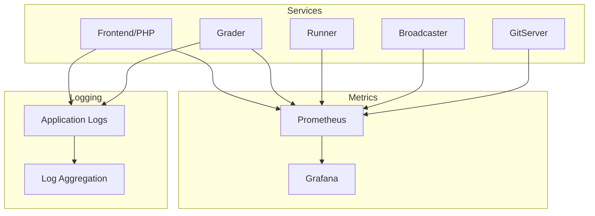

# Monitoramento

omegaUp usa várias ferramentas de monitoramento para rastrear a integridade, o desempenho e a confiabilidade do sistema em todos os serviços.

## Visão geral


## Coleção de métricas

### Métricas do avaliador

O Grader expõe métricas na porta `6060`:

```bash
curl http://grader:6060/metrics
```
**Métricas principais**:

| Métrica | Tipo | Descrição |
|--------|------|-------------|
| `grader_queue_length` | Medidor | Número de submissões em fila |
| `grader_queue_total_wait_time_seconds` | Histograma | Tempo que os envios passam na fila |
| `grader_runs_total` | Contador | Total de execuções processadas |
| `grader_run_duration_seconds` | Histograma | Hora de processar cada execução |
| `grader_runners_available` | Medidor | Número de corredores disponíveis |
| `grader_runners_total` | Medidor | Total de corredores inscritos |

### Métricas do corredor

Cada corredor reporta seu status ao avaliador:

| Métrica | Descrição |
|--------|------------|
| `runner_cpu_usage` | Utilização atual da CPU |
| `runner_memory_usage` | Consumo de memória |
| `runner_executions_total` | Total de execuções realizadas |
| `runner_compilation_errors` | Falhas de compilação |

### Métricas de Aplicação (PHP)

Métricas de aplicativos PHP rastreadas:

| Métrica | Descrição |
|--------|------------|
| `http_requests_total` | Total de solicitações HTTP por endpoint |
| `http_request_duration_seconds` | Solicitar histograma de latência |
| `api_errors_total` | Contagem de erros de API por tipo |
| `db_query_duration_seconds` | Tempos de consulta ao banco de dados |
| `cache_hits_total` | Taxa de acerto do cache Redis |

## Configuração do Prometheus

Exemplo de configuração de raspagem do Prometheus:

```yaml
# prometheus.yml
global:
  scrape_interval: 15s
  evaluation_interval: 15s

scrape_configs:
  - job_name: 'grader'
    static_configs:
      - targets: ['grader:6060']
    
  - job_name: 'broadcaster'
    static_configs:
      - targets: ['broadcaster:6061']
    
  - job_name: 'gitserver'
    static_configs:
      - targets: ['gitserver:6062']
    
  - job_name: 'frontend'
    static_configs:
      - targets: ['frontend:9090']
```
## Principais painéis

### Painel do avaliador

Monitore o processamento de envio:

- **Profundidade da fila**: envios atuais aguardando
- **Taxa de processamento**: execuções por minuto
- **Utilização de executores**: executores ativos versus inativos
- **Distribuição do veredicto**: detalhamento de AC/WA/TLE
- **Tempo Médio de Espera**: Tempo na fila

### Painel do concurso

Durante concursos ao vivo:

- **Participantes ativos**: usuários que estão enviando
- **Taxa de envio**: envios por minuto
- **Atualizações do placar**: frequência de atualização
- **Fila de Esclarecimentos**: Esclarecimentos pendentes

### Painel de infraestrutura

Visão geral da integridade do sistema:

- **Uso de CPU/memória**: por serviço
- **E/S de disco**: banco de dados e armazenamento de problemas
- **Tráfego de rede**: comunicação entre serviços
- **Taxas de erro**: respostas 5xx, tempos limite

## Regras de alerta

### Alertas Críticos

```yaml
# alerts.yml
groups:
  - name: critical
    rules:
      - alert: GraderQueueBacklog
        expr: grader_queue_length > 100
        for: 5m
        labels:
          severity: critical
        annotations:
          summary: "Grader queue backlog detected"
          description: "Queue has {{ $value }} pending submissions"
      
      - alert: NoRunnersAvailable
        expr: grader_runners_available == 0
        for: 1m
        labels:
          severity: critical
        annotations:
          summary: "No runners available"
          
      - alert: HighErrorRate
        expr: rate(api_errors_total[5m]) > 10
        for: 2m
        labels:
          severity: warning
        annotations:
          summary: "High API error rate"
```
### Alertas de aviso

```yaml
      - alert: HighQueueLatency
        expr: histogram_quantile(0.95, grader_queue_total_wait_time_seconds) > 60
        for: 10m
        labels:
          severity: warning
        annotations:
          summary: "High queue wait time"
      
      - alert: DatabaseSlowQueries
        expr: histogram_quantile(0.99, db_query_duration_seconds) > 1
        for: 5m
        labels:
          severity: warning
```
## Registro

### Locais de registro

| Serviço | Localização do registro |
|--------|-------------|
| Front-end (PHP) | `/var/log/omegaup/frontend.log` |
| Graduador | `/var/log/omegaup/grader.log` |
| Corredor | `/var/log/omegaup/runner.log` |
| Nginx | `/var/log/nginx/access.log`, `/var/log/nginx/error.log` |
| MySQL | `/var/log/mysql/error.log` |

### Formato de registro

Registro JSON estruturado:

```json
{
  "timestamp": "2025-01-23T10:30:00Z",
  "level": "INFO",
  "service": "grader",
  "message": "Run completed",
  "run_id": 12345,
  "verdict": "AC",
  "duration_ms": 450,
  "runner": "runner-1"
}
```
### Agregação de registros

Registro centralizado com pilha ELK:

```yaml
# filebeat.yml
filebeat.inputs:
  - type: log
    enabled: true
    paths:
      - /var/log/omegaup/*.log
    json.keys_under_root: true
    
output.elasticsearch:
  hosts: ["elasticsearch:9200"]
  index: "omegaup-%{+yyyy.MM.dd}"
```
## Verificações de integridade

### Pontos de extremidade de integridade do serviço

| Serviço | Ponto final | Resposta Esperada |
|--------|----------|-------------------|
| Interface | `GET /health/` | `200 OK` |
| Graduador | `GET /grader/status/` | JSON com informações da fila |
| MySQL | Verificação TCP em 3306 | Sucesso de conexão |
| Redis | `PING` | `PONG` |

### Verificações de integridade do Docker

```yaml
services:
  frontend:
    healthcheck:
      test: ["CMD", "curl", "-f", "http://localhost/health/"]
      interval: 30s
      timeout: 10s
      retries: 3
      start_period: 40s
  
  mysql:
    healthcheck:
      test: ["CMD", "mysqladmin", "ping", "-h", "localhost"]
      interval: 10s
      timeout: 5s
      retries: 5
```
## Linhas de base de desempenho

### Métricas Esperadas (Operação Normal)

| Métrica | Faixa normal | Aviso | Crítico |
|--------|--------------|---------|----------|
| Comprimento da fila | 0-10 | >50 | >100 |
| Tempo de espera na fila | <10s | >30s | >60 anos |
| Latência da API (p95) | <200ms | >500ms | >1s |
| Taxa de erro | <0.1% | >1% | >5% |
| Utilização do Corredor | 20-80% | >90% | 100% |

## Solução de problemas com métricas

### Envios Lentos

1. Verifique `grader_queue_length` - backlog da fila?
2. Verifique `grader_runners_available` - corredores suficientes?
3. Verifique `grader_run_duration_seconds` - problemas de lentidão?

### Altas taxas de erro

1. Verifique `api_errors_total` por tipo de erro
2. Verifique `db_query_duration_seconds` - problemas de banco de dados?
3. Verifique os logs de serviço em busca de rastreamentos de pilha

### Problemas de memória

1. Verifique os limites de memória do contêiner
2. Revise as métricas `cache_size_bytes`
3. Verifique se há vazamentos de memória em processos de longa execução

## Documentação Relacionada

- **[Solução de problemas](troubleshooting.md)** - Problemas e soluções comuns
- **[Infraestrutura](../architecture/infrastructure.md)** - Arquitetura de serviço
- **[Implantação](deployment.md)** - Processo de implantação
