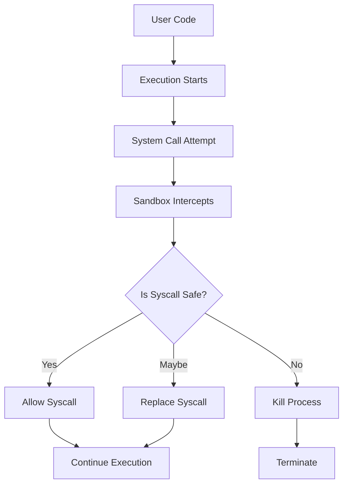

# Sandbox

omegaUp uses a modified version of **Moeval** (the sandbox used in IOI) for secure code execution.

## Overview

Sandbox is a debugger that uses Linux `ptrace` to intercept system calls made by user-submitted code, allowing fine-grained control over what the code can do.

## How It Works

## Syscall Handling

Sandbox can:

1. **Allow**: Permit harmless syscalls to proceed normally
2. **Replace**: Replace dangerous syscalls with harmless ones (e.g., replace `socket` with `getuid` to simulate no network)
3. **Kill**: Terminate the process if the syscall is very dangerous

## Features

### Modifications from Moeval

- **Syscall Mangling**: Replace dangerous syscalls
- **Multi-thread Support**: Handle multi-threaded programs
- **Verbose Mode**: Examine which syscalls were made
- **Path Normalization**: Handle relative paths (e.g., `./`)
- **Profile Support**: Read parameters from files for different compilers/interpreters
- **Cross-platform Version**: Non-ptrace version for platforms without ptrace

## Usage

Sandbox is used exclusively by **Runner** for code execution. It ensures:

- No network access
- No file system access (except allowed directories)
- No dangerous system calls
- Resource limits enforcement

## Related Documentation

- **[Runner](runner.md)** - Code execution system
- **[Grader](grader.md)** - Evaluation system
- **[System Internals](../architecture/internals.md)** - Detailed flow
